# 数据同步功能架构与实现文档

<cite>
**本文档中引用的文件**
- [app/utils/cloud/index.ts](file://app/utils/cloud/index.ts)
- [app/utils/cloud/upstash.ts](file://app/utils/cloud/upstash.ts)
- [app/utils/cloud/webdav.ts](file://app/utils/cloud/webdav.ts)
- [app/store/sync.ts](file://app/store/sync.ts)
- [app/utils/sync.ts](file://app/utils/sync.ts)
- [app/api/upstash/[action]/[...key]/route.ts](file://app/api/upstash/[action]/[...key]/route.ts)
- [app/api/webdav/[...path]/route.ts](file://app/api/webdav/[...path]/route.ts)
- [app/constant.ts](file://app/constant.ts)
- [app/utils/format.ts](file://app/utils/format.ts)
- [app/utils/store.ts](file://app/utils/store.ts)
- [app/utils/indexedDB-storage.ts](file://app/utils/indexedDB-storage.ts)
- [app/config/server.ts](file://app/config/server.ts)
</cite>

## 目录
1. [简介](#简介)
2. [系统架构概览](#系统架构概览)
3. [核心组件分析](#核心组件分析)
4. [云服务工具模块](#云服务工具模块)
5. [同步状态管理](#同步状态管理)
6. [数据合并策略](#数据合并策略)
7. [安全控制与认证](#安全控制与认证)
8. [性能优化与最佳实践](#性能优化与最佳实践)
9. [故障排除指南](#故障排除指南)
10. [总结](#总结)

## 简介

ChatGPT-Next-Web 的数据同步功能是一个高度集成的跨设备数据同步解决方案，支持通过 Upstash Redis 和 WebDAV 协议实现聊天记录、配置和会话状态的云端同步。该系统采用现代化的架构设计，提供了完整的加密传输、冲突解决和状态管理机制。

### 主要特性

- **多云服务支持**：同时支持 Upstash Redis 和 WebDAV 协议
- **数据完整性保障**：基于时间戳的冲突检测和解决机制
- **安全传输**：HTTPS 加密和令牌保护
- **智能分块处理**：针对大容量数据的分片上传机制
- **本地持久化**：IndexedDB 存储作为后备方案
- **实时状态同步**：双向数据同步和状态追踪

## 系统架构概览

数据同步系统采用分层架构设计，包含客户端同步逻辑、代理服务器层和云服务提供商接口。

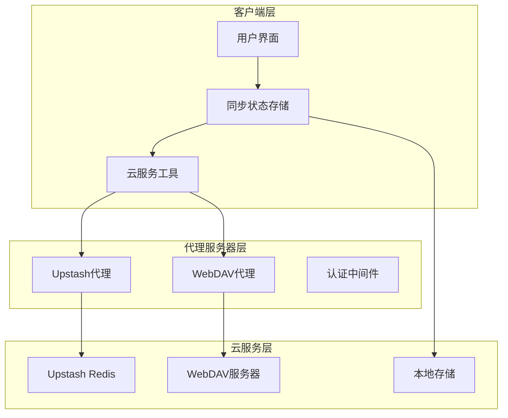

**图表来源**
- [app/store/sync.ts](file://app/store/sync.ts#L1-L151)
- [app/utils/cloud/index.ts](file://app/utils/cloud/index.ts#L1-L34)

**章节来源**
- [app/store/sync.ts](file://app/store/sync.ts#L1-L151)
- [app/utils/cloud/index.ts](file://app/utils/cloud/index.ts#L1-L34)

## 核心组件分析

### 同步状态存储模块

同步状态存储模块是整个数据同步系统的核心控制器，负责协调各个组件的工作流程。

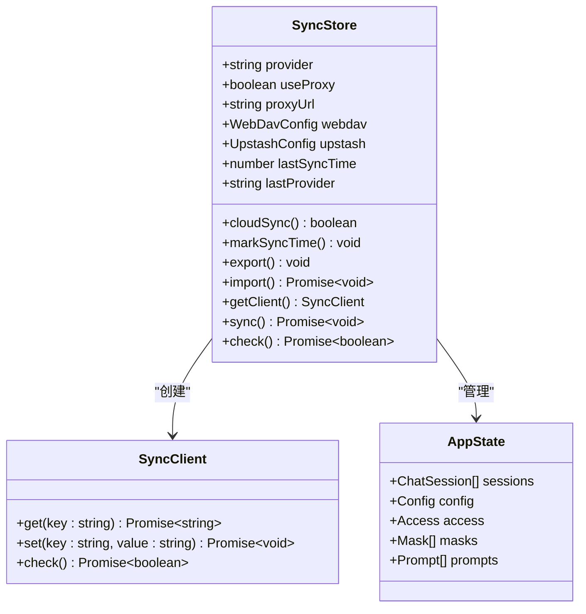

**图表来源**
- [app/store/sync.ts](file://app/store/sync.ts#L22-L44)
- [app/utils/sync.ts](file://app/utils/sync.ts#L49-L58)

### 数据状态结构

系统定义了统一的应用状态结构，包含所有需要同步的数据类型：

| 数据类型 | 描述 | 同步策略 |
|---------|------|----------|
| 聊天会话 | 用户的对话历史和会话信息 | 基于时间戳的增量合并 |
| 配置设置 | 应用程序配置和偏好设置 | 最新版本覆盖 |
| 访问控制 | API 密钥和访问权限 | 时间戳优先级合并 |
| 掩码模板 | 对话模板和预设配置 | 双向合并策略 |
| 提示词库 | 自定义提示词和指令 | 完整替换策略 |

**章节来源**
- [app/utils/sync.ts](file://app/utils/sync.ts#L49-L166)

## 云服务工具模块

### Upstash Redis 客户端

Upstash 是一个基于 Redis 的云数据库服务，提供高性能的键值存储能力。

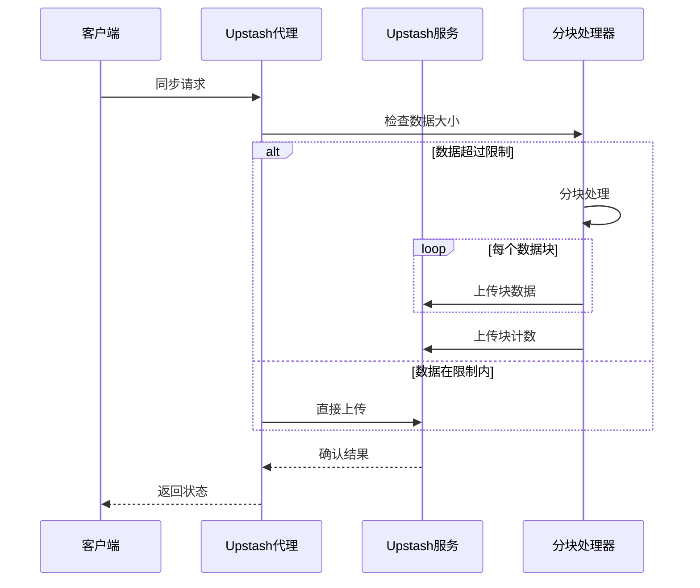

**图表来源**
- [app/utils/cloud/upstash.ts](file://app/utils/cloud/upstash.ts#L67-L76)
- [app/api/upstash/[action]/[...key]/route.ts](file://app/api/upstash/[action]/[...key]/route.ts#L1-L74)

#### 关键特性

- **自动分块**：当数据超过 1MB 限制时自动分割
- **代理支持**：支持通过代理服务器访问
- **认证机制**：基于 Bearer Token 的身份验证
- **错误处理**：完善的异常捕获和重试机制

**章节来源**
- [app/utils/cloud/upstash.ts](file://app/utils/cloud/upstash.ts#L1-L111)

### WebDAV 客户端

WebDAV 是一种基于 HTTP 协议的文件同步标准，提供完整的文件操作功能。

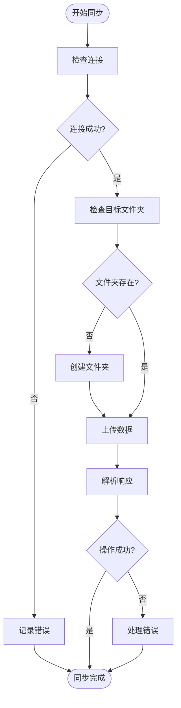

**图表来源**
- [app/utils/cloud/webdav.ts](file://app/utils/cloud/webdav.ts#L14-L60)

#### 支持的操作

| HTTP 方法 | 功能 | 使用场景 |
|-----------|------|----------|
| GET | 获取远程数据 | 下载备份文件 |
| PUT | 上传数据到指定路径 | 保存同步数据 |
| MKCOL | 创建目录 | 初始化同步环境 |

**章节来源**
- [app/utils/cloud/webdav.ts](file://app/utils/cloud/webdav.ts#L1-L98)

## 同步状态管理

### 连接状态监控

系统实现了完整的连接状态监控机制，确保同步过程的可靠性。

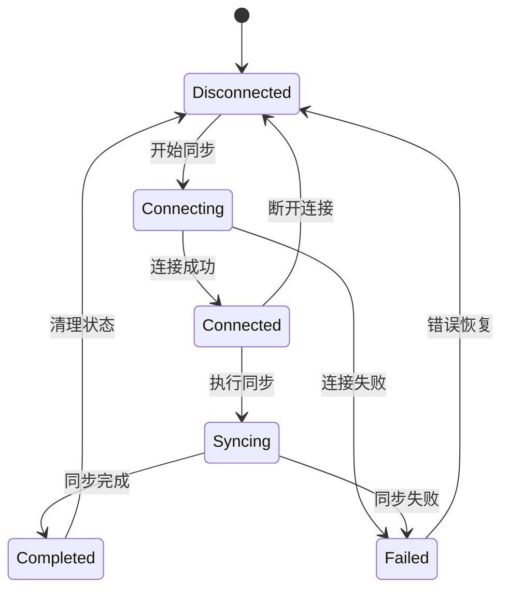

### 同步队列管理

系统采用异步队列模式处理同步请求，避免阻塞主线程：

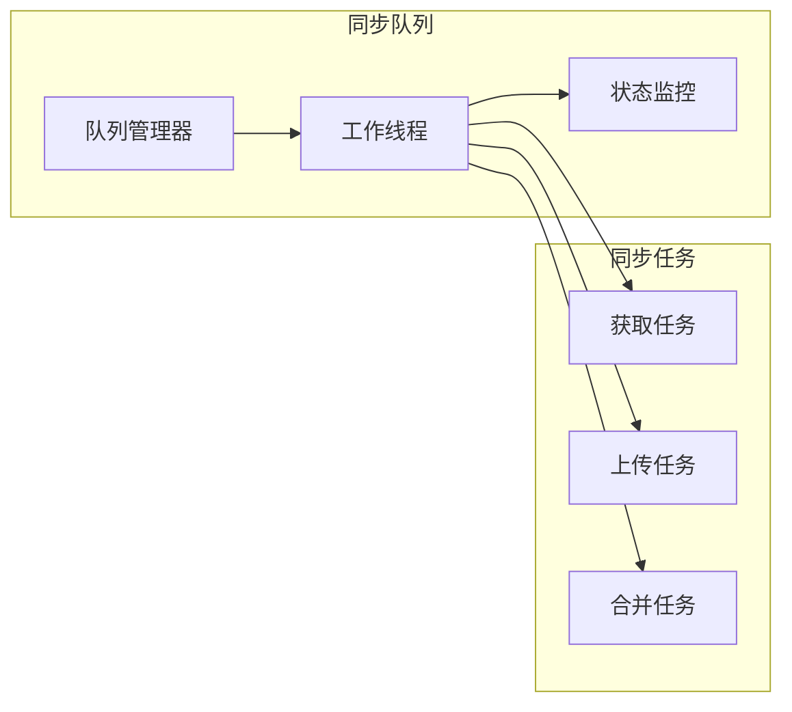

**章节来源**
- [app/store/sync.ts](file://app/store/sync.ts#L54-L125)

## 数据合并策略

### 冲突解决机制

系统实现了智能的冲突解决策略，确保数据的一致性和完整性。

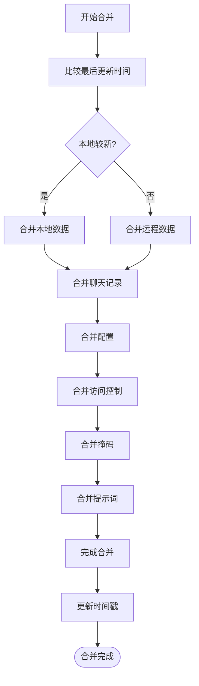

**图表来源**
- [app/utils/sync.ts](file://app/utils/sync.ts#L148-L166)

### 特定数据类型的合并策略

| 数据类型 | 合并策略 | 冲突处理 |
|----------|----------|----------|
| 聊天会话 | 增量合并（消息去重） | 基于时间戳排序 |
| 配置设置 | 最新版本覆盖 | 基于时间戳选择 |
| 访问控制 | 时间戳优先级 | 较新版本优先 |
| 掩码模板 | 双向合并 | 保留所有模板 |
| 提示词库 | 完整替换 | 远程数据优先 |

**章节来源**
- [app/utils/sync.ts](file://app/utils/sync.ts#L65-L119)

## 安全控制与认证

### 认证流程

系统实现了多层次的安全认证机制：

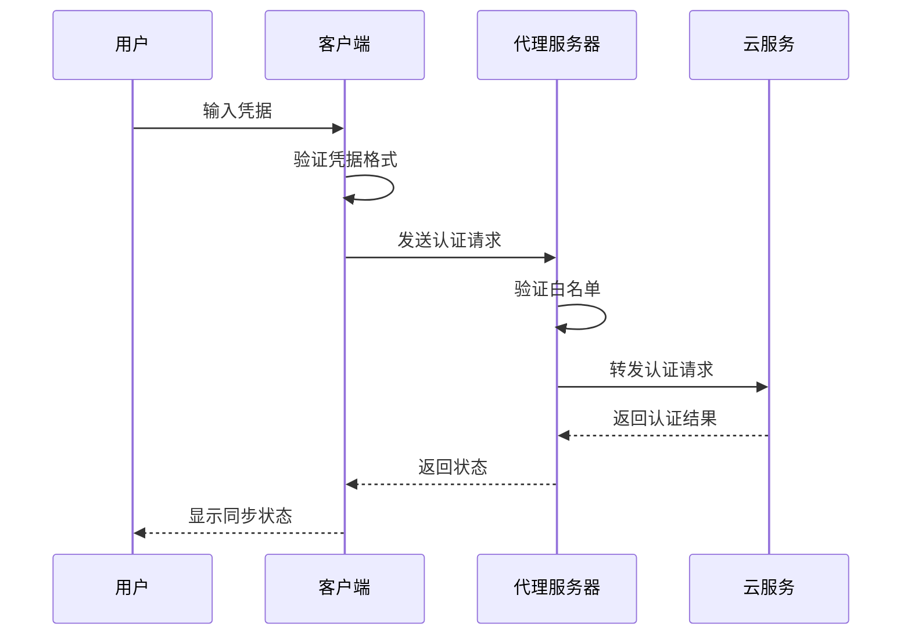

### 令牌保护机制

| 安全层级 | 实现方式 | 保护范围 |
|----------|----------|----------|
| 传输层 | HTTPS/TLS | 数据传输加密 |
| 应用层 | Bearer Token | API 访问授权 |
| 网络层 | IP 白名单 | 服务器访问控制 |
| 数据层 | 时间戳验证 | 数据版本控制 |

**章节来源**
- [app/api/webdav/[...path]/route.ts](file://app/api/webdav/[...path]/route.ts#L34-L58)
- [app/api/upstash/[action]/[...key]/route.ts](file://app/api/upstash/[action]/[...key]/route.ts#L14-L24)

### CORS 和速率限制

系统实现了严格的 CORS 策略和速率限制机制：

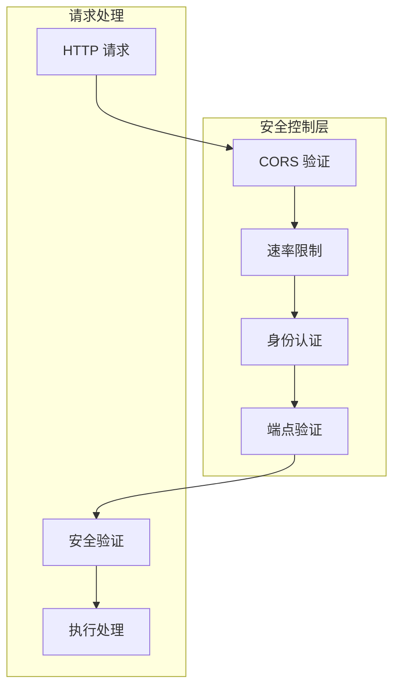

**章节来源**
- [app/api/webdav/[...path]/route.ts](file://app/api/webdav/[...path]/route.ts#L34-L95)
- [app/api/upstash/[action]/[...key]/route.ts](file://app/api/upstash/[action]/[...key]/route.ts#L14-L38)

## 性能优化与最佳实践

### 数据序列化格式

系统采用高效的 JSON 序列化格式，支持大容量数据的快速传输：

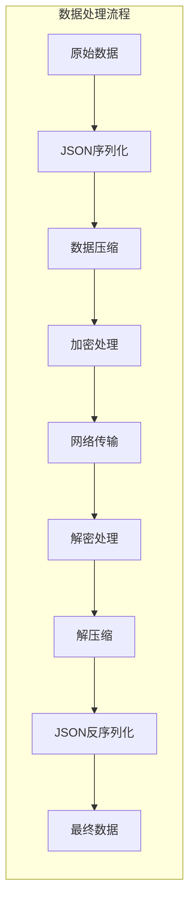

### 同步性能优化技巧

| 优化策略 | 实现方式 | 性能提升 |
|----------|----------|----------|
| 分块传输 | 大数据分片处理 | 减少单次传输压力 |
| 增量同步 | 基于时间戳的差异同步 | 减少传输数据量 |
| 缓存机制 | 本地状态缓存 | 提高响应速度 |
| 并行处理 | 异步并发操作 | 提升整体效率 |

### 存储优化

系统采用多层存储架构，确保数据的可靠性和性能：

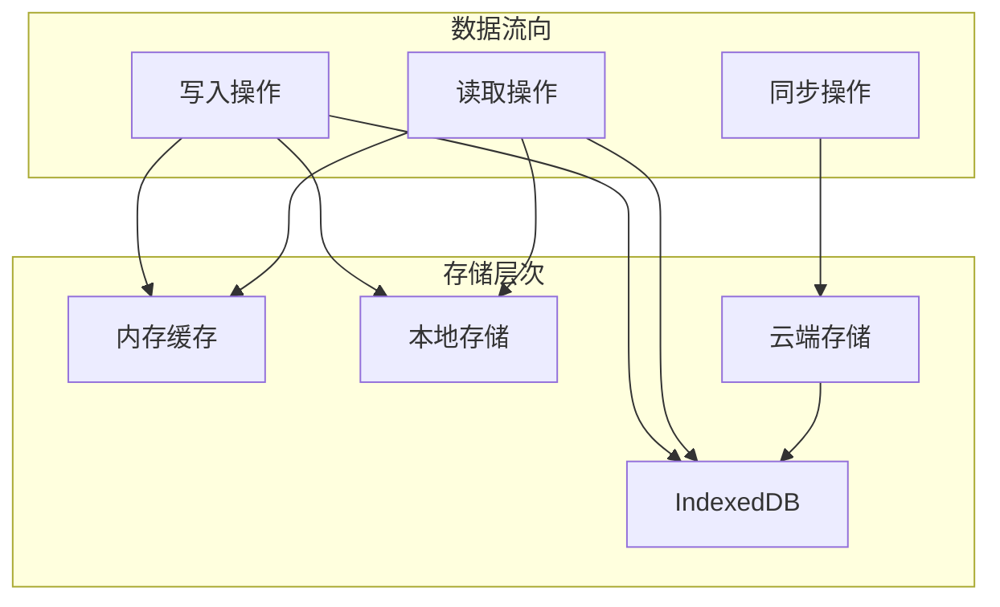

**章节来源**
- [app/utils/format.ts](file://app/utils/format.ts#L15-L28)
- [app/utils/indexedDB-storage.ts](file://app/utils/indexedDB-storage.ts#L1-L48)

## 故障排除指南

### 常见问题诊断

| 问题类型 | 症状表现 | 解决方案 |
|----------|----------|----------|
| 连接超时 | 同步请求无响应 | 检查网络连接和代理设置 |
| 认证失败 | 403/401 错误 | 验证 API 密钥和权限设置 |
| 数据冲突 | 同步后数据丢失 | 检查时间戳和合并策略 |
| 存储空间不足 | 上传失败 | 清理本地缓存和历史数据 |

### 日志监控

系统提供了完整的日志记录机制，便于问题诊断：

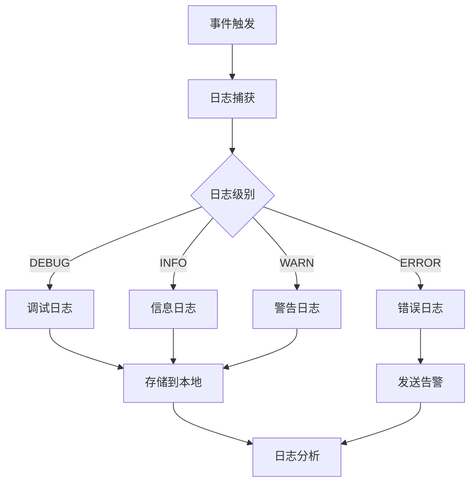

### 配置指南

#### Upstash 配置

```typescript
// 示例配置
{
  provider: 'upstash',
  useProxy: true,
  proxyUrl: '/api/upstash/',
  upstash: {
    endpoint: 'https://your-account.upstash.io',
    username: 'STORAGE_KEY', // 或自定义用户名
    apiKey: 'your-api-key'
  }
}
```

#### WebDAV 配置

```typescript
// 示例配置
{
  provider: 'webdav',
  useProxy: true,
  proxyUrl: '/api/webdav/',
  webdav: {
    endpoint: 'https://your-webdav-server.com/',
    username: 'your-username',
    password: 'your-password'
  }
}
```

**章节来源**
- [app/store/sync.ts](file://app/store/sync.ts#L25-L44)

## 总结

ChatGPT-Next-Web 的数据同步功能是一个设计精良、功能完备的跨设备数据同步解决方案。它通过以下核心优势为用户提供了可靠的同步体验：

### 技术优势

1. **多云服务支持**：同时兼容 Upstash 和 WebDAV，满足不同用户的部署需求
2. **智能冲突解决**：基于时间戳的冲突检测和解决机制，确保数据一致性
3. **安全可靠**：多层次的安全控制和加密传输，保护用户数据隐私
4. **高性能优化**：分块传输、增量同步等优化策略，提升同步效率

### 架构特点

- **模块化设计**：清晰的职责分离和接口抽象
- **可扩展性**：易于添加新的云服务提供商
- **容错机制**：完善的错误处理和恢复策略
- **用户体验**：直观的状态反馈和进度指示

### 应用价值

该同步系统不仅解决了跨设备数据同步的技术难题，更为用户提供了无缝的使用体验。通过合理的架构设计和安全措施，确保了数据的安全性和可靠性，是现代 Web 应用同步功能的优秀实践案例。