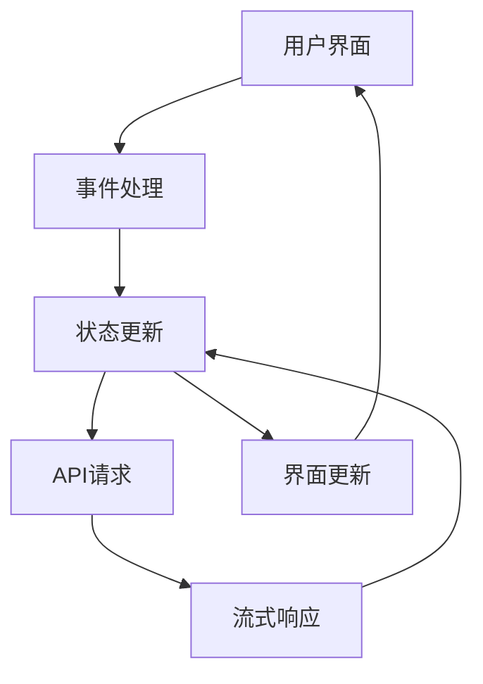

# 核心功能详解

<cite>
**本文档引用的文件**  
- [app/page.tsx](file://app/page.tsx)
- [app/layout.tsx](file://app/layout.tsx)
- [app/store/chat.ts](file://app/store/chat.ts)
- [app/client/api.ts](file://app/client/api.ts)
- [app/constant.ts](file://app/constant.ts)
- [app/components/home.tsx](file://app/components/home.tsx)
- [app/components/chat.tsx](file://app/components/chat.tsx)
- [app/store/config.ts](file://app/store/config.ts)
- [app/utils/chat.ts](file://app/utils/chat.ts)
- [app/utils/indexedDB-storage.ts](file://app/utils/indexedDB-storage.ts)
- [app/utils/store.ts](file://app/utils/store.ts)
- [app/mcp/actions.ts](file://app/mcp/actions.ts)
</cite>

## 目录
1. [多模型支持架构](#多模型支持架构)
2. [聊天会话管理系统](#聊天会话管理系统)
3. [用户界面与状态管理](#用户界面与状态管理)

## 多模型支持架构

ChatGPT-Next-Web通过统一的API适配层实现了对OpenAI、Google、Anthropic、百度、阿里云等多家AI服务提供商的支持。该架构的核心是`ClientApi`类，它作为抽象工厂模式的实现，根据不同的服务提供商创建相应的LLM API实例。

系统通过`ServiceProvider`枚举定义了所有支持的服务商，包括OpenAI、Google、Anthropic、Baidu、Alibaba等。当用户选择特定服务商时，`getClientApi`函数会根据`ServiceProvider`的值实例化对应的API客户端。例如，当选择Google时，会创建`GeminiProApi`实例；选择百度时，会创建`ErnieApi`实例。

API适配层的关键设计在于`LLMApi`抽象类，它定义了所有LLM服务必须实现的接口，包括`chat`、`speech`、`usage`和`models`方法。每个具体的服务提供商都实现了这个抽象类，从而确保了统一的调用方式。这种设计使得添加新的AI服务提供商变得非常简单，只需实现`LLMApi`接口并将其注册到`ClientApi`的工厂方法中即可。

HTTP请求的处理通过`getHeaders`函数统一管理，该函数根据当前选择的模型配置和访问存储状态，为不同服务商生成正确的认证头信息。例如，Azure使用"api-key"头，Anthropic使用"x-api-key"头，而大多数其他服务商使用"Authorization"头。

**Section sources**
- [app/client/api.ts](file://app/client/api.ts#L136-L400)
- [app/constant.ts](file://app/constant.ts#L120-L137)
- [app/utils/chat.ts](file://app/utils/chat.ts#L175-L390)

## 聊天会话管理系统

聊天会话管理系统是ChatGPT-Next-Web的核心数据结构，负责管理用户的对话历史、上下文记忆和会话状态。系统使用Zustand状态管理库来维护会话数据，并通过IndexedDB实现数据的持久化存储。

会话数据结构的核心是`ChatSession`接口，它包含会话ID、主题、记忆提示、消息列表、统计信息、最后更新时间、最后摘要索引和清除上下文索引等属性。每个会话包含一个`messages`数组，存储`ChatMessage`对象，这些对象记录了用户和AI之间的完整对话历史。

系统实现了自动摘要功能，当对话长度超过阈值时，会自动调用摘要模型生成会话摘要。`summarizeSession`方法负责这一过程，它首先确定合适的摘要模型（如gpt-4o-mini），然后将最近的对话消息发送给模型生成摘要。生成的摘要存储在`memoryPrompt`字段中，可以在后续对话中作为上下文使用。

数据持久化通过`indexedDBStorage`实现，这是一个包装了`idb-keyval`库的自定义存储适配器。它优先使用IndexedDB存储数据，同时兼容性地回退到localStorage。这种设计确保了在不同浏览器环境下的数据持久化能力。

**Section sources**
- [app/store/chat.ts](file://app/store/chat.ts#L84-L96)
- [app/utils/indexedDB-storage.ts](file://app/utils/indexedDB-storage.ts#L7-L48)
- [app/utils/store.ts](file://app/utils/store.ts#L29-L79)

## 用户界面与状态管理

用户界面与状态管理模块通过Zustand store与React组件的紧密集成，实现了高效的数据绑定和状态同步。系统使用`useChatStore`、`useAppConfig`等自定义Hook来访问全局状态，并在UI组件中实时响应状态变化。

聊天界面组件`Chat`通过`useChatStore` Hook订阅当前会话状态，当会话消息更新时，界面会自动重新渲染。输入框的提交处理通过`useSubmitHandler` Hook管理，它根据用户配置的提交键（如Enter、Ctrl+Enter等）来触发消息发送。

状态管理的关键在于`createPersistStore`工厂函数，它封装了Zustand的`persist`中间件，实现了状态的持久化。该函数不仅处理状态的存储和恢复，还添加了`markUpdate`、`update`等实用方法，简化了状态更新的操作。

组件间的交互通过事件回调和状态更新实现。例如，当用户点击发送按钮时，`onUserInput`方法被调用，它首先创建用户消息和AI响应消息，然后通过`getClientApi`获取相应的API客户端，最后发起流式请求并实时更新消息内容。

**Diagram sources**
- [app/components/chat.tsx](file://app/components/chat.tsx#L263-L308)
- [app/store/chat.ts](file://app/store/chat.ts#L407-L528)