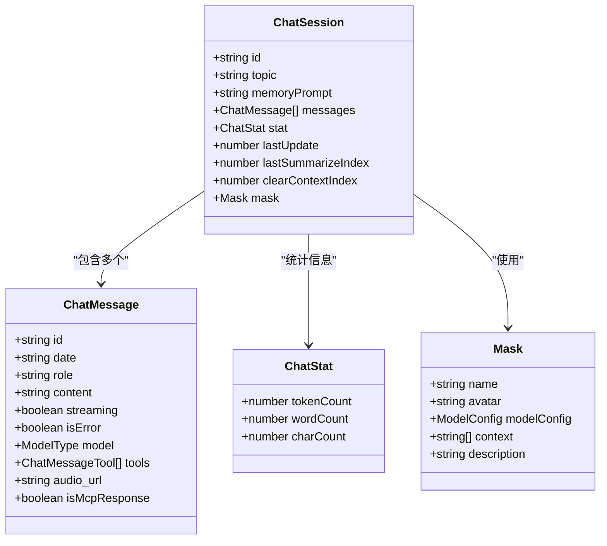
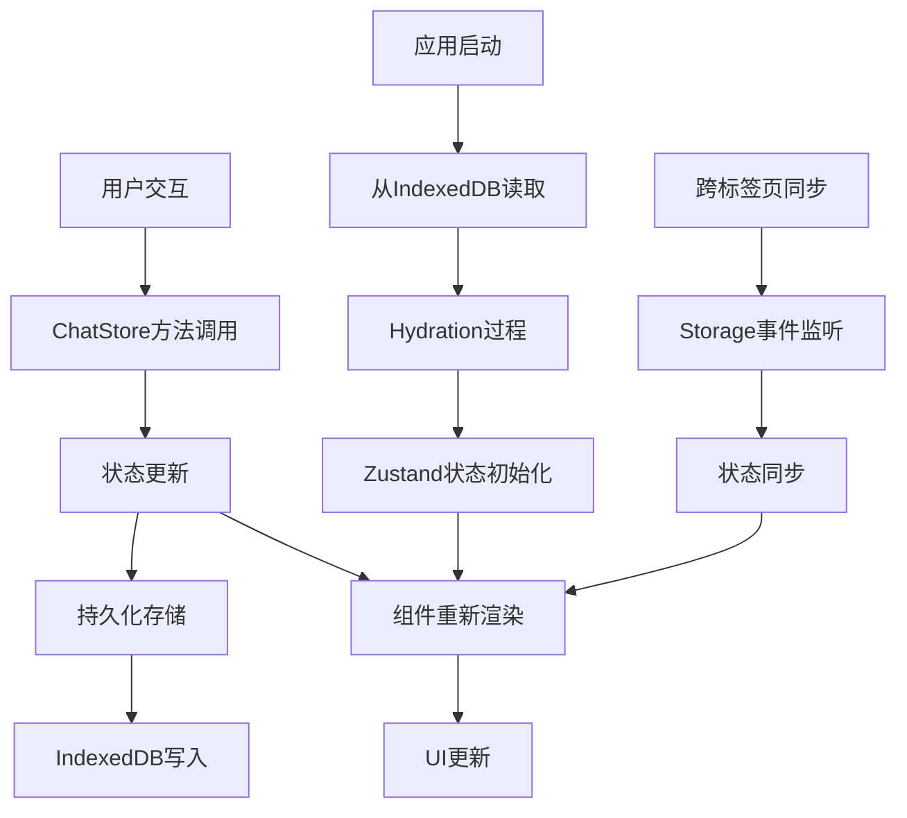
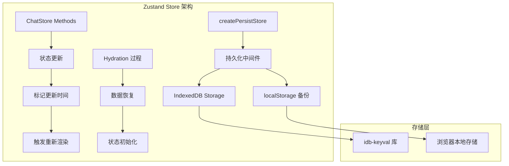
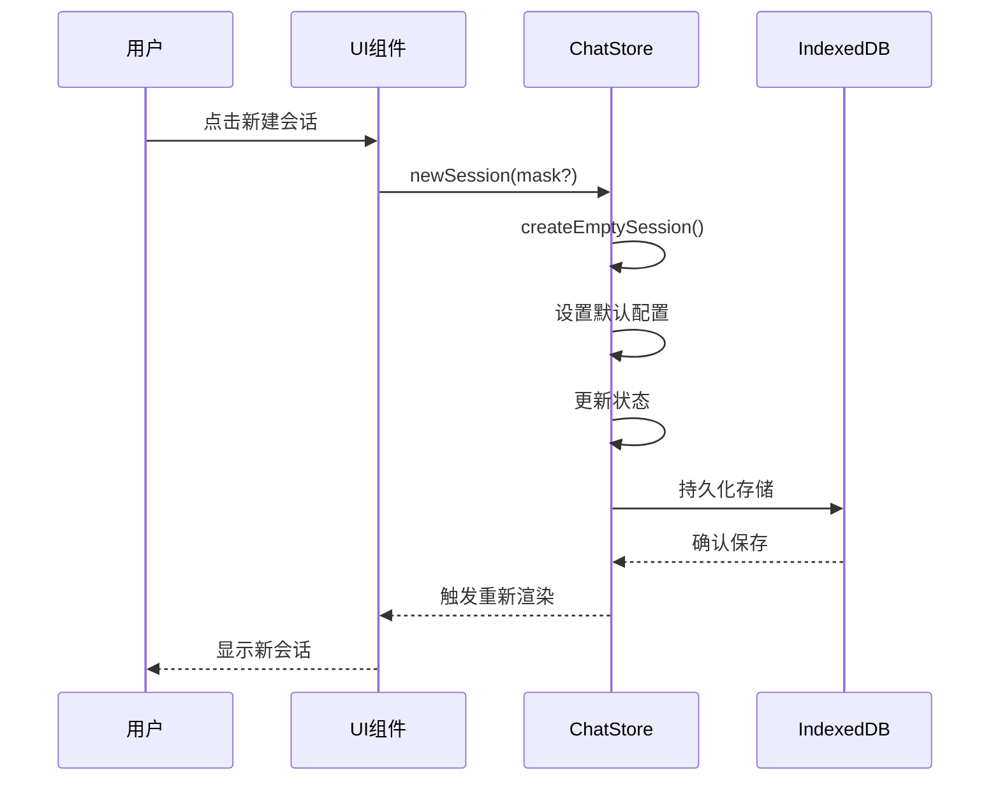
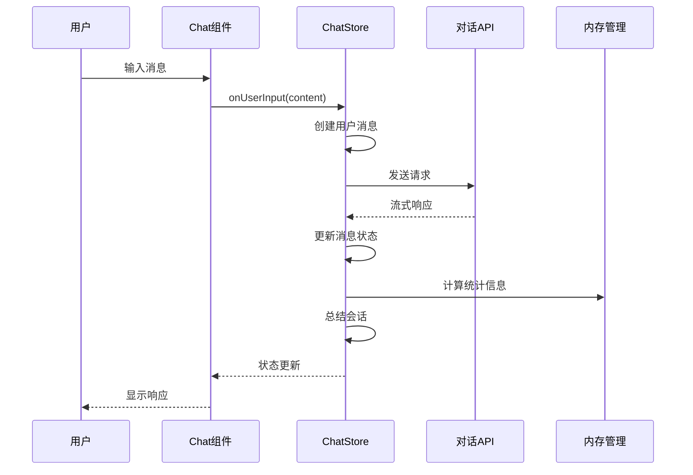
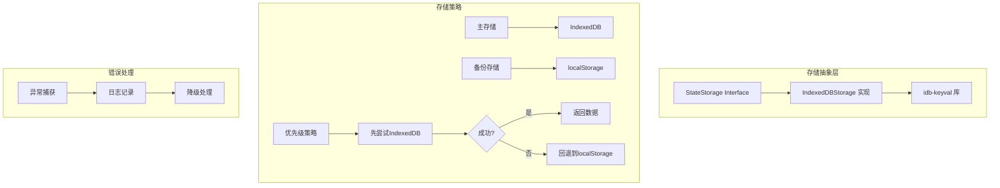
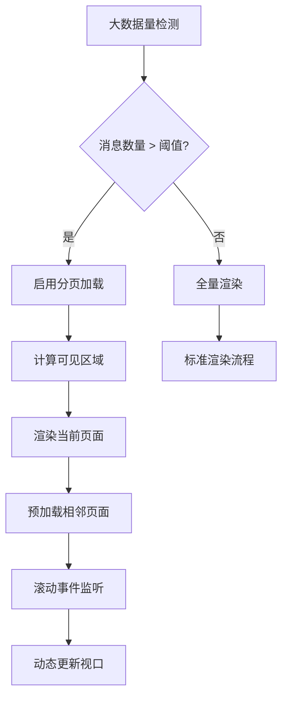
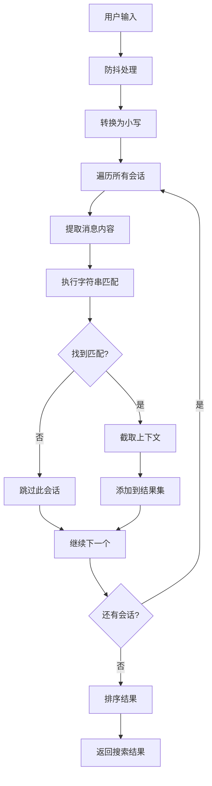
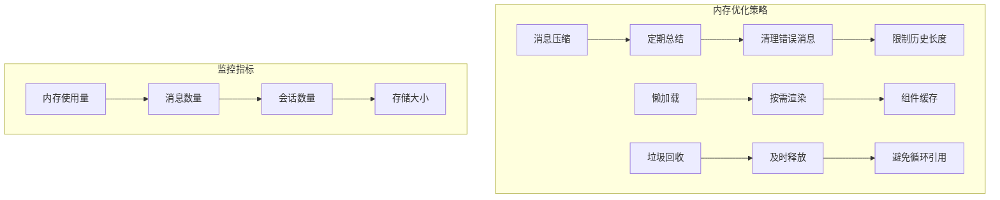
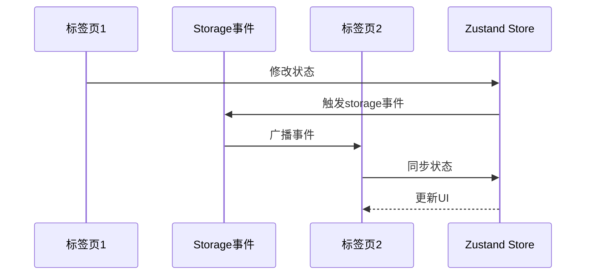

# 聊天历史管理系统全面文档

<cite>
**本文档引用的文件**
- [app/store/chat.ts](file://app/store/chat.ts)
- [app/store/index.ts](file://app/store/index.ts)
- [app/utils/indexedDB-storage.ts](file://app/utils/indexedDB-storage.ts)
- [app/utils/store.ts](file://app/utils/store.ts)
- [app/components/chat-list.tsx](file://app/components/chat-list.tsx)
- [app/components/home.tsx](file://app/components/home.tsx)
- [app/utils/chat.ts](file://app/utils/chat.ts)
- [app/components/search-chat.tsx](file://app/components/search-chat.tsx)
- [app/components/sidebar.tsx](file://app/components/sidebar.tsx)
- [app/constant.ts](file://app/constant.ts)
- [app/client/controller.ts](file://app/client/controller.ts)
- [app/utils/sync.ts](file://app/utils/sync.ts)
</cite>

## 目录
1. [系统概述](#系统概述)
2. [核心数据结构](#核心数据结构)
3. [状态管理架构](#状态管理架构)
4. [聊天会话生命周期](#聊天会话生命周期)
5. [持久化存储机制](#持久化存储机制)
6. [聊天列表渲染优化](#聊天列表渲染优化)
7. [搜索与过滤功能](#搜索与过滤功能)
8. [性能优化策略](#性能优化策略)
9. [跨组件状态同步](#跨组件状态同步)
10. [故障排除指南](#故障排除指南)
11. [总结](#总结)

## 系统概述

聊天历史管理系统是一个基于React和Zustand的状态管理解决方案，负责维护用户的聊天会话数据、消息历史记录以及相关的元信息。该系统采用现代化的前端架构，支持实时状态更新、持久化存储和高效的UI渲染。

### 主要特性

- **会话管理**：支持多会话并发处理，每个会话包含独立的消息历史
- **持久化存储**：基于IndexedDB的本地数据持久化，确保数据安全
- **实时状态同步**：通过Zustand实现跨组件的状态共享和更新
- **高性能渲染**：采用虚拟滚动和增量更新技术优化大型数据集显示
- **智能搜索**：提供全文搜索和模糊匹配功能
- **内存管理**：自动清理和压缩历史数据，防止内存泄漏

## 核心数据结构

### ChatSession 数据结构



**图表来源**
- [app/store/chat.ts](file://app/store/chat.ts#L84-L119)
- [app/store/chat.ts](file://app/store/chat.ts#L57-L76)

### 数据流架构



**图表来源**
- [app/utils/store.ts](file://app/utils/store.ts#L29-L78)
- [app/utils/indexedDB-storage.ts](file://app/utils/indexedDB-storage.ts#L7-L47)

**章节来源**
- [app/store/chat.ts](file://app/store/chat.ts#L84-L119)
- [app/store/chat.ts](file://app/store/chat.ts#L57-L76)

## 状态管理架构

### Zustand Store 设计

系统采用Zustand作为状态管理库，通过自定义的持久化中间件实现数据的持久化存储。



**图表来源**
- [app/utils/store.ts](file://app/utils/store.ts#L29-L78)
- [app/utils/indexedDB-storage.ts](file://app/utils/indexedDB-storage.ts#L7-L47)

### 状态管理方法

系统提供了完整的CRUD操作接口：

| 方法名 | 功能描述 | 参数 | 返回值 |
|--------|----------|------|--------|
| `newSession` | 创建新会话 | `mask?: Mask` | `void` |
| `deleteSession` | 删除指定会话 | `index: number` | `void` |
| `selectSession` | 切换到指定会话 | `index: number` | `void` |
| `moveSession` | 移动会话位置 | `from: number, to: number` | `void` |
| `updateMessage` | 更新消息内容 | `sessionIndex, messageIndex, updater` | `void` |
| `summarizeSession` | 总结会话内容 | `refreshTitle, targetSession` | `void` |

**章节来源**
- [app/store/chat.ts](file://app/store/chat.ts#L242-L384)
- [app/utils/store.ts](file://app/utils/store.ts#L29-L78)

## 聊天会话生命周期

### 会话创建流程



**图表来源**
- [app/store/chat.ts](file://app/store/chat.ts#L307-L327)

### 消息交互流程



**图表来源**
- [app/store/chat.ts](file://app/store/chat.ts#L407-L527)

### 会话删除与恢复

系统实现了撤销删除功能，允许用户在短时间内恢复误删的会话。

**章节来源**
- [app/store/chat.ts](file://app/store/chat.ts#L337-L378)
- [app/store/chat.ts](file://app/store/chat.ts#L407-L527)

## 持久化存储机制

### 存储架构设计



**图表来源**
- [app/utils/indexedDB-storage.ts](file://app/utils/indexedDB-storage.ts#L7-L47)

### 数据同步机制

系统支持跨标签页的数据同步，通过监听storage事件实现状态共享。

**章节来源**
- [app/utils/indexedDB-storage.ts](file://app/utils/indexedDB-storage.ts#L7-L47)
- [app/utils/sync.ts](file://app/utils/sync.ts#L1-L83)

## 聊天列表渲染优化

### 虚拟滚动实现

虽然当前代码中没有直接实现虚拟滚动，但系统已经为大数据量场景预留了优化空间：



### 渲染性能优化策略

| 优化技术 | 实现方式 | 性能提升 |
|----------|----------|----------|
| 增量更新 | 使用React.memo和useMemo | 减少不必要的重渲染 |
| 组件懒加载 | dynamic import | 降低初始包大小 |
| 事件委托 | 统一事件处理器 | 减少事件监听器数量 |
| 样式优化 | CSS-in-JS + 缓存 | 提升样式计算效率 |

**章节来源**
- [app/components/chat-list.tsx](file://app/components/chat-list.tsx#L105-L174)
- [app/components/sidebar.tsx](file://app/components/sidebar.tsx#L42-L44)

## 搜索与过滤功能

### 全文搜索算法



**图表来源**
- [app/components/search-chat.tsx](file://app/components/search-chat.tsx#L28-L67)

### 搜索结果排序

系统按照匹配内容的长度进行排序，确保最相关的搜索结果优先显示。

**章节来源**
- [app/components/search-chat.tsx](file://app/components/search-chat.tsx#L28-L67)

## 性能优化策略

### 内存管理机制



### 大数据量处理

对于包含大量消息的会话，系统实现了以下优化措施：

1. **智能摘要**：当消息超过阈值时自动创建摘要
2. **分页加载**：只加载当前可见区域的消息
3. **延迟计算**：使用useMemo和useCallback避免重复计算
4. **事件节流**：对频繁触发的操作进行节流处理

**章节来源**
- [app/store/chat.ts](file://app/store/chat.ts#L661-L796)
- [app/components/search-chat.tsx](file://app/components/search-chat.tsx#L28-L67)

## 跨组件状态同步

### 状态同步机制



**图表来源**
- [app/utils/sync.ts](file://app/utils/sync.ts#L1-L83)

### 状态合并策略

系统实现了智能的状态合并算法，确保不同标签页间的数据一致性：

| 合并类型 | 策略 | 适用场景 |
|----------|------|----------|
| 会话合并 | ID匹配 + 消息去重 | 新会话加入 |
| 消息追加 | 时间戳排序 | 新消息添加 |
| 配置同步 | 最新值覆盖 | 设置变更 |
| 删除处理 | 标记删除状态 | 会话删除 |

**章节来源**
- [app/utils/sync.ts](file://app/utils/sync.ts#L66-L83)

## 故障排除指南

### 常见问题及解决方案

| 问题类型 | 症状 | 可能原因 | 解决方案 |
|----------|------|----------|----------|
| 数据丢失 | 会话无法恢复 | IndexedDB损坏 | 清除浏览器缓存 |
| 加载缓慢 | 页面响应慢 | 消息过多 | 启用消息压缩 |
| 同步失败 | 多标签页不一致 | 浏览器设置限制 | 检查隐私设置 |
| 内存泄漏 | 页面卡顿 | 未正确清理 | 重启应用 |

### 调试工具

系统提供了丰富的调试信息：

```typescript
// 调试输出示例
console.log("[Chat History]", toBeSummarizedMsgs);
console.log("[Memory]", message);
console.log("[Global System Prompt]", systemPrompts.at(0)?.content);
```

**章节来源**
- [app/store/chat.ts](file://app/store/chat.ts#L751-L756)
- [app/store/chat.ts](file://app/store/chat.ts#L584-L587)

## 总结

聊天历史管理系统通过精心设计的架构实现了高效、可靠的状态管理。系统的核心优势包括：

1. **可靠的持久化存储**：基于IndexedDB的双重备份策略确保数据安全
2. **高性能渲染**：通过状态管理和优化策略实现流畅的用户体验
3. **智能内存管理**：自动压缩和清理机制防止内存泄漏
4. **跨组件同步**：完善的事件机制保证多标签页数据一致性
5. **可扩展架构**：模块化设计便于功能扩展和维护

该系统为现代Web应用提供了完整的聊天历史管理解决方案，能够满足各种规模的应用需求。通过持续的优化和改进，系统将继续为用户提供卓越的体验。