# 语音合成（TTS）技术实现深度解析

<cite>
**本文档引用的文件**
- [tts-config.tsx](file://app/components/tts-config.tsx)
- [audio.ts](file://app/lib/audio.ts)
- [ms_edge_tts.ts](file://app/utils/ms_edge_tts.ts)
- [audio.ts](file://app/utils/audio.ts)
- [config.ts](file://app/store/config.ts)
- [constant.ts](file://app/constant.ts)
- [chat.tsx](file://app/components/chat.tsx)
- [en.ts](file://app/locales/en.ts)
- [cn.ts](file://app/locales/cn.ts)
</cite>

## 目录
1. [概述](#概述)
2. [系统架构](#系统架构)
3. [核心组件分析](#核心组件分析)
4. [TTS引擎集成](#tts引擎集成)
5. [音频处理与播放](#音频处理与播放)
6. [配置管理系统](#配置管理系统)
7. [语音合成流程](#语音合成流程)
8. [性能优化与错误处理](#性能优化与错误处理)
9. [兼容性与最佳实践](#兼容性与最佳实践)
10. [故障排除指南](#故障排除指南)

## 概述

ChatGPT Next Web的语音合成（TTS）功能提供了强大的文本转语音能力，支持多种TTS引擎和音频格式。系统采用模块化设计，集成了微软Edge TTS和OpenAI TTS两大引擎，通过WebSocket协议实现实时音频流传输，并提供了完整的音频播放控制机制。

### 主要特性
- **多引擎支持**：同时支持微软Edge TTS和OpenAI TTS
- **实时流式传输**：基于WebSocket的实时音频流处理
- **灵活配置**：支持语速、音色、语言等参数调节
- **高质量音频**：支持多种音频格式和采样率
- **播放控制**：完整的音频播放生命周期管理

## 系统架构

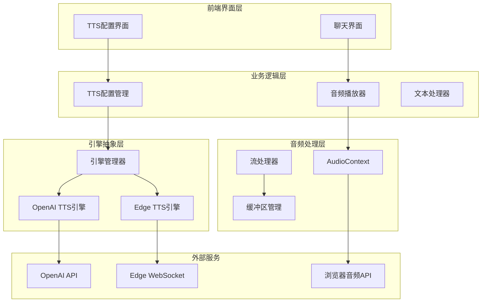

**图表来源**
- [tts-config.tsx](file://app/components/tts-config.tsx#L1-L134)
- [audio.ts](file://app/lib/audio.ts#L1-L201)
- [ms_edge_tts.ts](file://app/utils/ms_edge_tts.ts#L119-L391)

## 核心组件分析

### TTS配置组件（tts-config）

TTS配置组件提供了用户友好的界面来管理语音合成的各种参数，支持动态切换不同的TTS引擎和配置选项。

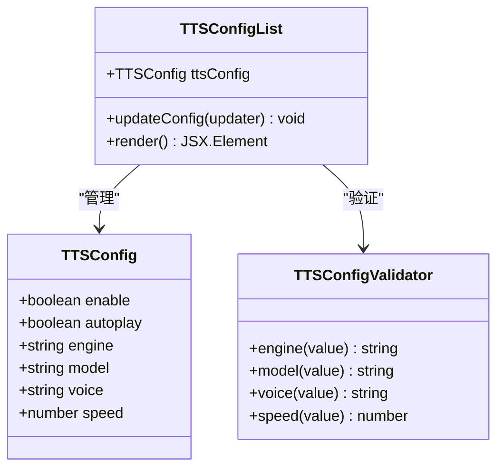

**图表来源**
- [tts-config.tsx](file://app/components/tts-config.tsx#L13-L133)
- [config.ts](file://app/store/config.ts#L86-L93)

**章节来源**
- [tts-config.tsx](file://app/components/tts-config.tsx#L1-L134)
- [config.ts](file://app/store/config.ts#L86-L93)

### 音频处理核心模块（audio.ts）

音频处理模块封装了复杂的Web Audio API操作，提供了简洁的接口来处理音频流和播放控制。

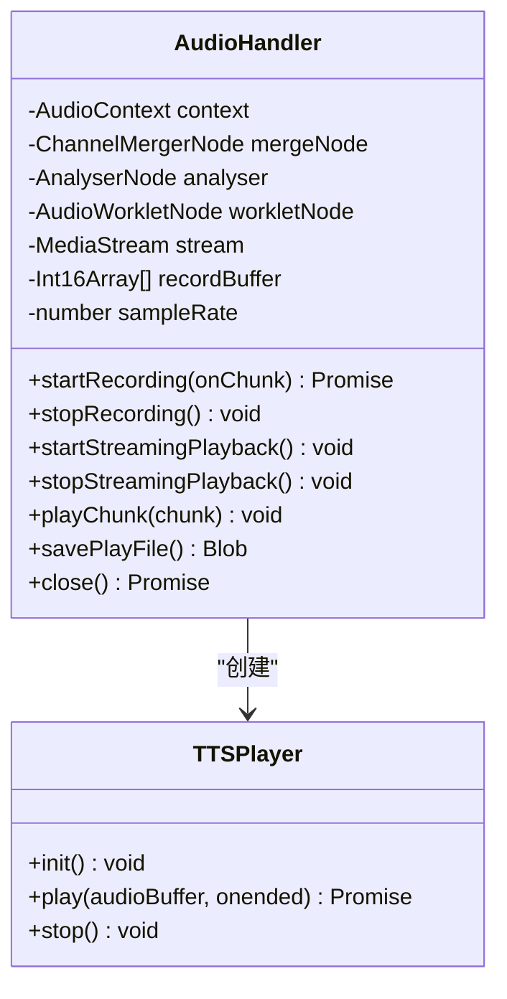

**图表来源**
- [audio.ts](file://app/lib/audio.ts#L1-L201)
- [audio.ts](file://app/utils/audio.ts#L1-L46)

**章节来源**
- [audio.ts](file://app/lib/audio.ts#L1-L201)
- [audio.ts](file://app/utils/audio.ts#L1-L46)

## TTS引擎集成

### 微软Edge TTS引擎

微软Edge TTS引擎通过WebSocket协议实现实时音频合成，支持丰富的语音参数配置和高质量的音频输出。

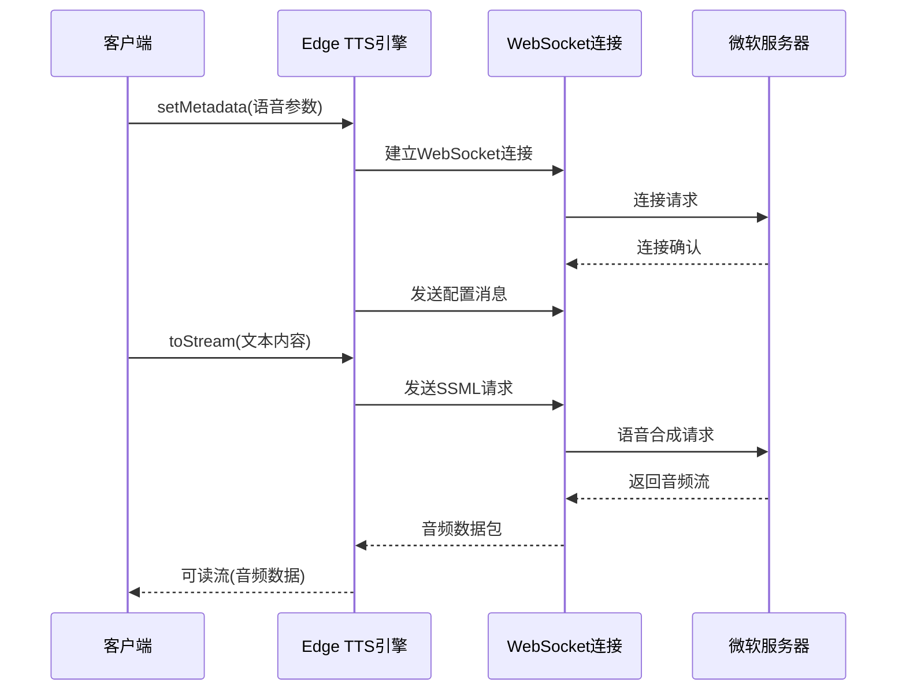

**图表来源**
- [ms_edge_tts.ts](file://app/utils/ms_edge_tts.ts#L161-L224)
- [ms_edge_tts.ts](file://app/utils/ms_edge_tts.ts#L334-L337)

**章节来源**
- [ms_edge_tts.ts](file://app/utils/ms_edge_tts.ts#L119-L391)

### OpenAI TTS引擎

OpenAI TTS引擎通过REST API提供语音合成服务，支持多种语音模型和音频格式。

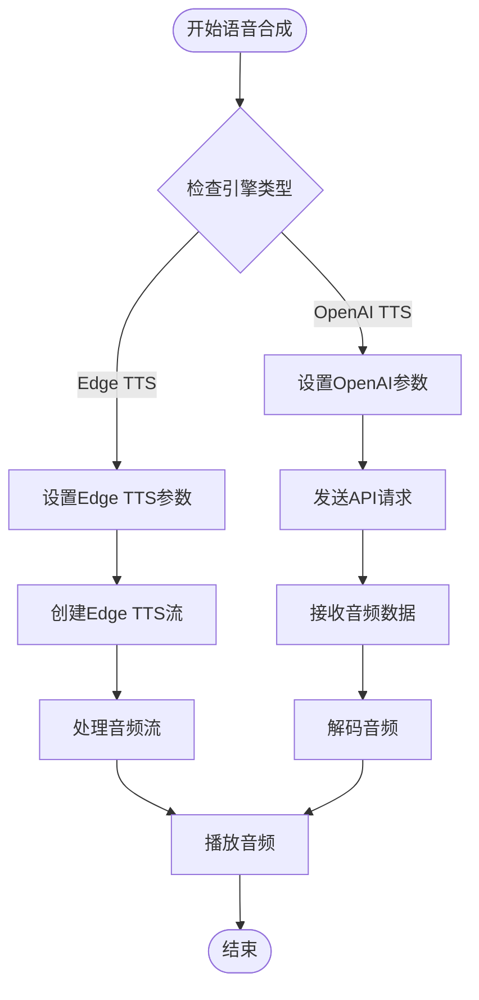

**图表来源**
- [chat.tsx](file://app/components/chat.tsx#L1303-L1317)

**章节来源**
- [chat.tsx](file://app/components/chat.tsx#L1303-L1330)

## 音频处理与播放

### 流式音频处理

系统实现了高效的流式音频处理机制，支持实时音频数据的接收、解码和播放。

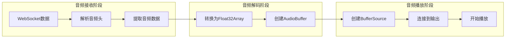

**图表来源**
- [audio.ts](file://app/lib/audio.ts#L109-L150)

### 音频播放控制

音频播放器提供了完整的播放控制功能，包括暂停、恢复、音量调节等操作。

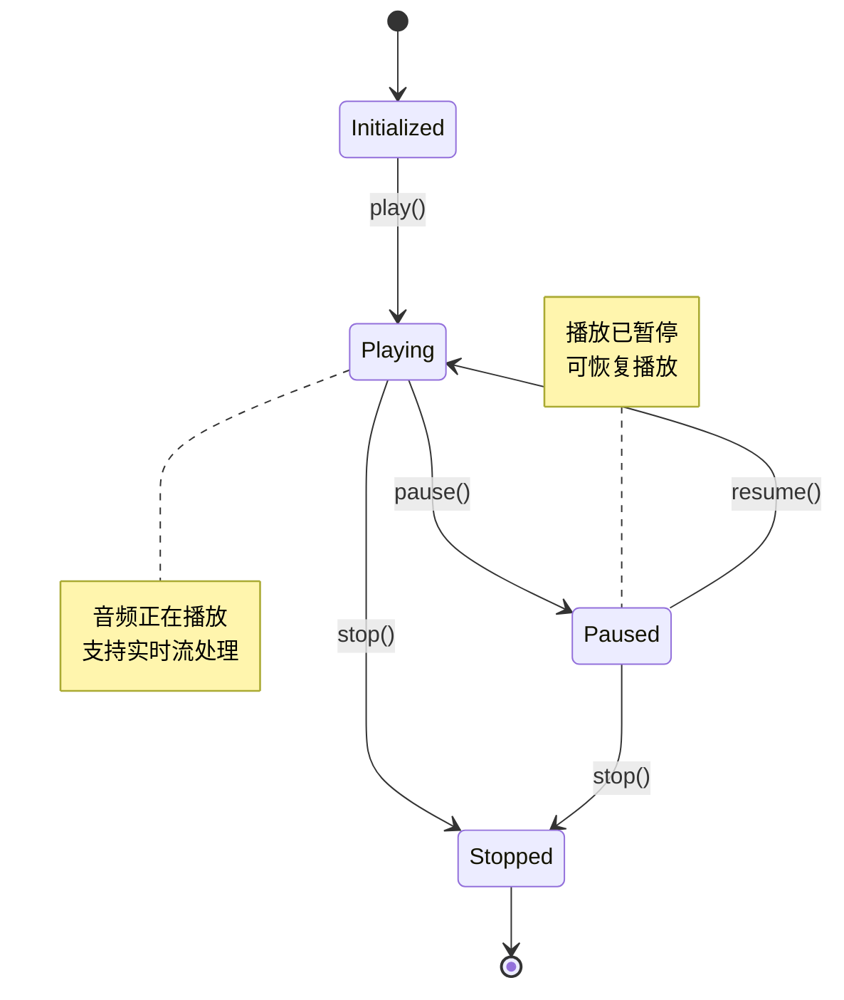

**图表来源**
- [audio.ts](file://app/lib/audio.ts#L109-L150)

**章节来源**
- [audio.ts](file://app/lib/audio.ts#L109-L150)

## 配置管理系统

### TTS配置结构

TTS配置通过类型安全的方式管理所有语音合成相关的参数。

| 配置项 | 类型 | 默认值 | 描述 |
|--------|------|--------|------|
| enable | boolean | false | 是否启用TTS功能 |
| autoplay | boolean | false | 是否自动播放语音 |
| engine | string | "OpenAI-TTS" | 使用的TTS引擎 |
| model | string | "tts-1" | TTS模型名称 |
| voice | string | "alloy" | 预设语音角色 |
| speed | number | 1.0 | 语音播放速度 |

**章节来源**
- [config.ts](file://app/store/config.ts#L86-L93)
- [constant.ts](file://app/constant.ts#L464-L476)

### 配置验证机制

系统提供了完善的配置验证机制，确保用户输入的有效性和一致性。

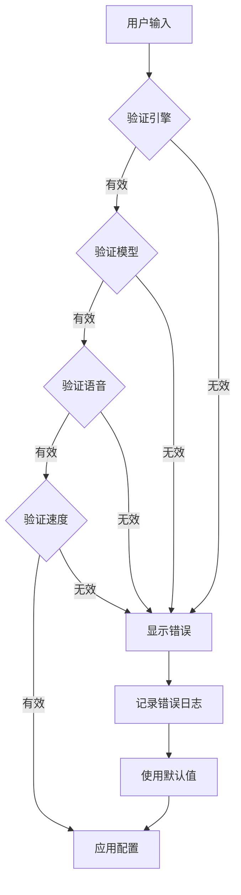

**图表来源**
- [config.ts](file://app/store/config.ts#L128-L141)

**章节来源**
- [config.ts](file://app/store/config.ts#L128-L141)

## 语音合成流程

### 完整处理流程

从文本输入到语音播放的完整流程展示了系统的整体架构和各组件间的协作关系。

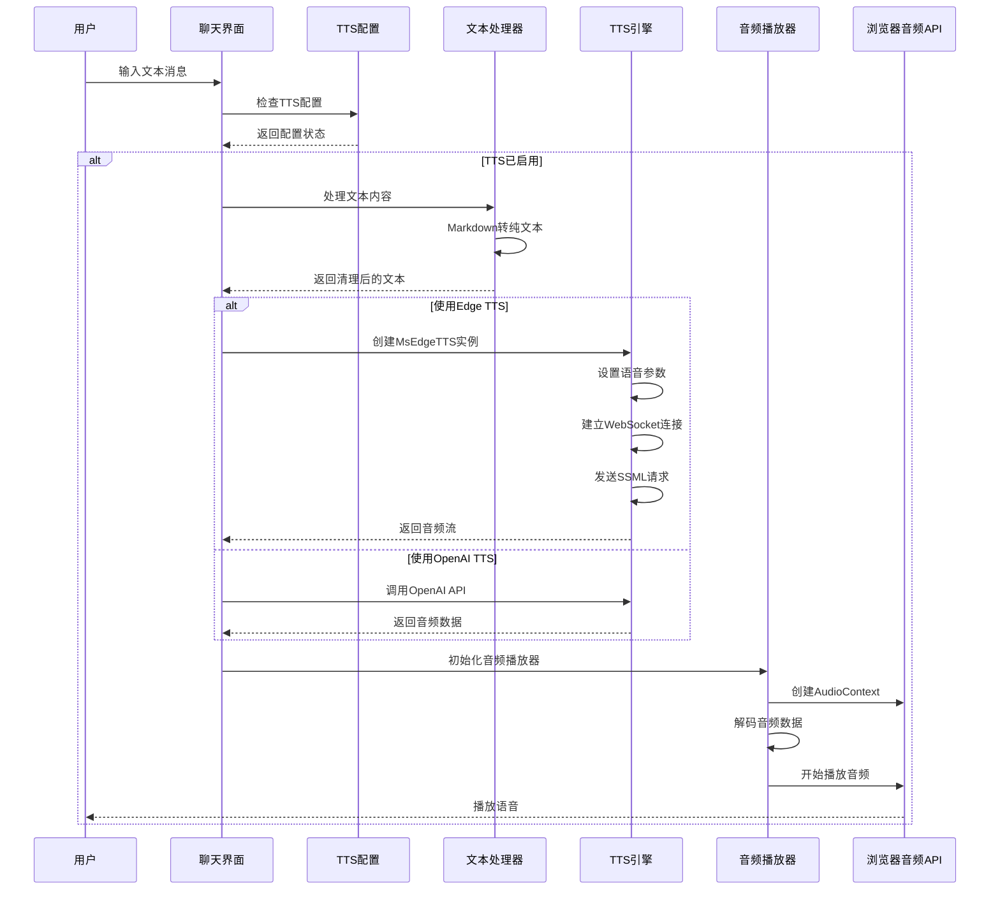

**图表来源**
- [chat.tsx](file://app/components/chat.tsx#L1300-L1330)

**章节来源**
- [chat.tsx](file://app/components/chat.tsx#L1300-L1330)

### 文本预处理机制

系统实现了智能的文本预处理机制，确保语音合成的质量和准确性。

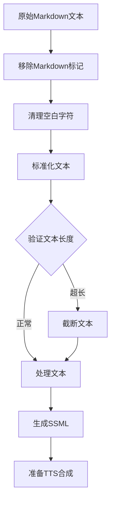

**图表来源**
- [chat.tsx](file://app/components/chat.tsx#L1300-L1302)

**章节来源**
- [chat.tsx](file://app/components/chat.tsx#L1300-L1302)

## 性能优化与错误处理

### 网络优化策略

系统采用了多种网络优化策略来提升TTS服务的响应速度和稳定性。

| 优化策略 | 实现方式 | 效果 |
|----------|----------|------|
| 连接复用 | WebSocket长连接 | 减少连接建立开销 |
| 请求合并 | 批量处理语音请求 | 降低网络延迟 |
| 缓存机制 | 语音片段缓存 | 减少重复请求 |
| 错误重试 | 指数退避算法 | 提高成功率 |

### 错误处理机制

系统实现了完善的错误处理机制，能够优雅地处理各种异常情况。

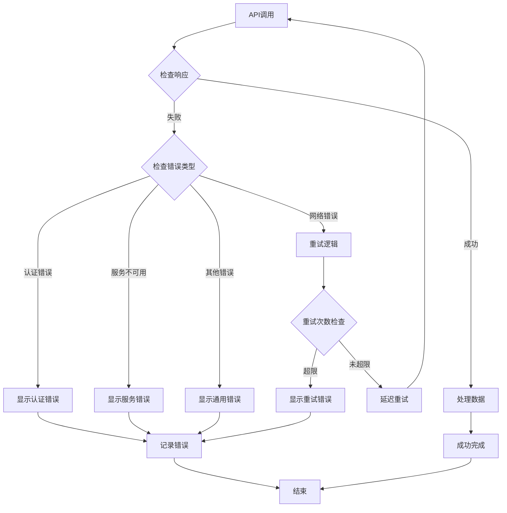

**图表来源**
- [ms_edge_tts.ts](file://app/utils/ms_edge_tts.ts#L150-L159)

**章节来源**
- [ms_edge_tts.ts](file://app/utils/ms_edge_tts.ts#L150-L159)

## 兼容性与最佳实践

### 浏览器兼容性

系统针对不同浏览器环境进行了充分的兼容性测试和优化。

| 功能特性 | Chrome | Firefox | Safari | Edge |
|----------|--------|---------|--------|------|
| WebSocket支持 | ✅ | ✅ | ✅ | ✅ |
| Web Audio API | ✅ | ✅ | ✅ | ✅ |
| Audio Worklet | ✅ | ❌ | ✅ | ✅ |
| 流式音频处理 | ✅ | ✅ | ✅ | ✅ |

### 最佳实践建议

1. **性能优化**
   - 合理设置音频采样率（推荐24kHz）
   - 使用适当的音频格式（MP3或Opus）
   - 实施音频缓存策略

2. **用户体验**
   - 提供清晰的TTS状态指示
   - 支持语音播放控制（暂停、停止）
   - 实现语音进度反馈

3. **错误处理**
   - 实施渐进式降级策略
   - 提供详细的错误信息
   - 实现自动重试机制

**章节来源**
- [audio.ts](file://app/lib/audio.ts#L1-L201)
- [ms_edge_tts.ts](file://app/utils/ms_edge_tts.ts#L1-L391)

## 故障排除指南

### 常见问题及解决方案

| 问题类型 | 症状 | 可能原因 | 解决方案 |
|----------|------|----------|----------|
| TTS不工作 | 点击朗读无声音 | TTS配置未启用 | 检查TTS开关设置 |
| 音频质量差 | 声音模糊或失真 | 音频格式不匹配 | 调整输出格式设置 |
| 连接超时 | 语音合成请求失败 | 网络连接问题 | 检查网络连接状态 |
| 引擎切换失败 | 切换TTS引擎报错 | API密钥无效 | 验证API密钥配置 |

### 调试工具和方法

1. **开发者工具**
   - 使用浏览器开发者工具监控网络请求
   - 检查WebSocket连接状态
   - 监控音频播放事件

2. **日志分析**
   - 启用详细日志记录
   - 分析错误堆栈信息
   - 跟踪音频处理流程

3. **性能监控**
   - 监控内存使用情况
   - 检查CPU占用率
   - 分析网络延迟

**章节来源**
- [ms_edge_tts.ts](file://app/utils/ms_edge_tts.ts#L134-L138)
- [audio.ts](file://app/lib/audio.ts#L1-L201)

## 结论

ChatGPT Next Web的语音合成系统通过模块化设计和多引擎支持，为用户提供了强大而灵活的文本转语音功能。系统不仅支持高质量的语音合成，还提供了完善的配置管理和错误处理机制，确保了良好的用户体验和系统稳定性。

通过本文档的详细分析，开发者可以深入理解系统的架构设计和实现细节，为后续的功能扩展和优化提供参考。系统的开放性和可扩展性也为未来集成更多TTS引擎和服务提供商奠定了坚实的基础。