# 测试策略

<cite>
**本文档中引用的文件**
- [jest.config.ts](file://jest.config.ts)
- [jest.setup.ts](file://jest.setup.ts)
- [package.json](file://package.json)
- [test/model-available.test.ts](file://test/model-available.test.ts)
- [test/model-provider.test.ts](file://test/model-provider.test.ts)
- [test/sum-module.test.ts](file://test/sum-module.test.ts)
- [test/vision-model-checker.test.ts](file://test/vision-model-checker.test.ts)
- [app/client/api.ts](file://app/client/api.ts)
- [app/utils/model.ts](file://app/utils/model.ts)
- [app/utils/chat.ts](file://app/utils/chat.ts)
- [app/utils/store.ts](file://app/utils/store.ts)
- [app/utils/sync.ts](file://app/utils/sync.ts)
</cite>

## 目录
1. [概述](#概述)
2. [测试框架配置](#测试框架配置)
3. [测试环境搭建](#测试环境搭建)
4. [现有测试用例分析](#现有测试用例分析)
5. [核心业务逻辑测试](#核心业务逻辑测试)
6. [模拟对象使用](#模拟对象使用)
7. [覆盖率报告生成](#覆盖率报告生成)
8. [测试套件运行指南](#测试套件运行指南)
9. [调试失败用例](#调试失败用例)
10. [持续集成集成](#持续集成集成)
11. [最佳实践建议](#最佳实践建议)

## 概述

本项目采用基于Jest的单元测试框架，为ChatGPT-Next-Web应用提供全面的测试覆盖。测试策略涵盖了API客户端、状态管理器、工具函数等核心业务逻辑，确保代码质量和系统稳定性。

### 测试架构特点

- **基于Jest的现代测试框架**：利用Jest的强大功能进行单元测试
- **TypeScript支持**：完全支持TypeScript类型检查和测试
- **ES模块兼容**：支持ESM模块格式的测试
- **覆盖率报告**：自动生成代码覆盖率报告
- **模拟对象支持**：强大的mock和spy功能

## 测试框架配置

### Jest配置详解

项目使用专门针对Next.js应用优化的Jest配置，通过`next/jest`插件实现最佳兼容性。

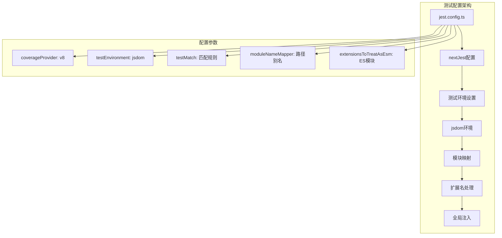

**图表来源**
- [jest.config.ts](file://jest.config.ts#L1-L23)

### 核心配置参数

| 配置项 | 值 | 说明 |
|--------|-----|------|
| `coverageProvider` | `"v8"` | 使用V8引擎生成覆盖率报告 |
| `testEnvironment` | `"jsdom"` | 在DOM环境中运行测试 |
| `testMatch` | `["**/*.test.js", "**/*.test.ts", "**/*.test.jsx", "**/*.test.tsx"]` | 测试文件匹配模式 |
| `moduleNameMapper` | `{ "^@/(.*)$": "<rootDir>/$1" }` | 支持路径别名映射 |
| `extensionsToTreatAsEsm` | `[ ".ts", ".tsx" ]` | 处理ES模块扩展名 |

**章节来源**
- [jest.config.ts](file://jest.config.ts#L9-L20)

## 测试环境搭建

### 全局设置配置

测试环境通过`jest.setup.ts`文件进行全局配置，主要包含以下内容：

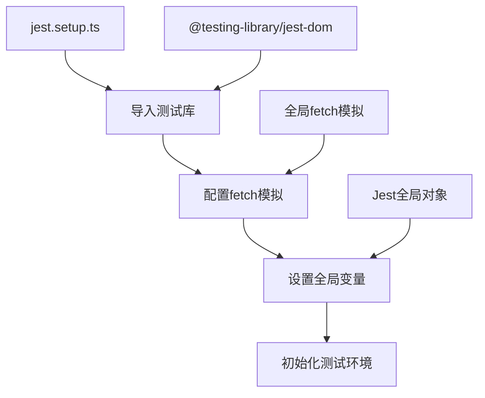

**图表来源**
- [jest.setup.ts](file://jest.setup.ts#L1-L22)

### 关键设置内容

1. **DOM匹配器库**：引入`@testing-library/jest-dom`提供丰富的断言方法
2. **全局fetch模拟**：为所有API请求提供默认响应
3. **Jest全局对象**：访问Jest的核心功能

**章节来源**
- [jest.setup.ts](file://jest.setup.ts#L1-L22)

## 现有测试用例分析

### 测试用例结构模式

项目中的测试用例遵循标准的Jest测试模式，每个测试文件都包含明确的描述和断言逻辑。

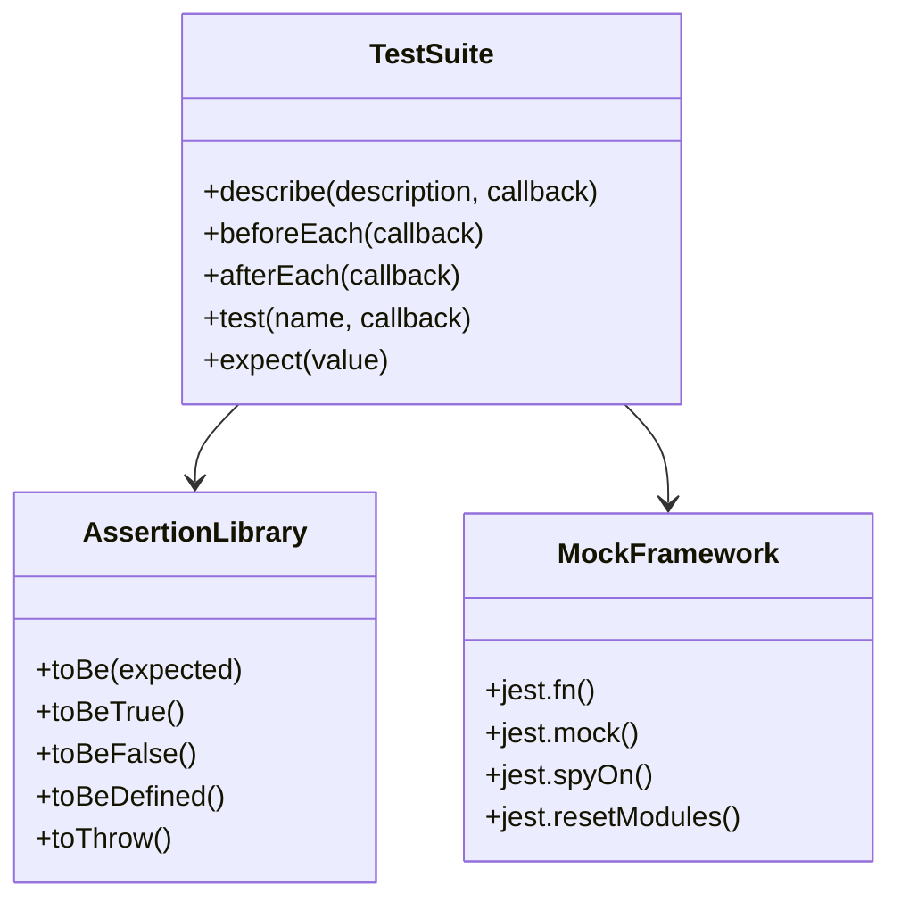

**图表来源**
- [test/model-available.test.ts](file://test/model-available.test.ts#L1-L81)
- [test/model-provider.test.ts](file://test/model-provider.test.ts#L1-L32)

### 核心测试用例分析

#### 1. 模型可用性检查测试

测试`isModelNotavailableInServer`函数的各种场景：

- 基础可用性检查
- 自定义模型禁用场景
- 环境变量影响测试
- 多提供者支持测试
- 大小写敏感性测试

#### 2. 模型提供者解析测试

测试`getModelProvider`函数的字符串解析能力：

- 基础@符号分割
- 无@符号情况处理
- 多@字符正确处理
- 空字符串输入处理

#### 3. 视觉模型识别测试

测试`isVisionModel`函数的视觉模型识别逻辑：

- 正确识别已知视觉模型
- 排除特定模型测试
- 环境变量配置测试
- 边界条件处理

**章节来源**
- [test/model-available.test.ts](file://test/model-available.test.ts#L1-L81)
- [test/model-provider.test.ts](file://test/model-provider.test.ts#L1-L32)
- [test/vision-model-checker.test.ts](file://test/vision-model-checker.test.ts#L1-L69)

## 核心业务逻辑测试

### API客户端测试策略

#### ClientApi类测试

API客户端是系统的核心组件，需要测试其构造、配置和各种操作方法。

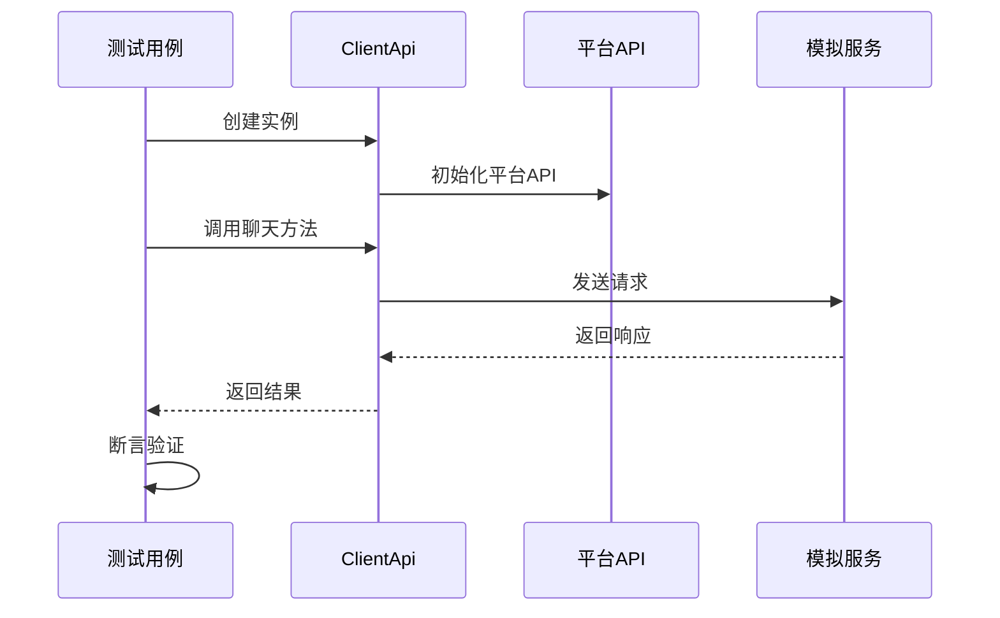

**图表来源**
- [app/client/api.ts](file://app/client/api.ts#L136-L182)

#### 关键测试场景

1. **构造函数测试**：验证不同提供者类型的正确初始化
2. **请求头生成测试**：测试认证和授权头部的正确生成
3. **错误处理测试**：验证异常情况下的错误处理
4. **共享功能测试**：测试对话分享功能

### 状态管理器测试

#### Zustand存储测试

状态管理器使用Zustand库，需要测试状态的持久化、更新和同步机制。

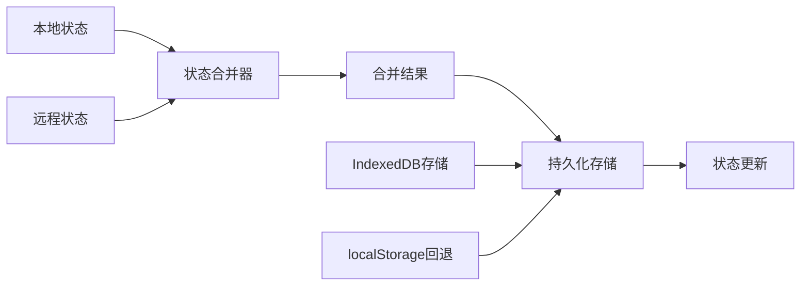

**图表来源**
- [app/utils/store.ts](file://app/utils/store.ts#L29-L51)
- [app/utils/sync.ts](file://app/utils/sync.ts#L65-L146)

#### 测试重点

1. **状态持久化测试**：验证数据在页面刷新后的保持
2. **跨设备同步测试**：测试多设备间的状态同步
3. **冲突解决测试**：验证状态合并时的冲突处理
4. **存储回退测试**：测试IndexedDB不可用时的localStorage回退

### 工具函数测试

#### 模型相关工具函数

模型相关的工具函数需要测试复杂的业务逻辑和边界条件。

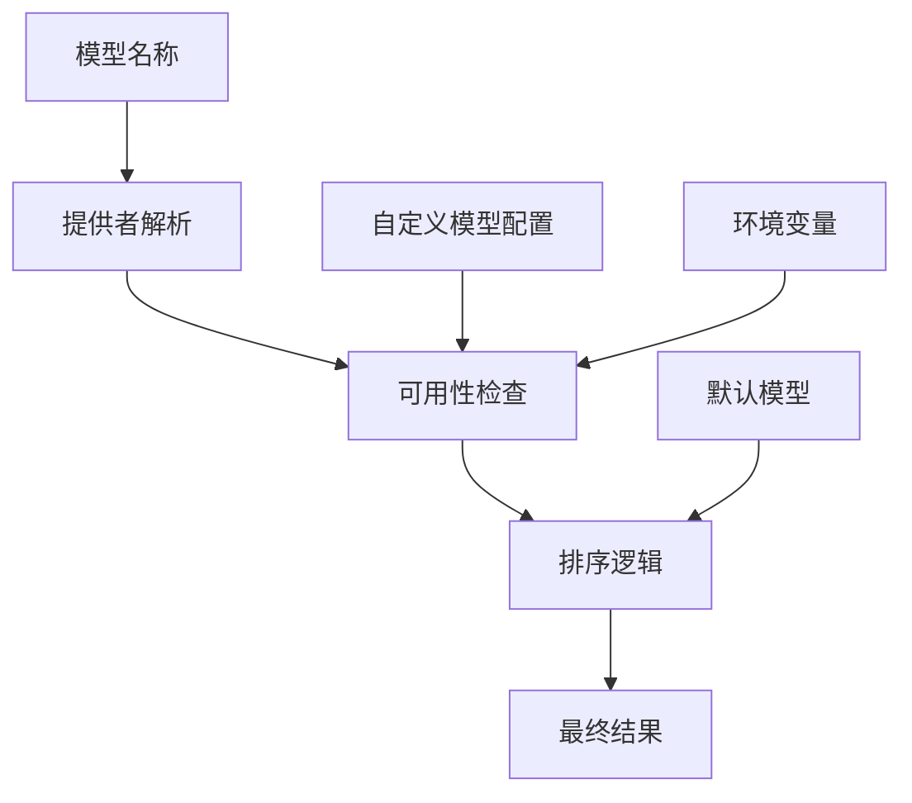

**图表来源**
- [app/utils/model.ts](file://app/utils/model.ts#L46-L259)

#### 关键测试函数

1. **collectModelTable**：测试模型表的构建逻辑
2. **isModelNotavailableInServer**：测试模型可用性判断
3. **getModelProvider**：测试提供者解析
4. **sortModelTable**：测试模型排序算法

**章节来源**
- [app/client/api.ts](file://app/client/api.ts#L1-L400)
- [app/utils/model.ts](file://app/utils/model.ts#L1-L259)

## 模拟对象使用

### Jest模拟功能

项目充分利用Jest的模拟功能来隔离测试依赖，提高测试的可靠性和速度。

#### 主要模拟技术

1. **函数模拟**：使用`jest.fn()`创建可控制的函数模拟
2. **模块模拟**：使用`jest.mock()`模拟整个模块
3. **方法监控**：使用`jest.spyOn()`监控方法调用
4. **模块重置**：使用`jest.resetModules()`清理模块缓存

### 模拟对象应用场景

#### 1. API请求模拟

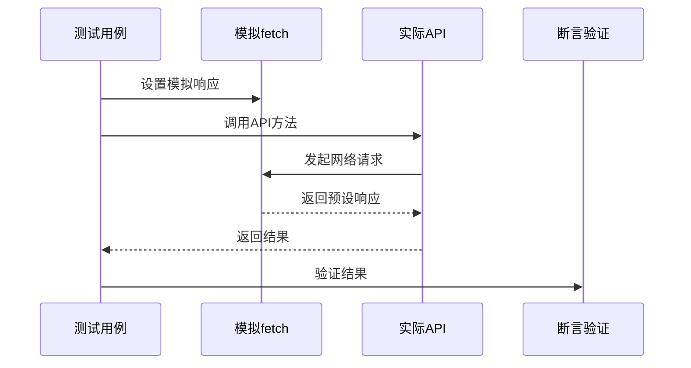

#### 2. 环境变量模拟

测试过程中经常需要模拟不同的环境变量配置：

- `DISABLE_GPT4`：禁用GPT-4模型测试
- `VISION_MODELS`：自定义视觉模型列表
- 访问控制相关的环境变量

#### 3. 时间和定时器模拟

使用`jest.useFakeTimers()`来控制时间相关的测试：

- 异步操作的时序控制
- 定时器的提前触发
- 超时处理的测试

**章节来源**
- [test/vision-model-checker.test.ts](file://test/vision-model-checker.test.ts#L5-L14)

## 覆盖率报告生成

### 覆盖率配置

项目使用V8引擎生成覆盖率报告，提供详细的代码执行统计。

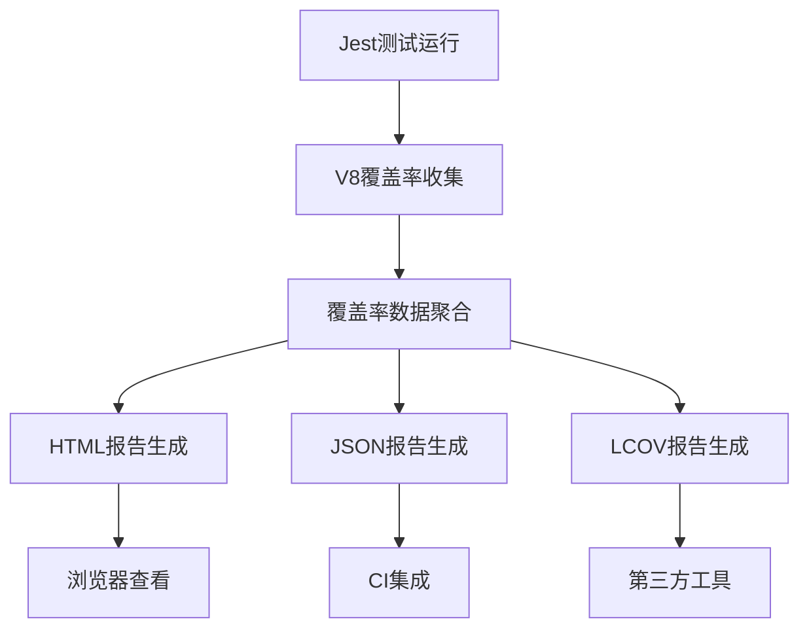

### 覆盖率指标

| 指标类型 | 目标要求 | 说明 |
|----------|----------|------|
| 行覆盖率 | >80% | 执行的代码行比例 |
| 函数覆盖率 | >80% | 调用的函数比例 |
| 分支覆盖率 | >70% | 执行的分支比例 |
| 语句覆盖率 | >80% | 执行的语句比例 |

### 覆盖率分析工具

1. **HTML报告**：交互式网页形式展示覆盖率详情
2. **命令行输出**：简洁的文本格式覆盖率信息
3. **CI集成**：与持续集成系统无缝对接
4. **阈值检查**：自动检查覆盖率是否达标

## 测试套件运行指南

### 命令行操作

项目提供了多种测试运行方式以适应不同的开发需求。

#### 基本测试命令

```bash
# 开发模式：监视文件变化并自动重新运行测试
yarn test

# CI模式：一次性运行所有测试（不监视文件变化）
yarn test:ci

# 单独运行特定测试文件
yarn test test/model-available.test.ts
```

#### 测试选项

| 选项 | 功能 | 使用场景 |
|------|------|----------|
| `--watch` | 文件监视模式 | 开发过程中的实时测试 |
| `--coverage` | 生成覆盖率报告 | 代码质量评估 |
| `--verbose` | 详细输出 | 调试测试问题 |
| `--testNamePattern` | 运行特定测试 | 快速定位问题 |

### 测试运行流程

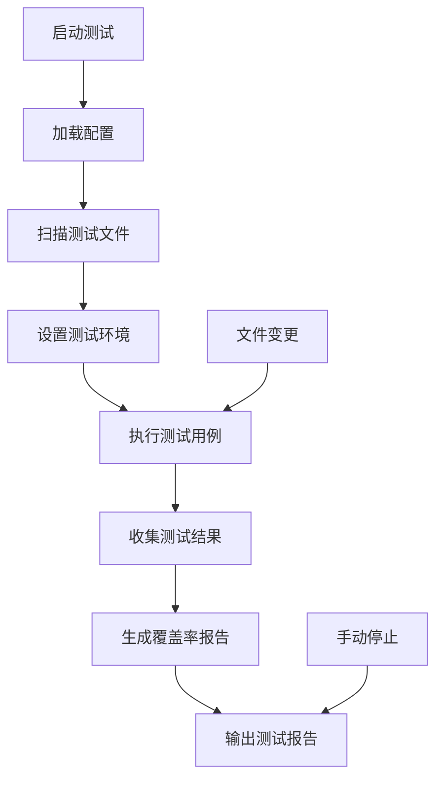

### 性能优化建议

1. **并行测试**：利用Jest的并行执行能力加速测试
2. **测试分组**：根据依赖关系合理组织测试文件
3. **模拟优化**：避免过度模拟减少测试复杂度
4. **资源清理**：及时清理测试产生的临时资源

**章节来源**
- [package.json](file://package.json#L18-L21)

## 调试失败用例

### 常见测试失败原因

#### 1. 异步操作问题

异步测试失败通常是由于Promise处理不当或超时设置不合理。

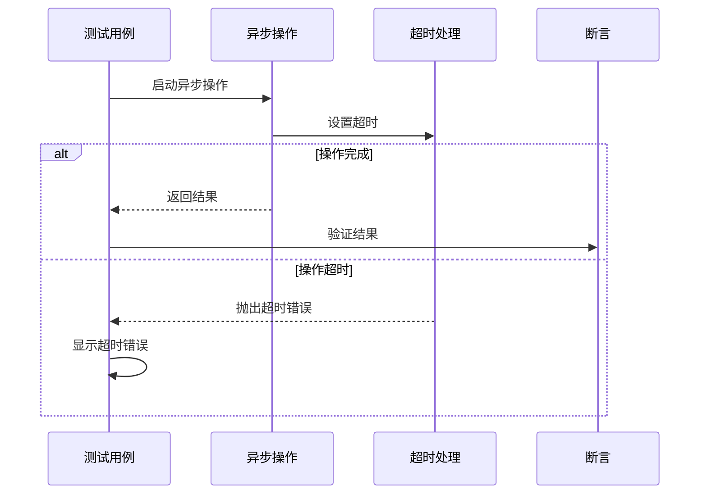

#### 2. 模拟对象配置错误

模拟对象的配置错误会导致测试无法正确执行。

#### 3. 环境依赖问题

测试环境中的外部依赖（如网络请求、数据库连接）可能导致测试不稳定。

### 调试步骤

#### 1. 启用详细输出

```bash
# 使用verbose选项获取详细信息
yarn test --verbose

# 查看特定测试的详细输出
yarn test --testNamePattern="失败的测试名称" --verbose
```

#### 2. 单独运行失败的测试

```bash
# 只运行特定的测试文件
yarn test test/失败的测试文件.test.ts

# 使用调试模式运行
node --inspect-brk $(yarn bin jest) --runInBand test/失败的测试文件.test.ts
```

#### 3. 检查模拟对象配置

```typescript
// 在测试中添加调试信息
console.log('模拟对象状态:', mockObject.mock);
console.log('函数调用次数:', mockFunction.mock.calls.length);
```

#### 4. 环境变量检查

```bash
# 检查当前环境变量
printenv | grep -E "(DISABLE_GPT4|VISION_MODELS)"

# 设置临时环境变量
export DISABLE_GPT4=1
yarn test
```

### 调试工具推荐

1. **Chrome DevTools**：配合`--inspect-brk`使用进行断点调试
2. **VS Code调试器**：图形化界面调试测试代码
3. **测试日志**：在测试中添加详细的日志输出
4. **覆盖率分析**：检查未执行的代码路径

## 持续集成集成

### CI/CD流水线集成

项目可以轻松集成到各种持续集成平台，实现自动化测试。

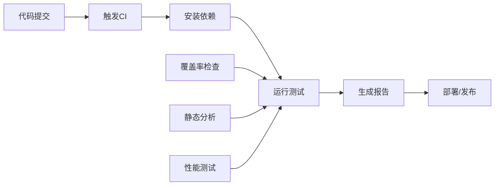

### CI配置示例

#### GitHub Actions配置

```yaml
name: 测试
on: [push, pull_request]
jobs:
  test:
    runs-on: ubuntu-latest
    steps:
      - uses: actions/checkout@v2
      - uses: actions/setup-node@v2
        with:
          node-version: '18'
      - run: yarn install
      - run: yarn test:ci
      - name: 上传覆盖率报告
        uses: codecov/codecov-action@v1
```

#### GitLab CI配置

```yaml
stages:
  - test

test:
  stage: test
  image: node:18
  script:
    - yarn install
    - yarn test:ci
  coverage: '/All files[^|]*\s*\|[^|]*\s+(\d+\%)$/'
  artifacts:
    reports:
      junit: test-results.xml
      coverage_report:
        coverage_format: cobertura
        path: coverage/cobertura-coverage.xml
```

### 质量门控

#### 覆盖率阈值设置

```javascript
// jest.config.js中的覆盖率配置
module.exports = {
  coverageThreshold: {
    global: {
      branches: 70,
      functions: 80,
      lines: 80,
      statements: 80
    }
  }
};
```

#### 测试失败处理

1. **立即失败**：任何测试失败都阻止部署
2. **覆盖率不足**：覆盖率低于阈值时标记警告
3. **性能回归**：检测测试执行时间的显著增加

### 自动化报告

1. **测试结果通知**：测试失败时发送通知
2. **覆盖率趋势**：跟踪覆盖率的变化趋势
3. **测试性能监控**：监控测试执行时间的变化
4. **代码质量指标**：集成静态分析工具

## 最佳实践建议

### 测试设计原则

#### 1. AAA模式（Arrange-Act-Assert）

每个测试用例都应该遵循"准备-执行-断言"的结构：

```typescript
// Arrange - 准备测试数据和环境
const input = "测试输入";
const expectedResult = "预期结果";

// Act - 执行被测试的代码
const result = functionUnderTest(input);

// Assert - 验证结果是否符合预期
expect(result).toBe(expectedResult);
```

#### 2. 测试命名规范

测试用例的命名应该清晰表达测试意图：

```typescript
describe('isModelNotavailableInServer', () => {
  test('should return false for available models', () => {
    // 测试可用模型的情况
  });
  
  test('should return true when model is disabled', () => {
    // 测试禁用模型的情况
  });
});
```

#### 3. 测试隔离原则

每个测试用例应该是独立的，不依赖其他测试的状态：

```typescript
describe('模型可用性测试', () => {
  beforeEach(() => {
    // 每个测试前重置环境
    jest.resetModules();
    process.env = { ...originalEnv };
  });
  
  afterEach(() => {
    // 清理测试产生的副作用
    process.env = originalEnv;
  });
});
```

### 测试维护策略

#### 1. 测试重构

定期重构测试代码以保持其可读性和可维护性：

- 移除重复的测试代码
- 提取公共的测试辅助函数
- 更新过时的测试断言
- 优化测试数据的组织

#### 2. 测试文档

为重要的测试用例添加文档注释：

```typescript
/**
 * 测试模型可用性检查函数
 * @description 验证当模型在服务器上被禁用时返回true
 */
test('should return true when model is disabled in server', () => {
  // 测试实现
});
```

#### 3. 测试监控

建立测试健康度监控：

- 监控测试执行时间的增长
- 跟踪测试失败率的变化
- 检测覆盖率的下降趋势
- 分析测试代码的质量指标

### 团队协作规范

#### 1. 代码审查中的测试

在代码审查中重点关注测试质量：

- 测试覆盖率是否足够
- 测试用例是否覆盖了边界条件
- 测试命名是否清晰易懂
- 是否存在不必要的模拟

#### 2. 测试责任分工

明确团队成员在测试方面的职责：

- 功能开发人员负责编写单元测试
- 架构师负责设计测试策略
- QA工程师负责集成测试和端到端测试
- DevOps负责CI/CD和测试基础设施

#### 3. 测试培训

定期进行测试相关的培训：

- Jest框架的高级用法
- 模拟对象的最佳实践
- 性能测试和压力测试
- 测试驱动开发（TDD）实践

### 性能优化建议

#### 1. 测试执行优化

```typescript
// 使用runInBand避免并发问题
module.exports = {
  runInBand: true,
  maxWorkers: 1
};

// 使用测试分组减少不必要的重载
module.exports = {
  testMatch: [
    '**/__tests__/**/*.[jt]s?(x)',
    '**/?(*.)+(spec|test).[tj]s?(x)'
  ]
};
```

#### 2. 内存使用优化

```typescript
// 及时清理测试产生的内存
afterEach(() => {
  // 清理DOM事件监听器
  document.removeEventListener('click', handler);
  
  // 清理定时器
  jest.clearAllTimers();
  
  // 重置模拟对象
  jest.resetAllMocks();
});
```

#### 3. 并行测试配置

```typescript
module.exports = {
  maxWorkers: '50%', // 使用50%的CPU核心
  workerIdleMemoryLimit: '500MB', // 限制工作进程内存使用
  testEnvironment: 'jsdom' // 选择合适的测试环境
};
```

通过遵循这些最佳实践，可以构建一个高质量、可维护且高效的测试体系，为ChatGPT-Next-Web项目的稳定性和可靠性提供坚实保障。