# 插件状态管理

<cite>
**本文档中引用的文件**
- [app/store/plugin.ts](file://app/store/plugin.ts)
- [app/components/plugin.tsx](file://app/components/plugin.tsx)
- [app/utils/store.ts](file://app/utils/store.ts)
- [app/utils/indexedDB-storage.ts](file://app/utils/indexedDB-storage.ts)
- [public/plugins.json](file://public/plugins.json)
- [app/constant.ts](file://app/constant.ts)
- [app/typing.ts](file://app/typing.ts)
</cite>

## 目录
1. [简介](#简介)
2. [项目结构概览](#项目结构概览)
3. [核心数据结构](#核心数据结构)
4. [状态管理架构](#状态管理架构)
5. [详细组件分析](#详细组件分析)
6. [插件生命周期管理](#插件生命周期管理)
7. [持久化存储机制](#持久化存储机制)
8. [插件工具服务](#插件工具服务)
9. [状态同步与热重载](#状态同步与热重载)
10. [性能考虑](#性能考虑)
11. [故障排除指南](#故障排除指南)
12. [总结](#总结)

## 简介

ChatGPT Next Web 的插件状态管理系统是一个高度模块化的架构，负责管理插件的安装、配置、启用/禁用状态以及与用户界面的实时交互。该系统采用 Zustand 状态管理库，结合 IndexedDB 持久化存储，实现了插件的完整生命周期管理。

系统的核心设计理念包括：
- **响应式状态管理**：通过 Zustand 实现高效的组件状态同步
- **持久化存储**：使用 IndexedDB 确保插件配置的持久保存
- **热重载支持**：支持插件配置的实时更新而不影响用户体验
- **类型安全**：完整的 TypeScript 类型定义确保开发时的类型安全

## 项目结构概览

插件系统的核心文件组织如下：

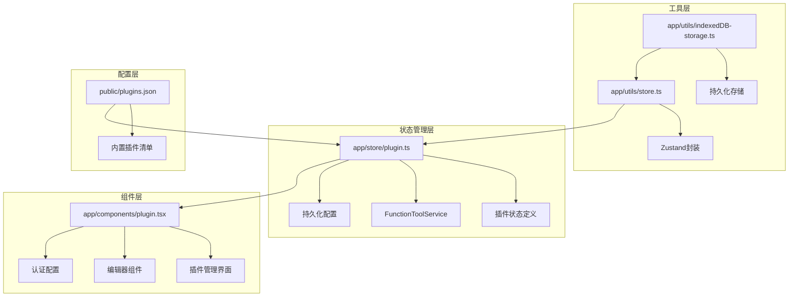

**图表来源**
- [app/store/plugin.ts](file://app/store/plugin.ts#L1-L272)
- [app/components/plugin.tsx](file://app/components/plugin.tsx#L1-L371)
- [app/utils/store.ts](file://app/utils/store.ts#L1-L79)

## 核心数据结构

### 插件类型定义

系统定义了完整的插件数据结构，包含所有必要的元信息和配置参数：

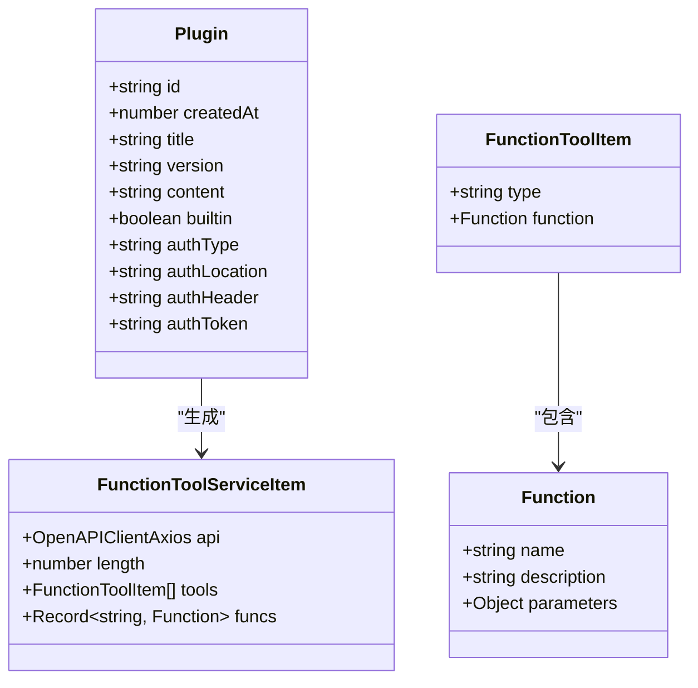

**图表来源**
- [app/store/plugin.ts](file://app/store/plugin.ts#L12-L23)
- [app/store/plugin.ts](file://app/store/plugin.ts#L25-L32)
- [app/store/plugin.ts](file://app/store/plugin.ts#L34-L39)

### 默认状态配置

系统提供了标准化的默认插件状态，确保新创建的插件具有正确的初始值：

| 属性 | 类型 | 默认值 | 描述 |
|------|------|--------|------|
| id | string | nanoid() | 唯一标识符，使用随机生成算法 |
| createdAt | number | Date.now() | 创建时间戳 |
| title | string | "" | 插件显示名称 |
| version | string | "1.0.0" | 版本号 |
| content | string | "" | OpenAPI规范内容 |
| builtin | boolean | false | 是否为内置插件 |
| authType | string | undefined | 认证类型(bearer/basic/custom) |
| authLocation | string | undefined | 认证位置(header/query/body) |
| authHeader | string | undefined | 自定义头部名称 |
| authToken | string | undefined | 认证令牌 |

**节来源**
- [app/store/plugin.ts](file://app/store/plugin.ts#L158-L166)
- [app/store/plugin.ts](file://app/store/plugin.ts#L168-L170)

## 状态管理架构

### Zustand 持久化存储架构

系统采用自定义的持久化存储方案，结合 IndexedDB 和 localStorage 提供双重保障：

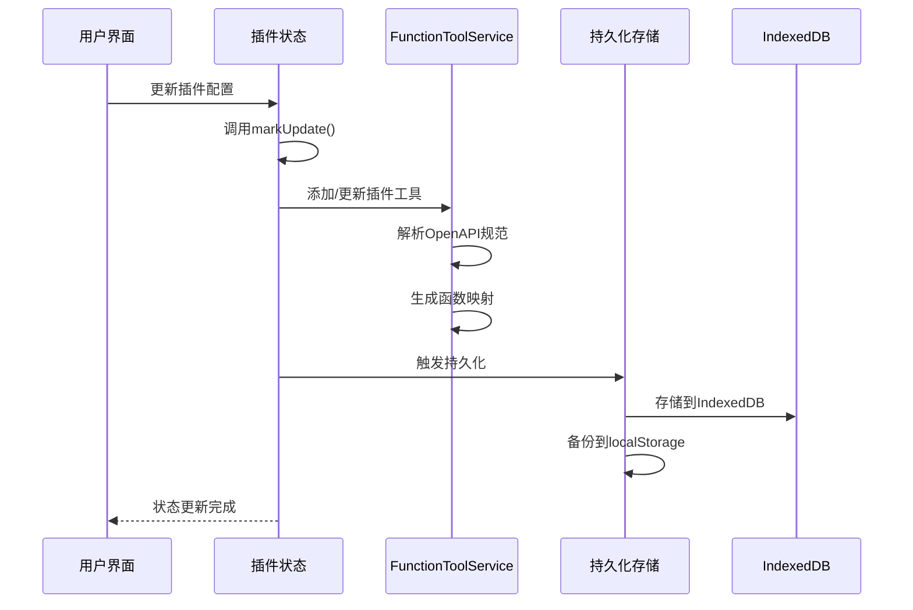

**图表来源**
- [app/store/plugin.ts](file://app/store/plugin.ts#L172-L271)
- [app/utils/store.ts](file://app/utils/store.ts#L29-L79)

### 状态管理方法

插件状态管理器提供了完整的 CRUD 操作和工具管理功能：

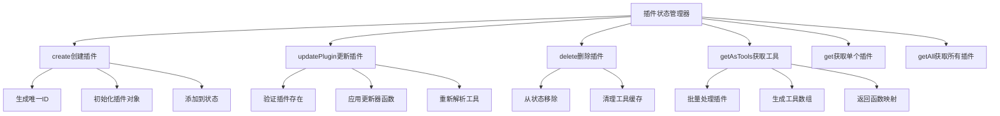

**图表来源**
- [app/store/plugin.ts](file://app/store/plugin.ts#L175-L228)

**节来源**
- [app/store/plugin.ts](file://app/store/plugin.ts#L175-L228)

## 详细组件分析

### 插件管理界面组件

插件管理界面提供了完整的插件生命周期管理功能：

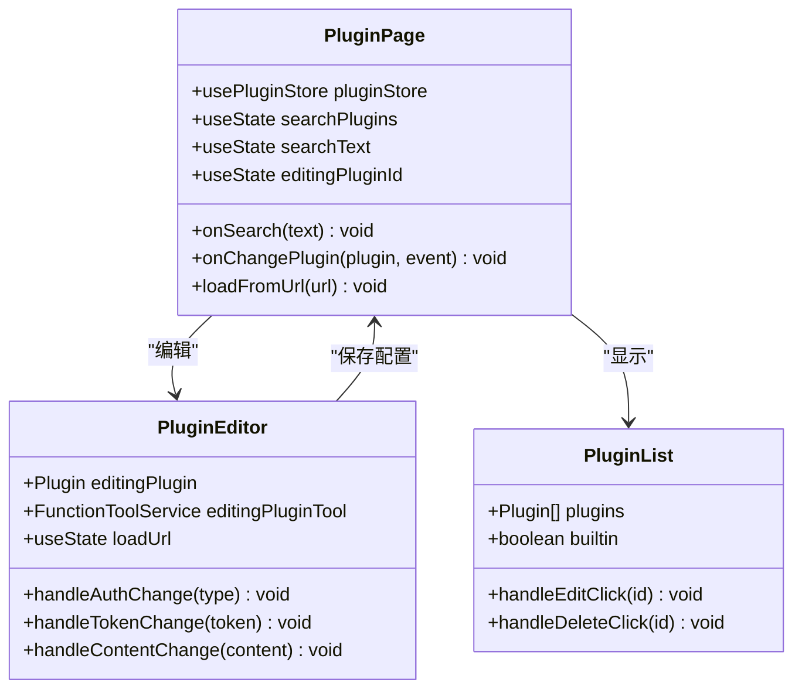

**图表来源**
- [app/components/plugin.tsx](file://app/components/plugin.tsx#L33-L371)

### 插件编辑器功能

编辑器组件支持复杂的插件配置管理：

| 功能 | 描述 | 实现方式 |
|------|------|----------|
| OpenAPI规范编辑 | 支持实时语法检查和格式化 | 使用yaml库解析和验证 |
| 认证配置 | 支持多种认证方式(Bearer/Basic/Custom) | 动态表单渲染 |
| 工具预览 | 实时显示生成的函数工具 | FunctionToolService解析 |
| URL加载 | 从远程地址加载插件规范 | 异步HTTP请求 |
| 实时验证 | 编辑过程中的语法验证 | debounce防抖处理 |

**节来源**
- [app/components/plugin.tsx](file://app/components/plugin.tsx#L60-L118)

## 插件生命周期管理

### 内置插件加载机制

系统在初始化时会自动加载并注册内置插件：

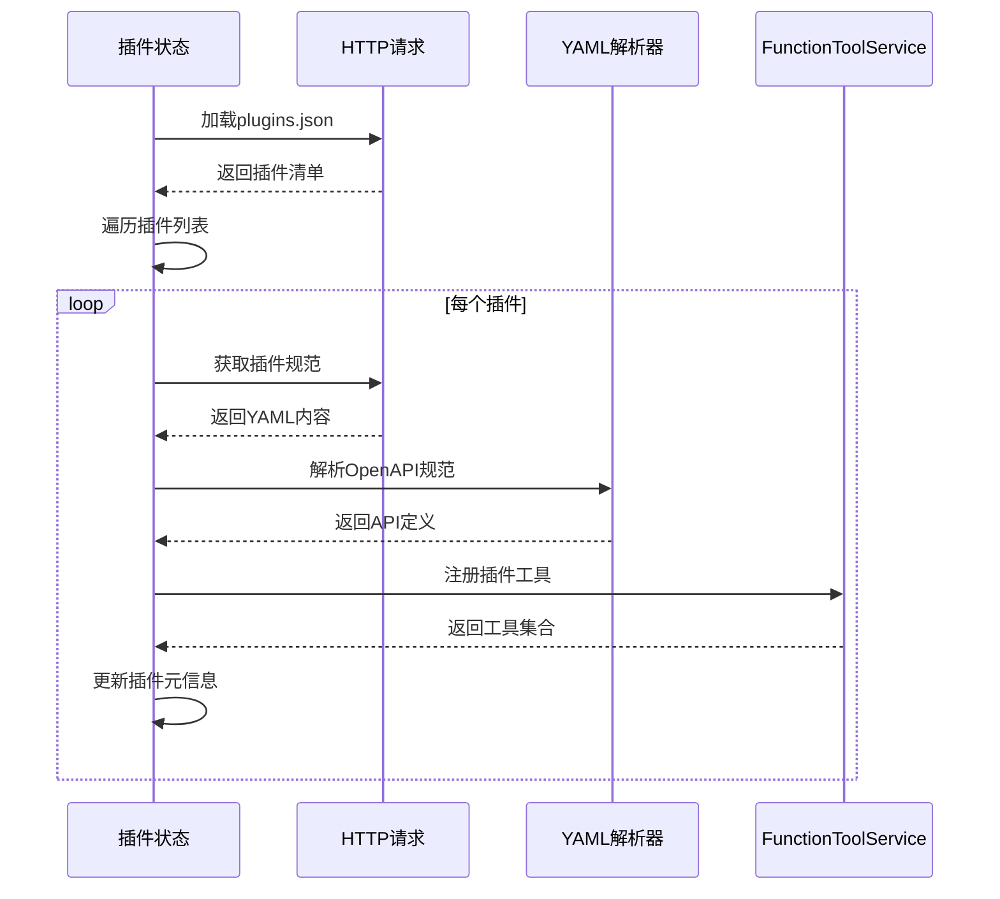

**图表来源**
- [app/store/plugin.ts](file://app/store/plugin.ts#L239-L268)

### 插件状态同步策略

系统实现了多层次的状态同步机制：

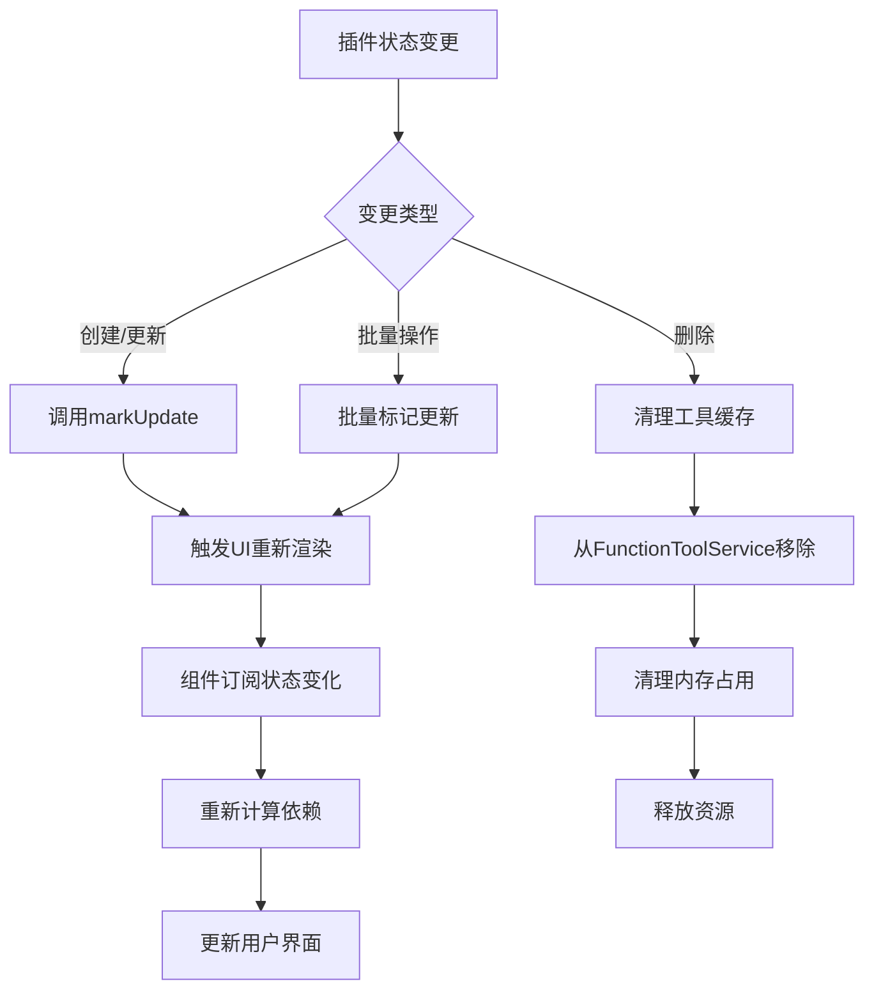

**图表来源**
- [app/store/plugin.ts](file://app/store/plugin.ts#L186-L206)
- [app/utils/store.ts](file://app/utils/store.ts#L54-L72)

**节来源**
- [app/store/plugin.ts](file://app/store/plugin.ts#L239-L268)

## 持久化存储机制

### 双重存储保障

系统采用 IndexedDB 和 localStorage 的双重存储策略：

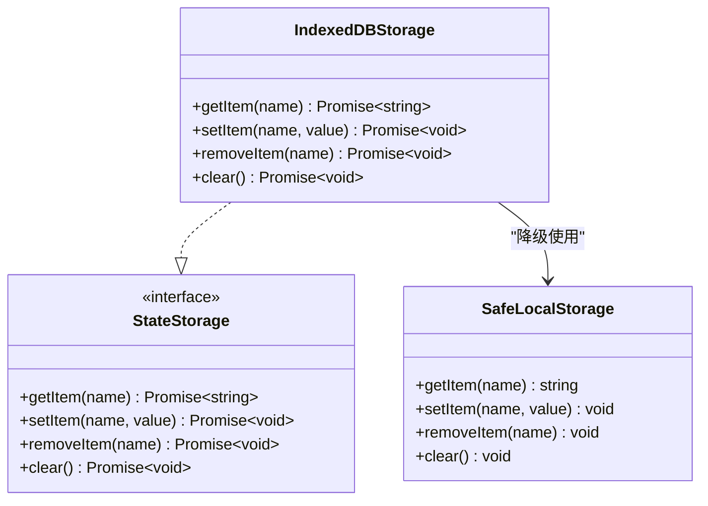

**图表来源**
- [app/utils/indexedDB-storage.ts](file://app/utils/indexedDB-storage.ts#L7-L47)

### 存储策略优化

| 存储类型 | 优势 | 适用场景 | 容量限制 |
|----------|------|----------|----------|
| IndexedDB | 大容量存储、异步操作 | 插件配置、大型规范 | 浏览器限制 |
| localStorage | 同步访问、简单API | 小型配置、临时数据 | 5MB左右 |
| 内存缓存 | 最快访问速度 | 运行时状态、临时数据 | 受限于可用内存 |

**节来源**
- [app/utils/indexedDB-storage.ts](file://app/utils/indexedDB-storage.ts#L1-L47)

## 插件工具服务

### FunctionToolService 架构

FunctionToolService 是插件系统的核心工具服务，负责将 OpenAPI 规范转换为可调用的函数工具：

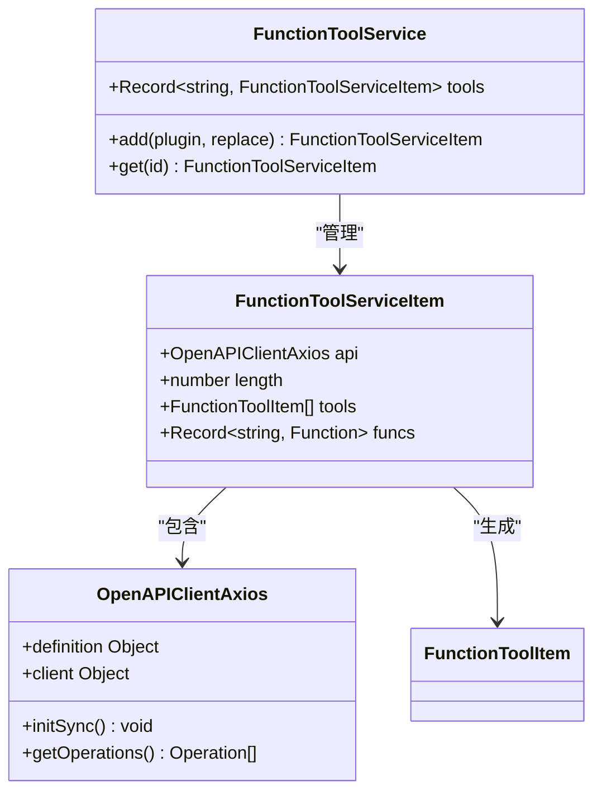

**图表来源**
- [app/store/plugin.ts](file://app/store/plugin.ts#L41-L156)

### 工具生成流程

系统通过解析 OpenAPI 规范自动生成可用的函数工具：

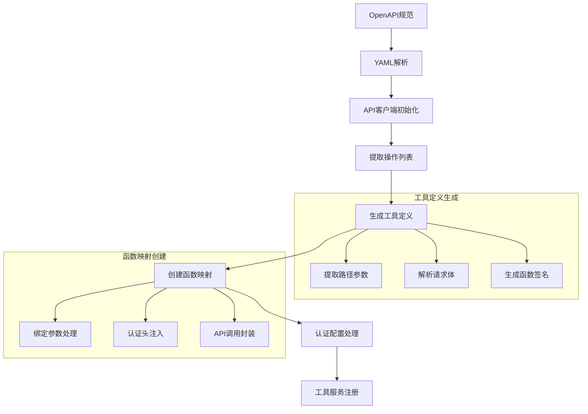

**图表来源**
- [app/store/plugin.ts](file://app/store/plugin.ts#L42-L151)

**节来源**
- [app/store/plugin.ts](file://app/store/plugin.ts#L41-L156)

## 状态同步与热重载

### 实时状态更新机制

系统实现了高效的实时状态更新机制：

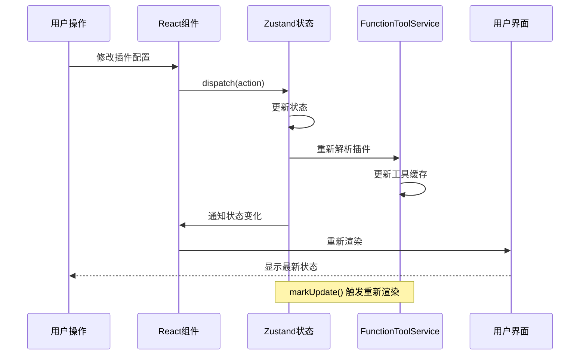

**图表来源**
- [app/utils/store.ts](file://app/utils/store.ts#L54-L72)

### 热重载支持

系统支持插件配置的热重载，无需刷新页面即可应用更改：

| 功能 | 实现方式 | 效果 |
|------|----------|------|
| 实时验证 | debounce防抖处理 | 避免频繁验证导致性能问题 |
| 错误恢复 | try-catch异常处理 | 保持系统稳定性 |
| 状态回滚 | 原子性更新操作 | 确保状态一致性 |
| 工具重建 | FunctionToolService重建 | 更新可用函数列表 |

**节来源**
- [app/components/plugin.tsx](file://app/components/plugin.tsx#L60-L86)

## 性能考虑

### 优化策略

系统采用了多种性能优化策略：

1. **延迟加载**：插件工具仅在需要时才进行解析和初始化
2. **缓存机制**：FunctionToolService 缓存已解析的插件工具
3. **防抖处理**：复杂操作使用 debounce 避免频繁更新
4. **内存管理**：及时清理不再使用的插件工具缓存

### 性能监控指标

| 指标 | 目标值 | 监控方式 |
|------|--------|----------|
| 插件加载时间 | < 200ms | 初始化计时 |
| 工具生成时间 | < 100ms | FunctionToolService计时 |
| 内存占用 | < 50MB | 浏览器开发者工具 |
| UI响应时间 | < 16ms | requestAnimationFrame |

## 故障排除指南

### 常见问题及解决方案

| 问题类型 | 症状 | 可能原因 | 解决方案 |
|----------|------|----------|----------|
| 插件加载失败 | 插件列表为空 | 网络连接问题 | 检查网络连接，尝试重新加载 |
| OpenAPI解析错误 | 编辑器报错 | 规范格式不正确 | 验证YAML语法，使用在线验证工具 |
| 认证配置失效 | API调用失败 | 令牌过期或格式错误 | 重新配置认证信息 |
| 工具缓存异常 | 函数调用无响应 | 缓存损坏 | 清理浏览器缓存，重启应用 |

### 调试工具

系统提供了多种调试工具帮助开发者诊断问题：

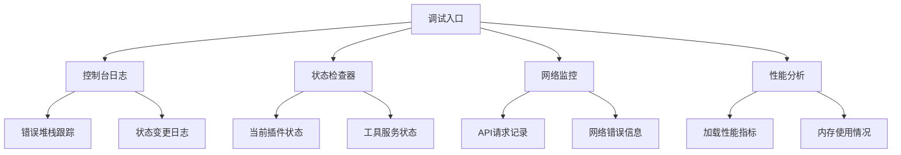

## 总结

ChatGPT Next Web 的插件状态管理系统是一个设计精良、功能完备的状态管理解决方案。它成功地解决了以下关键挑战：

### 核心优势

1. **类型安全**：完整的 TypeScript 类型定义确保开发时的类型安全
2. **持久化存储**：双重存储策略提供可靠的数据持久化保障
3. **实时更新**：高效的响应式状态管理支持热重载功能
4. **扩展性强**：模块化设计便于功能扩展和维护
5. **性能优化**：多重优化策略确保良好的用户体验

### 技术亮点

- **Zustand集成**：简洁高效的状态管理方案
- **IndexedDB持久化**：大容量数据存储能力
- **OpenAPI工具生成**：自动化函数工具创建
- **热重载支持**：无缝的开发体验
- **错误处理机制**：健壮的异常处理策略

该系统为 ChatGPT Next Web 提供了强大的插件管理能力，支持用户灵活地扩展和定制聊天功能，同时保持了良好的性能和用户体验。