# 数据同步管理

<cite>
**本文档引用的文件**
- [app/store/sync.ts](file://app/store/sync.ts)
- [app/utils/sync.ts](file://app/utils/sync.ts)
- [app/utils/cloud/upstash.ts](file://app/utils/cloud/upstash.ts)
- [app/utils/cloud/webdav.ts](file://app/utils/cloud/webdav.ts)
- [app/utils/cloud/index.ts](file://app/utils/cloud/index.ts)
- [app/store/chat.ts](file://app/store/chat.ts)
- [app/store/config.ts](file://app/store/config.ts)
- [app/utils/store.ts](file://app/utils/store.ts)
- [app/utils/indexedDB-storage.ts](file://app/utils/indexedDB-storage.ts)
- [app/components/settings.tsx](file://app/components/settings.tsx)
</cite>

## 目录
1. [概述](#概述)
2. [系统架构](#系统架构)
3. [核心组件分析](#核心组件分析)
4. [后端服务集成](#后端服务集成)
5. [同步算法与冲突解决](#同步算法与冲突解决)
6. [状态管理与持久化](#状态管理与持久化)
7. [错误处理与重试机制](#错误处理与重试机制)
8. [用户界面与反馈](#用户界面与反馈)
9. [性能优化考虑](#性能优化考虑)
10. [故障排除指南](#故障排除指南)

## 概述

ChatGPT Next Web 的数据同步管理系统是一个跨设备数据同步解决方案，支持在多个设备间保持聊天记录、配置信息和用户偏好的一致性。系统采用分布式架构，支持多种后端存储服务，包括 Upstash Redis 和 WebDAV 协议，并提供了完善的冲突解决策略和错误处理机制。

### 主要特性

- **多后端支持**：同时支持 Upstash 和 WebDAV 两种同步后端
- **智能冲突解决**：基于时间戳的版本控制和增量合并算法
- **离线优先**：本地 IndexedDB 存储 + 离线缓存机制
- **实时状态监控**：同步状态可视化和错误反馈
- **无缝迁移**：支持导入导出功能和数据备份恢复

## 系统架构

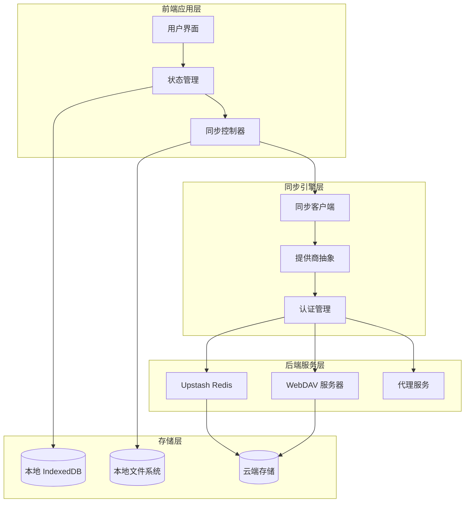

**架构图来源**
- [app/store/sync.ts](file://app/store/sync.ts#L1-L151)
- [app/utils/cloud/index.ts](file://app/utils/cloud/index.ts#L1-L34)

## 核心组件分析

### 同步状态管理器

同步状态管理器是整个同步系统的核心控制器，负责协调各个组件的工作。

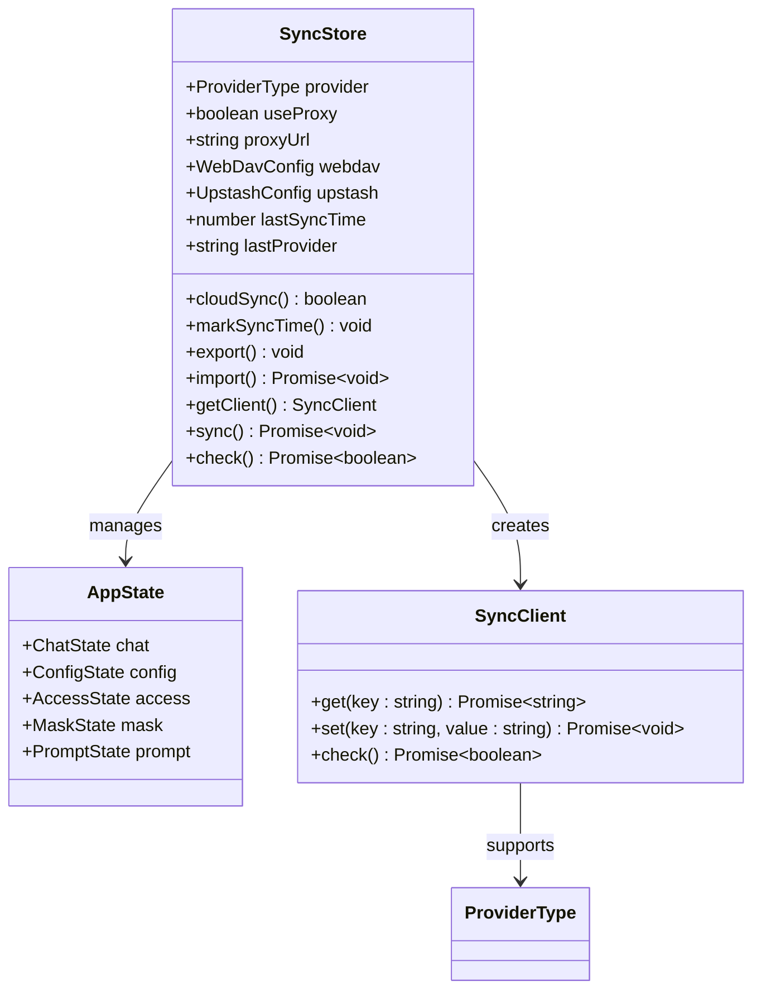

**类图来源**
- [app/store/sync.ts](file://app/store/sync.ts#L25-L44)
- [app/utils/sync.ts](file://app/utils/sync.ts#L49-L58)

### 应用状态结构

系统将应用状态划分为多个独立的模块，每个模块都有自己的状态管理器：

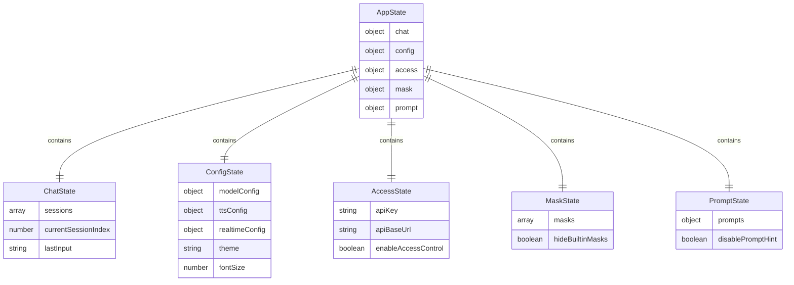

**实体关系图来源**
- [app/utils/sync.ts](file://app/utils/sync.ts#L49-L58)
- [app/store/chat.ts](file://app/store/chat.ts#L226-L230)
- [app/store/config.ts](file://app/store/config.ts#L41-L107)

**章节来源**
- [app/store/sync.ts](file://app/store/sync.ts#L1-L151)
- [app/utils/sync.ts](file://app/utils/sync.ts#L1-L166)

## 后端服务集成

### Upstash Redis 集成

Upstash 是一个基于 Redis 的云数据库服务，提供高可用的键值存储能力。

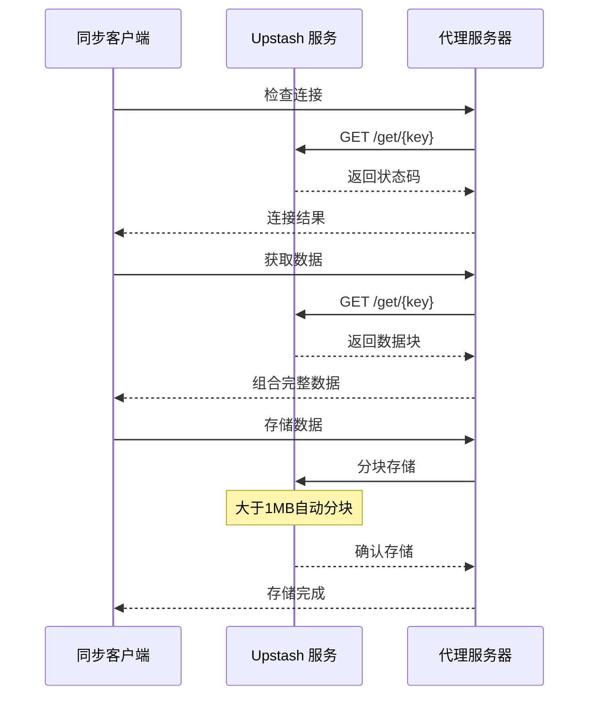

**序列图来源**
- [app/utils/cloud/upstash.ts](file://app/utils/cloud/upstash.ts#L18-L111)

#### Upstash 特性

- **自动分块存储**：当数据超过1MB时自动分割为多个块
- **代理支持**：支持通过代理服务器访问
- **认证机制**：基于 Bearer Token 的 API 密钥认证
- **错误处理**：完善的网络异常处理和重试机制

### WebDAV 集成

WebDAV 是一种基于 HTTP 协议的文件同步标准，支持目录创建、文件上传下载等功能。

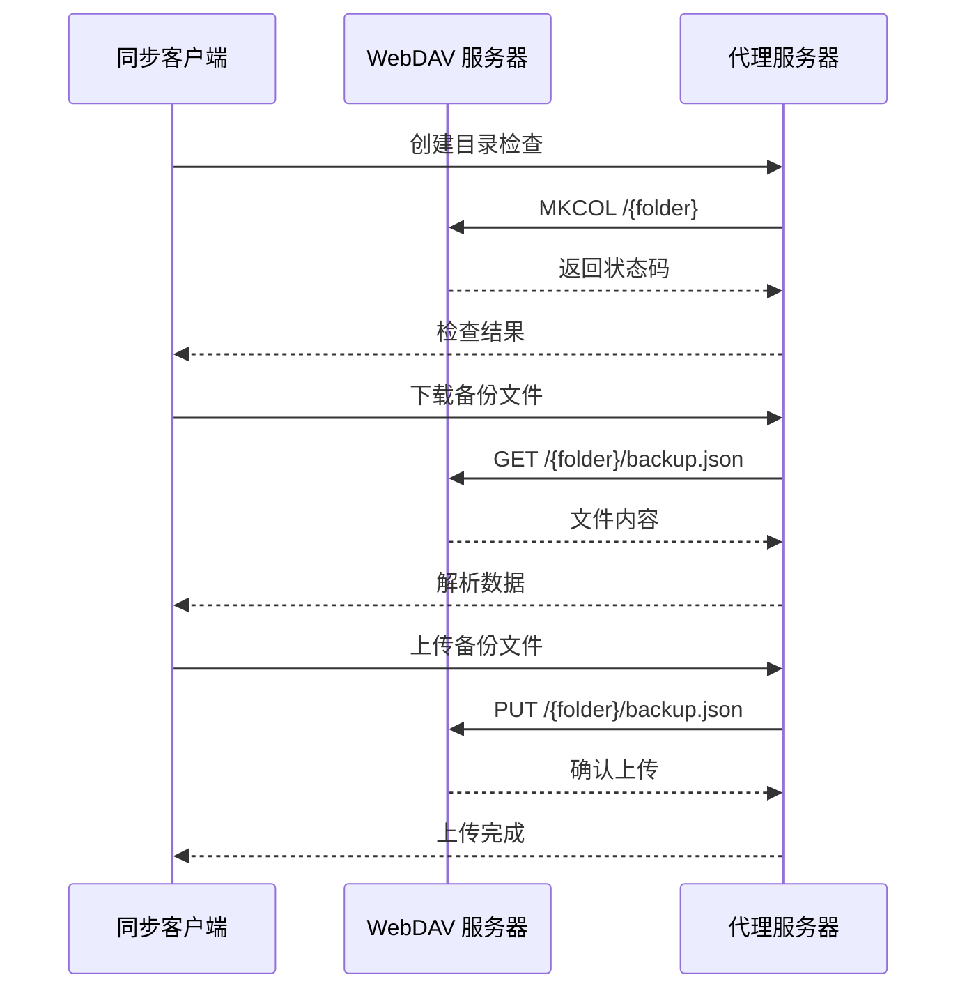

**序列图来源**
- [app/utils/cloud/webdav.ts](file://app/utils/cloud/webdav.ts#L15-L98)

#### WebDAV 特性

- **标准协议**：基于 HTTP/WebDAV 标准
- **基础认证**：支持用户名密码认证
- **目录隔离**：使用应用标识符作为命名空间
- **容错处理**：支持多种 HTTP 状态码的处理

**章节来源**
- [app/utils/cloud/upstash.ts](file://app/utils/cloud/upstash.ts#L1-L111)
- [app/utils/cloud/webdav.ts](file://app/utils/cloud/webdav.ts#L1-L98)
- [app/utils/cloud/index.ts](file://app/utils/cloud/index.ts#L1-L34)

## 同步算法与冲突解决

### 增量同步算法

系统采用基于时间戳的增量同步算法，确保数据的一致性和最小化传输开销。

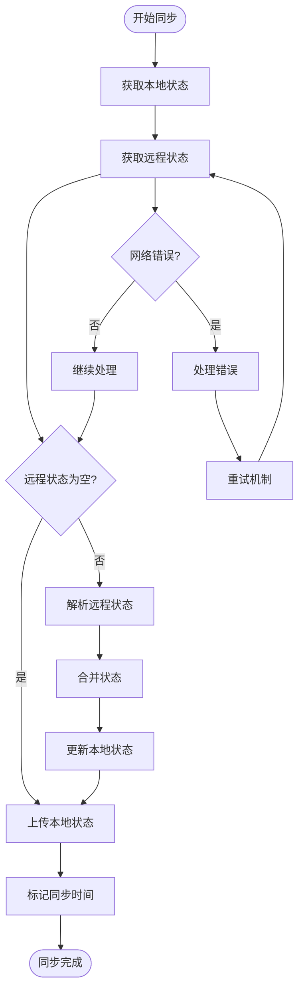

**流程图来源**
- [app/store/sync.ts](file://app/store/sync.ts#L91-L119)

### 冲突解决策略

系统实现了多层次的冲突解决机制：

#### 1. 时间戳版本控制

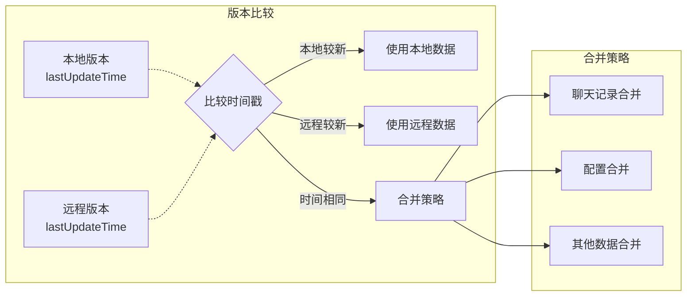

**流程图来源**
- [app/utils/sync.ts](file://app/utils/sync.ts#L148-L166)

#### 2. 聊天记录合并算法

聊天记录是最复杂的合并场景，需要处理消息去重和顺序维护：

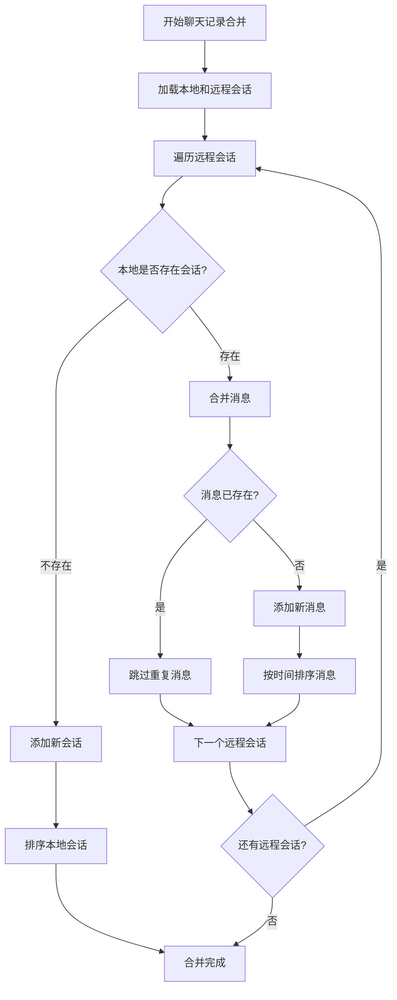

**流程图来源**
- [app/utils/sync.ts](file://app/utils/sync.ts#L66-L102)

### 数据一致性保证

系统通过以下机制确保数据一致性：

1. **原子操作**：整个同步过程视为原子事务
2. **回滚机制**：同步失败时恢复到之前状态
3. **幂等性**：多次执行同一操作结果一致
4. **完整性检查**：验证数据格式和结构正确性

**章节来源**
- [app/store/sync.ts](file://app/store/sync.ts#L91-L119)
- [app/utils/sync.ts](file://app/utils/sync.ts#L66-L166)

## 状态管理与持久化

### Zustand 状态管理

系统使用 Zustand 作为状态管理库，结合持久化中间件实现数据持久化。

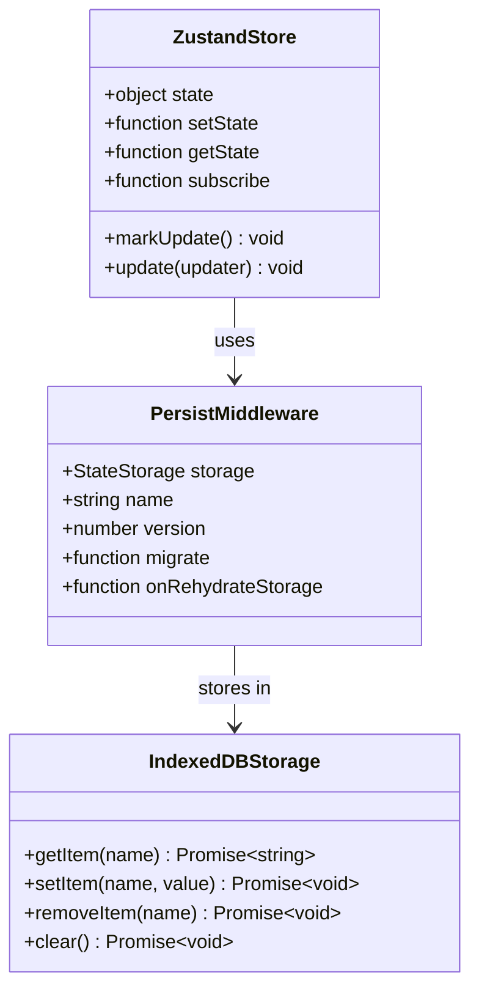

**类图来源**
- [app/utils/store.ts](file://app/utils/store.ts#L29-L79)
- [app/utils/indexedDB-storage.ts](file://app/utils/indexedDB-storage.ts#L7-L47)

### IndexedDB 存储策略

系统采用 IndexedDB 作为主要的本地存储介质，提供大容量和高性能的数据存储能力。

#### 存储特性

- **异步操作**：所有存储操作都是异步的
- **错误降级**：存储失败时自动降级到 localStorage
- **数据验证**：存储前验证数据完整性
- **清理机制**：定期清理过期数据

#### 存储模式

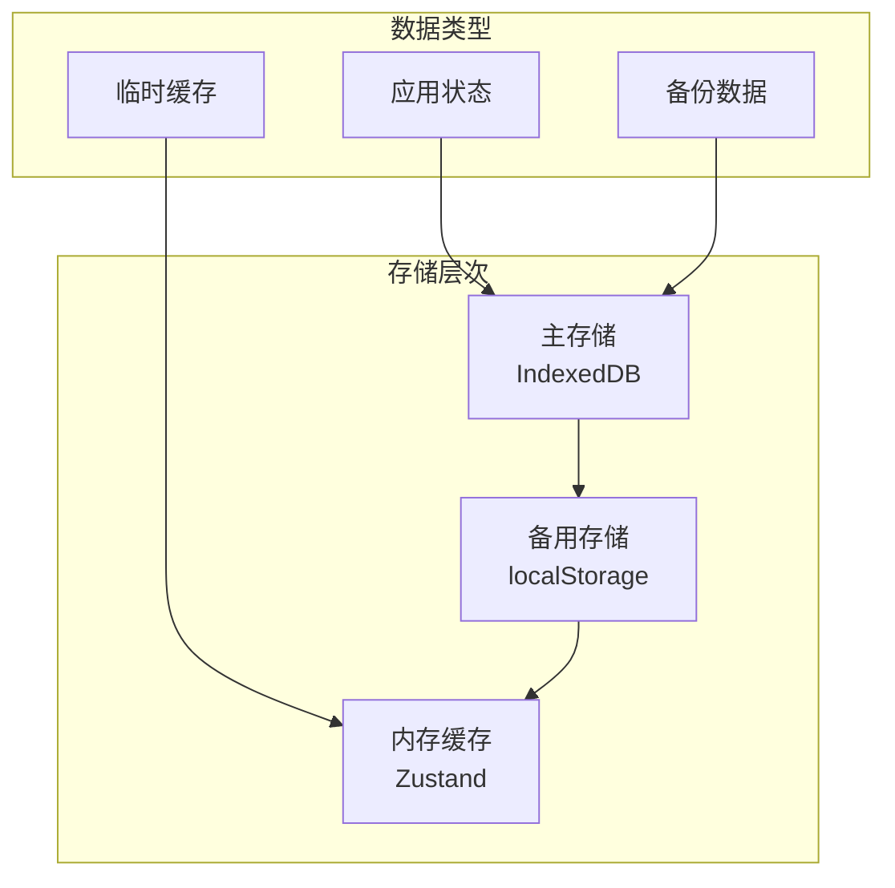

**图表来源**
- [app/utils/indexedDB-storage.ts](file://app/utils/indexedDB-storage.ts#L1-L48)

**章节来源**
- [app/utils/store.ts](file://app/utils/store.ts#L1-L79)
- [app/utils/indexedDB-storage.ts](file://app/utils/indexedDB-storage.ts#L1-L48)

## 错误处理与重试机制

### 网络错误处理

系统实现了完善的网络错误处理机制，能够应对各种网络异常情况。

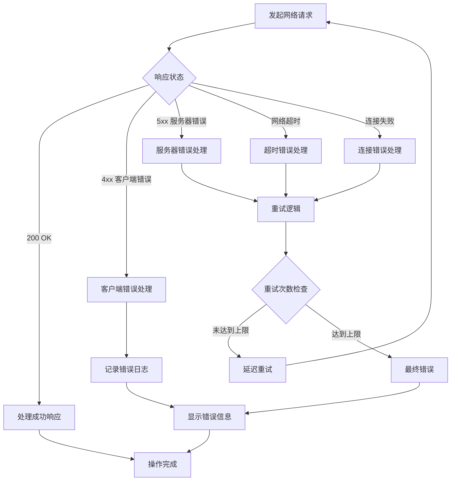

### 重试策略

系统采用指数退避算法实现智能重试：

- **初始延迟**：1秒
- **最大延迟**：30秒  
- **最大重试次数**：3次
- **退避因子**：2
- **抖动**：±25% 随机延迟

### 错误分类与处理

| 错误类型 | 处理策略 | 用户反馈 |
|---------|---------|---------|
| 认证失败 | 刷新令牌/重新登录 | 显示认证错误提示 |
| 网络超时 | 自动重试 | 显示加载动画 |
| 服务器错误 | 降级处理 | 显示服务器不可用 |
| 数据损坏 | 数据修复 | 显示恢复选项 |
| 存储失败 | 本地缓存 | 显示离线模式 |

**章节来源**
- [app/store/sync.ts](file://app/store/sync.ts#L112-L115)
- [app/utils/cloud/upstash.ts](file://app/utils/cloud/upstash.ts#L26-L30)
- [app/utils/cloud/webdav.ts](file://app/utils/cloud/webdav.ts#L29-L35)

## 用户界面与反馈

### 同步状态监控

系统提供了直观的同步状态监控界面，让用户随时了解同步状态。

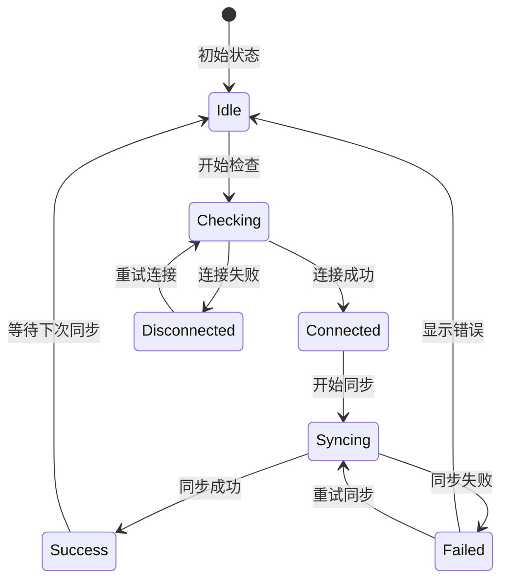

### 用户反馈机制

#### 实时状态指示器

- **连接状态图标**：不同颜色表示不同状态
- **进度条**：显示同步进度
- **时间戳**：显示上次同步时间
- **错误详情**：详细的错误信息展示

#### 通知系统

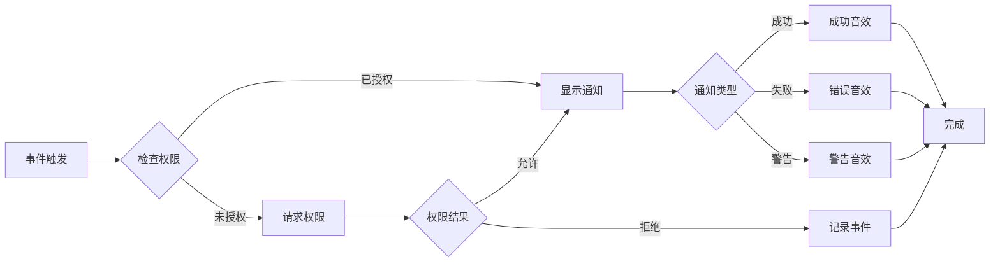

### 导入导出功能

系统提供了完整的数据导入导出功能，支持手动备份和恢复：

#### 导出功能特性

- **全量导出**：包含所有应用状态数据
- **时间戳文件名**：自动生成带时间戳的文件名
- **格式验证**：确保导出文件格式正确
- **压缩支持**：可选的文件压缩功能

#### 导入功能特性

- **数据验证**：导入前验证数据完整性
- **增量合并**：支持增量导入和覆盖导入
- **错误恢复**：导入失败时提供恢复选项
- **版本兼容**：支持不同版本间的数据迁移

**章节来源**
- [app/components/settings.tsx](file://app/components/settings.tsx#L288-L340)
- [app/store/sync.ts](file://app/store/sync.ts#L58-L82)

## 性能优化考虑

### 同步频率优化

系统采用智能同步调度算法，平衡同步频率和用户体验：

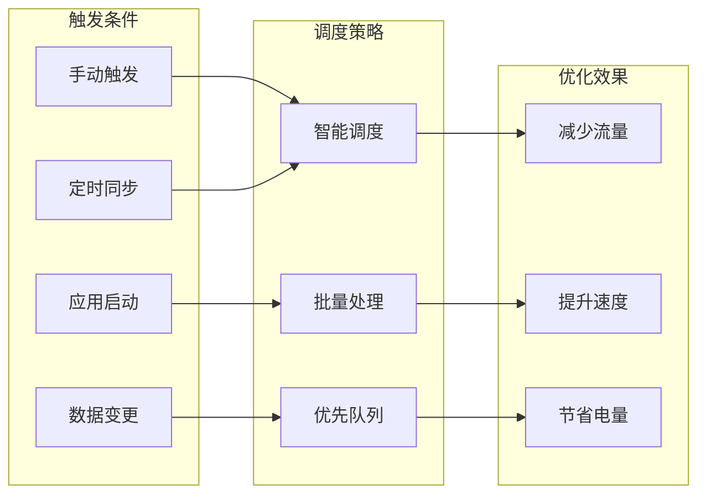

### 内存管理

- **懒加载**：按需加载数据，避免内存占用过高
- **数据压缩**：对大型数据进行压缩存储
- **垃圾回收**：及时释放不再使用的数据引用
- **分页加载**：大量数据采用分页加载策略

### 网络优化

- **HTTP/2 支持**：利用多路复用提高传输效率
- **数据压缩**：启用 gzip/brotli 压缩
- **CDN 加速**：支持 CDN 缓存和加速
- **连接池**：复用 HTTP 连接减少握手开销

## 故障排除指南

### 常见问题诊断

#### 同步失败问题

**症状**：同步按钮显示红色，提示同步失败

**诊断步骤**：
1. 检查网络连接状态
2. 验证认证凭据有效性
3. 确认后端服务可用性
4. 检查存储空间是否充足

**解决方案**：
- 重新输入认证信息
- 切换代理服务器
- 清理本地缓存
- 联系技术支持

#### 数据丢失问题

**症状**：同步后某些数据消失或损坏

**诊断步骤**：
1. 检查导入导出功能
2. 验证数据完整性
3. 检查版本兼容性
4. 分析错误日志

**解决方案**：
- 使用备份数据恢复
- 执行数据修复程序
- 重新初始化同步
- 联系技术支持

#### 性能问题

**症状**：同步过程缓慢或卡顿

**诊断步骤**：
1. 检查网络带宽
2. 分析数据大小
3. 监控系统资源
4. 检查并发限制

**解决方案**：
- 优化网络连接
- 减少同步频率
- 清理历史数据
- 升级硬件配置

### 调试工具

系统提供了内置的调试工具帮助开发者和高级用户诊断问题：

- **同步日志**：详细的同步过程日志
- **状态检查器**：实时查看应用状态
- **网络监控**：监控网络请求和响应
- **性能分析器**：分析性能瓶颈

### 技术支持

当遇到无法解决的问题时，用户可以通过以下渠道获得帮助：

1. **在线文档**：详细的使用说明和故障排除指南
2. **社区论坛**：与其他用户交流经验和解决方案
3. **技术支持**：专业的技术团队提供一对一支持
4. **问题报告**：提交 bug 报告和功能建议

**章节来源**
- [app/store/sync.ts](file://app/store/sync.ts#L122-L125)
- [app/utils/sync.ts](file://app/utils/sync.ts#L137-L146)

## 结论

ChatGPT Next Web 的数据同步管理系统是一个功能完善、设计精良的跨设备同步解决方案。它通过模块化的架构设计、智能的冲突解决算法和完善的错误处理机制，为用户提供了可靠的数据同步体验。

### 系统优势

- **可靠性**：多重备份和错误恢复机制确保数据安全
- **灵活性**：支持多种后端服务和配置选项
- **易用性**：直观的用户界面和清晰的状态反馈
- **扩展性**：模块化设计便于功能扩展和维护

### 发展方向

未来系统可以在以下方面进一步改进：

- **增量同步优化**：更高效的增量同步算法
- **离线编辑支持**：增强离线环境下的编辑能力
- **多用户协作**：支持多用户共享和协作编辑
- **数据加密**：增强数据传输和存储的安全性

通过持续的技术创新和用户反馈优化，这个同步系统将继续为用户提供更好的跨设备数据同步体验。