# 状态管理设计

<cite>
**本文档中引用的文件**
- [app/store/index.ts](file://app/store/index.ts)
- [app/store/chat.ts](file://app/store/chat.ts)
- [app/store/config.ts](file://app/store/config.ts)
- [app/store/access.ts](file://app/store/access.ts)
- [app/store/plugin.ts](file://app/store/plugin.ts)
- [app/store/mask.ts](file://app/store/mask.ts)
- [app/store/sync.ts](file://app/store/sync.ts)
- [app/store/update.ts](file://app/store/update.ts)
- [app/utils/store.ts](file://app/utils/store.ts)
- [app/utils/indexedDB-storage.ts](file://app/utils/indexedDB-storage.ts)
- [app/typing.ts](file://app/typing.ts)
- [app/constant.ts](file://app/constant.ts)
- [app/utils/hooks.ts](file://app/utils/hooks.ts)
- [app/utils/sync.ts](file://app/utils/sync.ts)
</cite>

## 目录
1. [概述](#概述)
2. [项目架构](#项目架构)
3. [核心Store模块](#核心store模块)
4. [状态持久化策略](#状态持久化策略)
5. [Store间依赖关系](#store间依赖关系)
6. [自定义Hook封装](#自定义hook封装)
7. [异步操作处理](#异步操作处理)
8. [最佳实践与陷阱](#最佳实践与陷阱)
9. [总结](#总结)

## 概述

本项目采用基于Zustand的状态管理架构，通过模块化的Store设计实现复杂应用状态的统一管理。整个状态管理系统包含多个专门化的Store模块，每个模块负责特定的功能领域，同时通过统一的持久化策略和依赖管理机制确保状态的一致性和可靠性。

## 项目架构

### 整体架构图

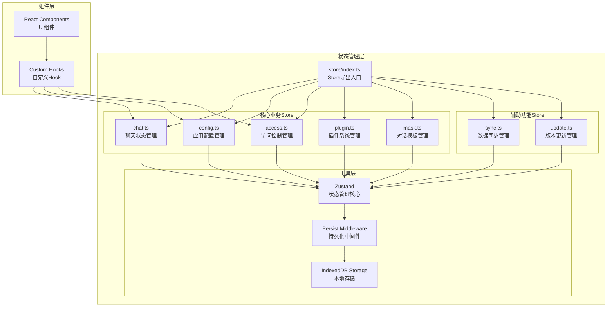

**图表来源**
- [app/store/index.ts](file://app/store/index.ts#L1-L6)
- [app/utils/store.ts](file://app/utils/store.ts#L29-L79)

### Store模块职责划分

| Store模块 | 主要职责 | 核心数据结构 | 持久化策略 |
|-----------|----------|--------------|------------|
| chat | 聊天会话管理、消息处理 | ChatSession数组、当前会话索引 | 完整持久化 |
| config | 应用全局配置、模型设置 | 全局配置对象、模型配置 | 完整持久化 |
| access | API密钥管理、服务提供商配置 | 访问控制状态、各服务商配置 | 完整持久化 |
| plugin | 插件系统管理、工具函数 | 插件列表、工具映射 | 完整持久化 |
| mask | 对话模板管理 | 模板列表、语言设置 | 完整持久化 |
| sync | 数据同步、备份恢复 | 同步配置、远程状态 | 部分持久化 |
| update | 版本检查、使用统计 | 版本信息、使用情况 | 部分持久化 |

**节来源**
- [app/store/index.ts](file://app/store/index.ts#L1-L6)
- [app/store/chat.ts](file://app/store/chat.ts#L226-L230)
- [app/store/config.ts](file://app/store/config.ts#L41-L107)
- [app/store/access.ts](file://app/store/access.ts#L65-L154)

## 核心Store模块

### Chat Store - 聊天状态管理

Chat Store是整个应用的核心状态管理模块，负责维护聊天会话、消息历史和相关配置。

#### 数据结构定义

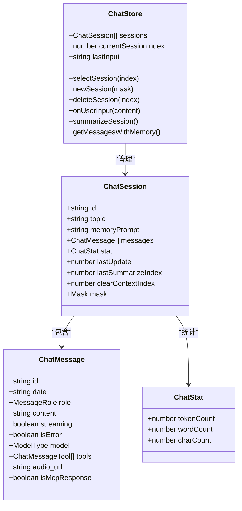

**图表来源**
- [app/store/chat.ts](file://app/store/chat.ts#L44-L118)
- [app/store/chat.ts](file://app/store/chat.ts#L232-L234)

#### 核心功能特性

1. **多会话管理**: 支持同时维护多个聊天会话，每个会话独立的状态管理
2. **智能摘要**: 自动对长对话进行内容摘要，优化性能
3. **记忆机制**: 维护上下文记忆，支持长期对话连续性
4. **工具集成**: 支持MCP（Model Context Protocol）工具调用

**节来源**
- [app/store/chat.ts](file://app/store/chat.ts#L232-L932)

### Config Store - 应用配置管理

Config Store管理应用的全局配置和模型参数设置。

#### 配置层次结构

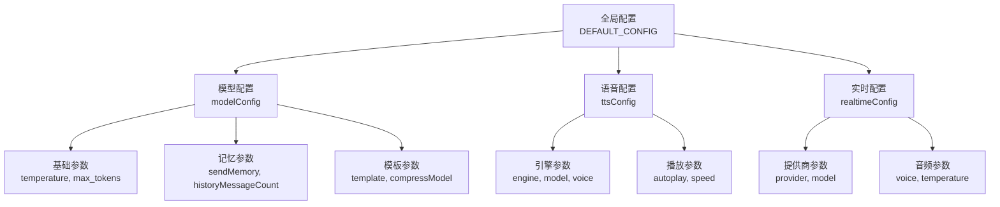

**图表来源**
- [app/store/config.ts](file://app/store/config.ts#L66-L106)

**节来源**
- [app/store/config.ts](file://app/store/config.ts#L41-L262)

### Access Store - 访问控制管理

Access Store负责管理各种AI服务提供商的API密钥和配置。

#### 服务提供商支持

| 提供商 | 基础URL | 验证方法 | 特殊配置 |
|--------|---------|----------|----------|
| OpenAI | OPENAI_BASE_URL | isValidOpenAI | 支持代理配置 |
| Azure | Azure配置 | isValidAzure | 需要端点和版本 |
| Google | GEMINI_BASE_URL | isValidGoogle | 安全设置阈值 |
| Anthropic | ANTHROPIC_BASE_URL | isValidAnthropic | API版本控制 |
| 百度 | BAIDU_BASE_URL | isValidBaidu | API密钥+密钥对 |
| 字节跳动 | BYTEDANCE_BASE_URL | isValidByteDance | 单API密钥 |
| 阿里云 | ALIBABA_BASE_URL | isValidAlibaba | 单API密钥 |
| 腾讯 | TENCENT_BASE_URL | isValidTencent | 密钥对验证 |
| 月球 | MOONSHOT_BASE_URL | isValidMoonshot | 单API密钥 |

**节来源**
- [app/store/access.ts](file://app/store/access.ts#L1-L304)

### Plugin Store - 插件系统管理

Plugin Store实现了动态插件加载和管理功能。

#### 插件生命周期管理

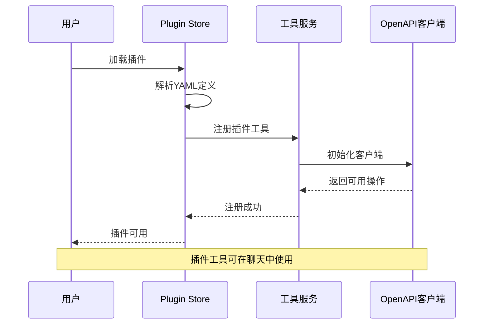

**图表来源**
- [app/store/plugin.ts](file://app/store/plugin.ts#L41-L151)

**节来源**
- [app/store/plugin.ts](file://app/store/plugin.ts#L1-L272)

## 状态持久化策略

### 存储架构设计

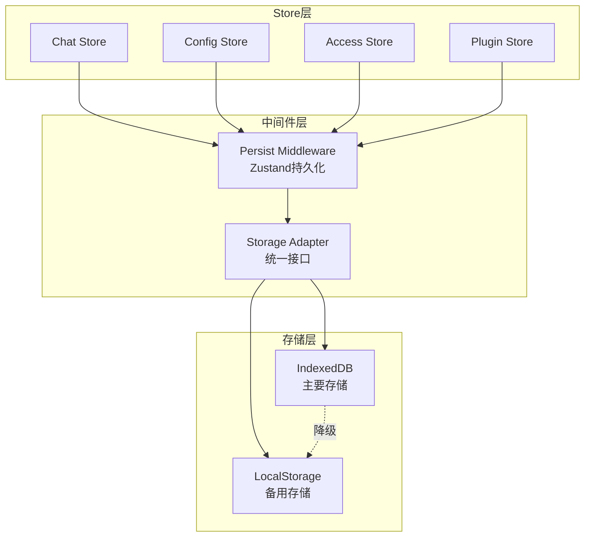

**图表来源**
- [app/utils/indexedDB-storage.ts](file://app/utils/indexedDB-storage.ts#L7-L47)
- [app/utils/store.ts](file://app/utils/store.ts#L37-L42)

### 持久化实现细节

#### IndexedDB存储适配器

存储适配器提供了可靠的降级机制：

1. **优先使用IndexedDB**: 作为主要存储介质，提供更好的性能和容量
2. **自动降级到LocalStorage**: 当IndexedDB不可用时自动切换
3. **错误处理**: 完善的异常捕获和回退机制
4. **数据验证**: 在存储前验证数据完整性

**节来源**
- [app/utils/indexedDB-storage.ts](file://app/utils/indexedDB-storage.ts#L1-L48)

#### 自定义Store工厂函数

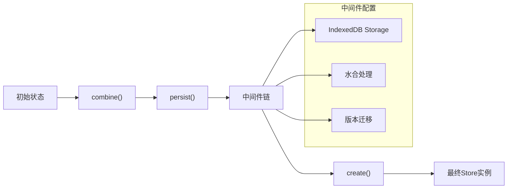

**图表来源**
- [app/utils/store.ts](file://app/utils/store.ts#L44-L78)

**节来源**
- [app/utils/store.ts](file://app/utils/store.ts#L1-L79)

## Store间依赖关系

### 依赖关系图

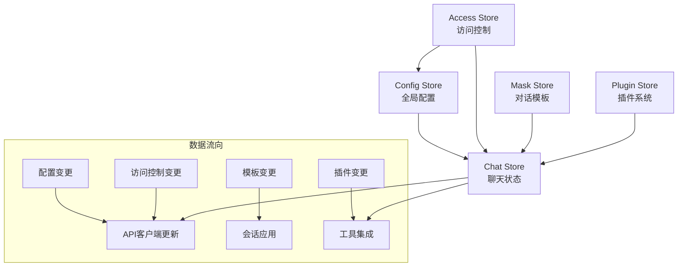

**图表来源**
- [app/store/chat.ts](file://app/store/chat.ts#L35-L36)
- [app/store/config.ts](file://app/store/config.ts#L164-L166)
- [app/store/access.ts](file://app/store/access.ts#L156-L158)

### 状态同步机制

#### 配置变更触发链

当配置发生变更时，系统会自动触发以下同步流程：

1. **Config Store变更**: 触发全局配置更新
2. **Access Store变更**: 更新API客户端配置
3. **Chat Store监听**: 接收配置变更通知
4. **API客户端重建**: 基于新配置重新初始化
5. **会话状态刷新**: 确保所有会话使用最新配置

**节来源**
- [app/store/config.ts](file://app/store/config.ts#L164-L262)
- [app/store/access.ts](file://app/store/access.ts#L156-L304)

## 自定义Hook封装

### Hook设计模式

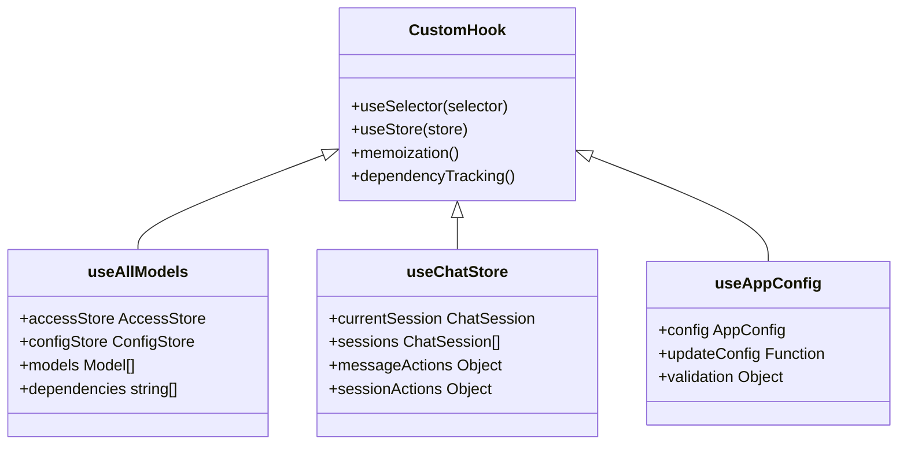

**图表来源**
- [app/utils/hooks.ts](file://app/utils/hooks.ts#L5-L22)

### Hook最佳实践

#### 性能优化策略

1. **Memoization**: 使用`useMemo`避免不必要的重计算
2. **选择性订阅**: 只订阅需要的状态片段
3. **依赖数组优化**: 正确设置依赖数组防止重复渲染
4. **批量更新**: 合并多个状态更新操作

#### 错误处理模式

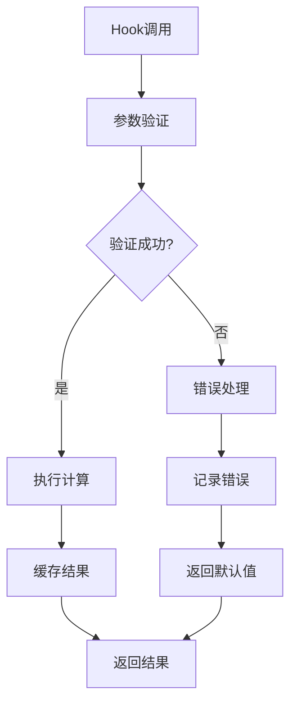

**节来源**
- [app/utils/hooks.ts](file://app/utils/hooks.ts#L1-L23)

## 异步操作处理

### 异步操作流水线

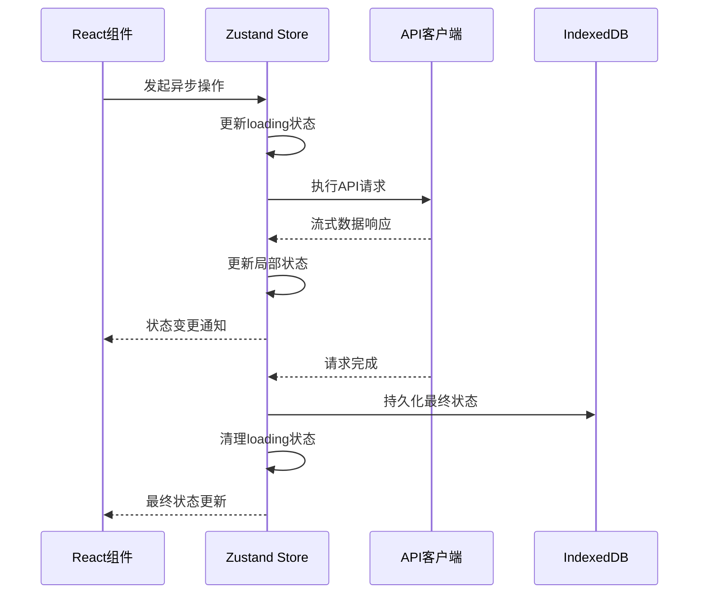

### 错误处理策略

#### 分层错误处理

1. **网络层错误**: 处理连接超时、服务器错误
2. **业务层错误**: 处理API响应错误、数据格式错误
3. **UI层错误**: 处理用户交互错误、状态更新错误
4. **降级策略**: 提供备用方案和默认行为

#### 并发控制

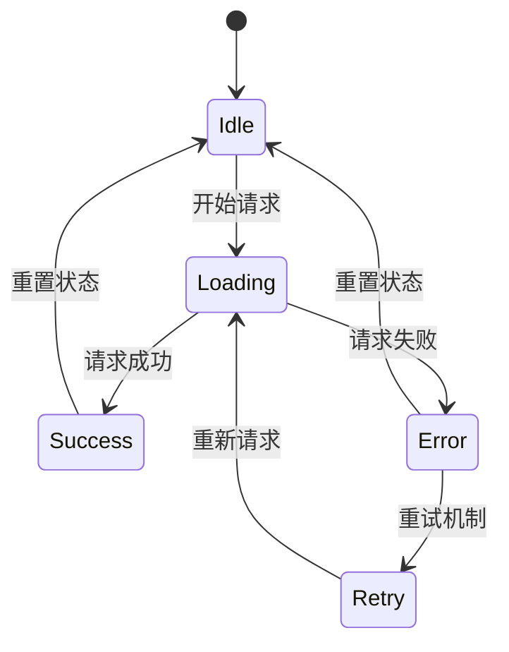

**节来源**
- [app/store/chat.ts](file://app/store/chat.ts#L459-L527)

## 最佳实践与陷阱

### 设计原则

#### 单一职责原则
每个Store模块都有明确的职责边界：
- **Chat Store**: 专注于聊天会话和消息管理
- **Config Store**: 专注于应用配置和模型参数
- **Access Store**: 专注于API访问和认证
- **Plugin Store**: 专注于插件系统和工具管理

#### 状态规范化
- 避免嵌套过深的状态结构
- 使用标准化的数据格式
- 实现类型安全的状态管理

### 常见陷阱与解决方案

#### 状态不一致问题

**问题**: 多个Store之间状态不同步
**解决方案**: 
- 使用事件驱动的状态同步
- 实现跨Store的依赖管理
- 提供状态验证机制

#### 内存泄漏风险

**问题**: 长时间运行后内存占用过高
**解决方案**:
- 及时清理无用的会话数据
- 实现状态压缩和归档机制
- 监控内存使用情况

#### 性能优化策略

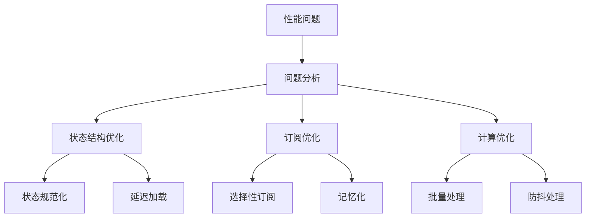

### 调试和监控

#### 状态追踪机制

1. **时间旅行调试**: 支持状态历史回放
2. **变更日志**: 记录所有状态变更
3. **性能监控**: 监控状态更新频率和耗时
4. **错误追踪**: 追踪状态相关的错误

#### 开发工具集成

- **Redux DevTools**: 状态调试和分析
- **性能分析器**: 监控状态更新性能
- **内存分析器**: 检测内存泄漏
- **类型检查**: 确保类型安全性

## 总结

本项目的状态管理架构展现了现代前端应用的最佳实践：

### 架构优势

1. **模块化设计**: 清晰的职责分离，便于维护和扩展
2. **类型安全**: 完整的TypeScript类型定义，减少运行时错误
3. **持久化可靠**: 双重存储保障，确保数据安全
4. **性能优化**: 智能的订阅机制和缓存策略
5. **开发体验**: 丰富的调试工具和错误处理

### 技术创新

1. **自定义持久化**: 基于IndexedDB的高性能存储
2. **智能状态同步**: 自动化的跨Store状态同步
3. **插件化架构**: 动态插件加载和管理
4. **流式处理**: 支持实时数据流和增量更新

### 未来发展方向

1. **状态压缩**: 实现更高效的状态存储和传输
2. **分布式同步**: 支持多设备间的状态同步
3. **AI增强**: 利用AI技术优化状态管理和预测
4. **性能优化**: 进一步提升大规模应用的性能表现

这套状态管理架构不仅满足了当前应用的需求，更为未来的功能扩展和技术演进奠定了坚实的基础。