# 聊天状态管理

<cite>
**本文档中引用的文件**
- [app/store/chat.ts](file://app/store/chat.ts)
- [app/components/chat.tsx](file://app/components/chat.tsx)
- [app/utils/chat.ts](file://app/utils/chat.ts)
- [app/utils/stream.ts](file://app/utils/stream.ts)
- [app/utils/store.ts](file://app/utils/store.ts)
- [app/constant.ts](file://app/constant.ts)
- [app/utils/indexedDB-storage.ts](file://app/utils/indexedDB-storage.ts)
- [app/client/api.ts](file://app/client/api.ts)
- [app/client/controller.ts](file://app/client/controller.ts)
- [app/utils/sync.ts](file://app/utils/sync.ts)
</cite>

## 目录
1. [简介](#简介)
2. [项目架构概览](#项目架构概览)
3. [核心数据结构](#核心数据结构)
4. [聊天状态管理器](#聊天状态管理器)
5. [会话生命周期管理](#会话生命周期管理)
6. [消息处理机制](#消息处理机制)
7. [自动摘要与上下文管理](#自动摘要与上下文管理)
8. [流式响应处理](#流式响应处理)
9. [错误处理与恢复](#错误处理与恢复)
10. [状态订阅与更新](#状态订阅与更新)
11. [API层数据交互](#api层数据交互)
12. [最佳实践指南](#最佳实践指南)
13. [总结](#总结)

## 简介

ChatGPT Next Web 的聊天状态管理系统是一个复杂而精密的状态管理解决方案，它负责管理用户的聊天会话、消息历史、模型配置以及各种上下文信息。该系统采用现代化的前端状态管理模式，结合 Zustand 状态库和 IndexedDB 持久化存储，为用户提供流畅且可靠的消息交互体验。

## 项目架构概览

系统的整体架构采用了分层设计模式，主要包含以下几个层次：

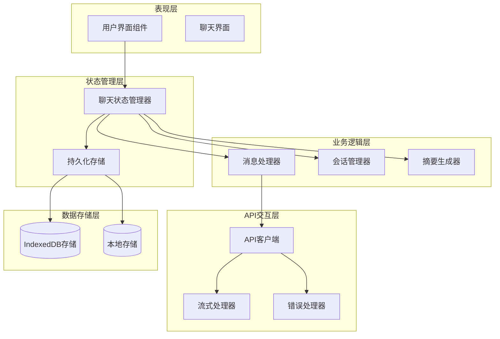

**图表来源**
- [app/store/chat.ts](file://app/store/chat.ts#L232-L234)
- [app/utils/store.ts](file://app/utils/store.ts#L29-L78)
- [app/utils/indexedDB-storage.ts](file://app/utils/indexedDB-storage.ts#L7-L47)

## 核心数据结构

### ChatSession 会话对象

ChatSession 是系统中最核心的数据结构，代表一个完整的聊天会话：

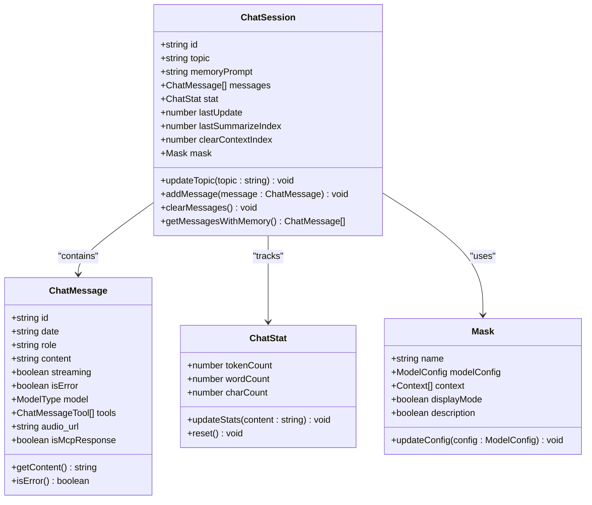

**图表来源**
- [app/store/chat.ts](file://app/store/chat.ts#L84-L96)
- [app/store/chat.ts](file://app/store/chat.ts#L57-L66)
- [app/store/chat.ts](file://app/store/chat.ts#L78-L82)

### 关键字段含义

| 字段名 | 类型 | 含义 | 默认值 |
|--------|------|------|--------|
| `id` | string | 会话唯一标识符 | 自动生成的 nanoid |
| `topic` | string | 会话主题标题 | "默认话题" |
| `memoryPrompt` | string | 长期记忆提示词 | "" |
| `messages` | ChatMessage[] | 消息列表 | [] |
| `stat` | ChatStat | 统计信息 | 初始化统计值 |
| `lastUpdate` | number | 最后更新时间戳 | 当前时间 |
| `lastSummarizeIndex` | number | 最后摘要索引位置 | 0 |
| `clearContextIndex` | number | 清除上下文索引 | undefined |
| `mask` | Mask | 模型配置掩码 | 默认配置 |

**章节来源**
- [app/store/chat.ts](file://app/store/chat.ts#L84-L96)

## 聊天状态管理器

### useChatStore 设计

useChatStore 是基于 Zustand 构建的状态管理器，提供了完整的聊天状态管理功能：

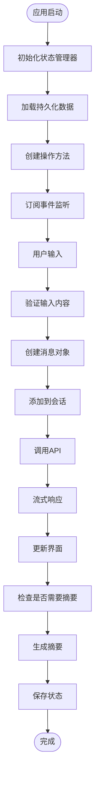

**图表来源**
- [app/store/chat.ts](file://app/store/chat.ts#L232-L234)
- [app/store/chat.ts](file://app/store/chat.ts#L242-L857)

### 状态持久化机制

系统采用双重存储策略确保数据安全：

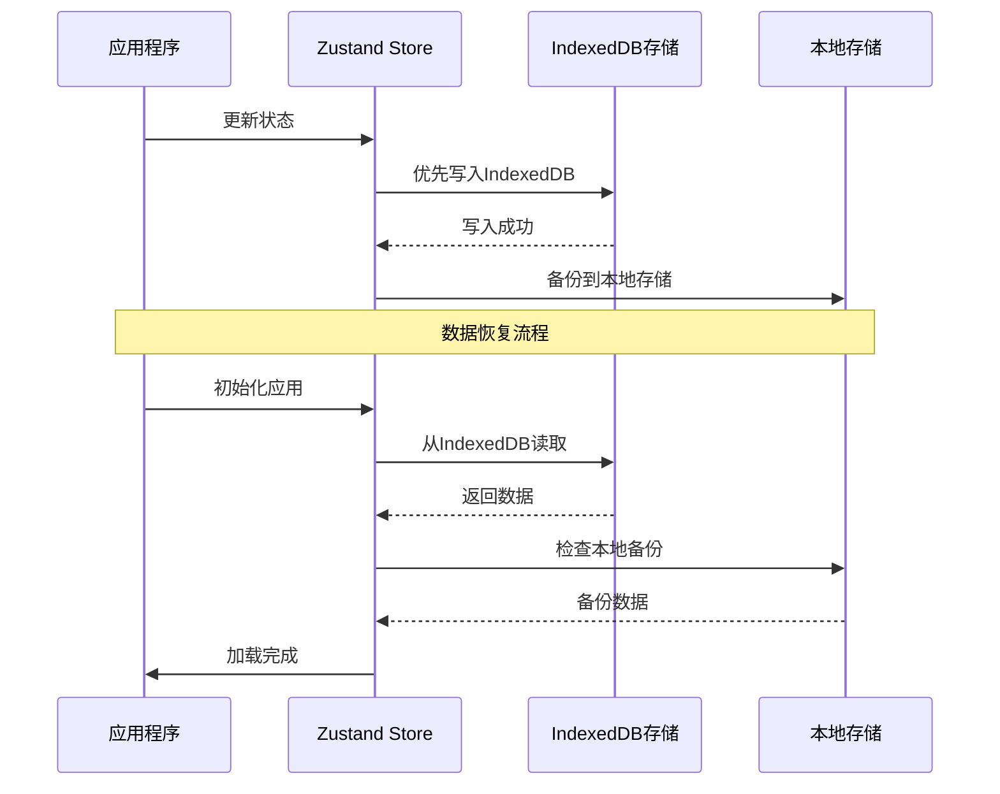

**图表来源**
- [app/utils/indexedDB-storage.ts](file://app/utils/indexedDB-storage.ts#L7-L47)
- [app/utils/store.ts](file://app/utils/store.ts#L29-L78)

**章节来源**
- [app/store/chat.ts](file://app/store/chat.ts#L232-L234)
- [app/utils/store.ts](file://app/utils/store.ts#L29-L78)

## 会话生命周期管理

### 会话创建与初始化

系统支持多种会话创建方式：

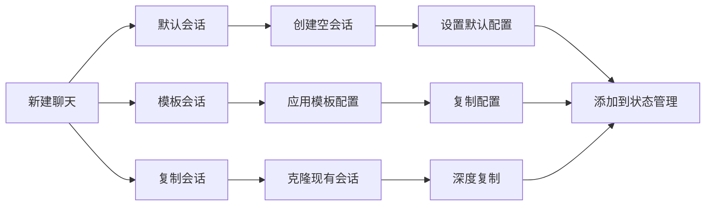

**图表来源**
- [app/store/chat.ts](file://app/store/chat.ts#L242-L328)

### 会话切换与导航

系统提供了灵活的会话管理和导航功能：

| 操作类型 | 方法名 | 功能描述 | 参数 |
|----------|--------|----------|------|
| 切换会话 | `selectSession(index)` | 选择指定索引的会话 | `index: number` |
| 下一会话 | `nextSession(delta)` | 基于偏移量切换会话 | `delta: number` |
| 移动会话 | `moveSession(from, to)` | 重新排序会话位置 | `from: number, to: number` |
| 删除会话 | `deleteSession(index)` | 删除指定索引的会话 | `index: number` |
| 清空会话 | `clearSessions()` | 清空所有会话 | 无参数 |
| 复制会话 | `forkSession()` | 复制当前会话 | 无参数 |

**章节来源**
- [app/store/chat.ts](file://app/store/chat.ts#L268-L378)

## 消息处理机制

### 消息创建与验证

系统提供了完整的消息创建和验证机制：

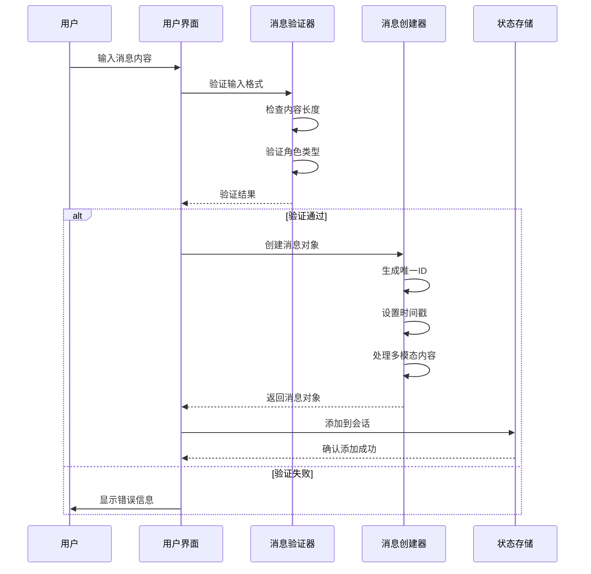

**图表来源**
- [app/store/chat.ts](file://app/store/chat.ts#L68-L76)
- [app/store/chat.ts](file://app/store/chat.ts#L407-L440)

### 多模态内容处理

系统支持文本、图片等多种内容类型的处理：

| 内容类型 | 处理方式 | 存储格式 | 特殊处理 |
|----------|----------|----------|----------|
| 文本内容 | 直接存储 | string | 模板填充、编码转换 |
| 图片内容 | 压缩上传 | Base64字符串 | 大小限制、格式转换 |
| 视频内容 | 上传处理 | URL链接 | 流媒体支持 |
| 音频内容 | 录音处理 | Base64音频 | TTS集成 |
| 工具调用 | 执行处理 | JSON对象 | 异步执行 |

**章节来源**
- [app/store/chat.ts](file://app/store/chat.ts#L407-L440)
- [app/utils/chat.ts](file://app/utils/chat.ts#L144-L165)

## 自动摘要与上下文管理

### 摘要生成机制

系统实现了智能的对话摘要生成功能：

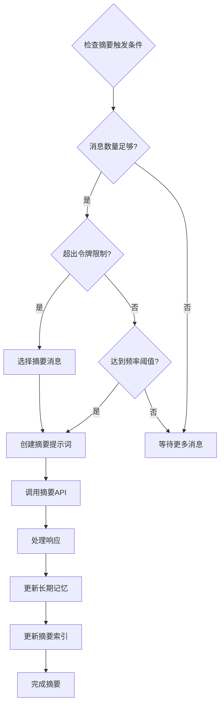

**图表来源**
- [app/store/chat.ts](file://app/store/chat.ts#L661-L796)

### 上下文窗口管理

系统采用动态上下文窗口管理策略：

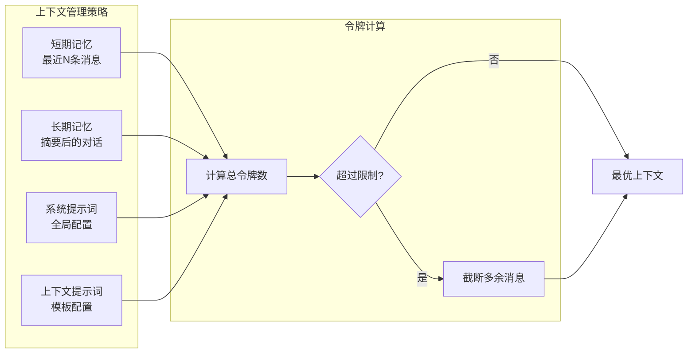

**图表来源**
- [app/store/chat.ts](file://app/store/chat.ts#L542-L639)

**章节来源**
- [app/store/chat.ts](file://app/store/chat.ts#L661-L796)
- [app/store/chat.ts](file://app/store/chat.ts#L542-L639)

## 流式响应处理

### 流式传输架构

系统实现了高效的流式响应处理机制：

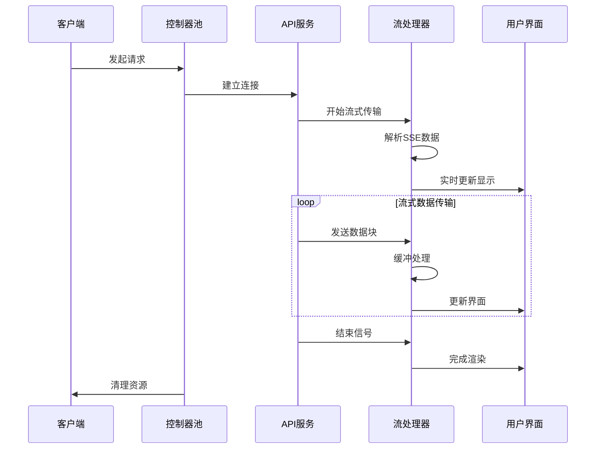

**图表来源**
- [app/utils/stream.ts](file://app/utils/stream.ts#L22-L108)
- [app/client/controller.ts](file://app/client/controller.ts#L1-L37)

### 响应动画与平滑处理

系统提供了响应动画效果以提升用户体验：

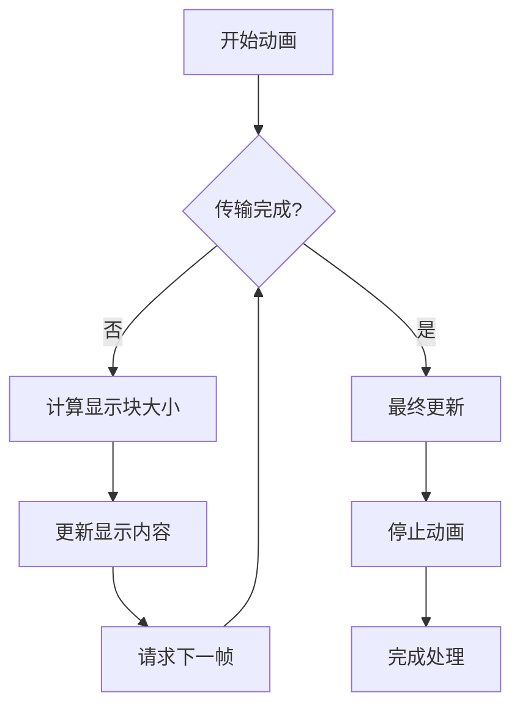

**图表来源**
- [app/utils/stream.ts](file://app/utils/stream.ts#L198-L217)

**章节来源**
- [app/utils/stream.ts](file://app/utils/stream.ts#L22-L108)
- [app/client/controller.ts](file://app/client/controller.ts#L1-L37)

## 错误处理与恢复

### 错误分类与处理

系统实现了完善的错误处理机制：

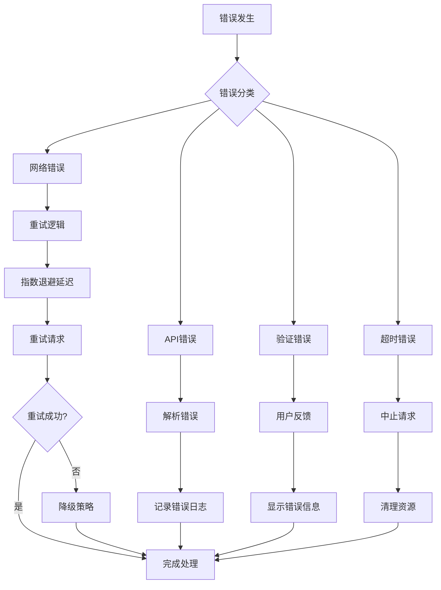

**图表来源**
- [app/utils/chat.ts](file://app/utils/chat.ts#L378-L387)
- [app/client/platforms/tencent.ts](file://app/client/platforms/tencent.ts#L140-L182)

### 并发控制与资源管理

系统提供了强大的并发控制机制：

| 功能模块 | 实现方式 | 作用范围 | 资源管理 |
|----------|----------|----------|----------|
| 请求控制器 | AbortController池 | 全局 | 自动清理 |
| 连接池管理 | WebSocket池 | 单个提供商 | 连接复用 |
| 重试机制 | 指数退避算法 | 单个请求 | 最大重试次数 |
| 超时控制 | 全局超时设置 | 所有请求 | 可配置超时 |
| 错误恢复 | 降级策略 | 整个系统 | 服务可用性 |

**章节来源**
- [app/client/controller.ts](file://app/client/controller.ts#L1-L37)
- [app/utils/chat.ts](file://app/utils/chat.ts#L378-L387)

## 状态订阅与更新

### 状态订阅机制

系统采用响应式状态订阅模式：

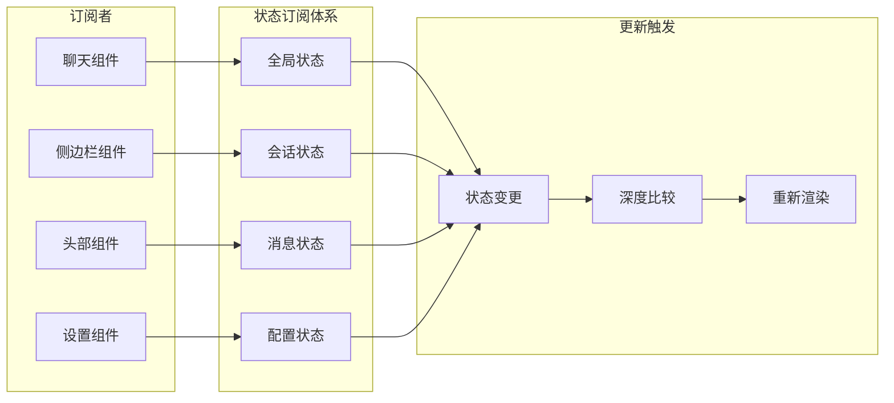

**图表来源**
- [app/components/chat.tsx](file://app/components/chat.tsx#L1-L50)

### 组件状态绑定

聊天组件通过自定义Hook实现状态绑定：

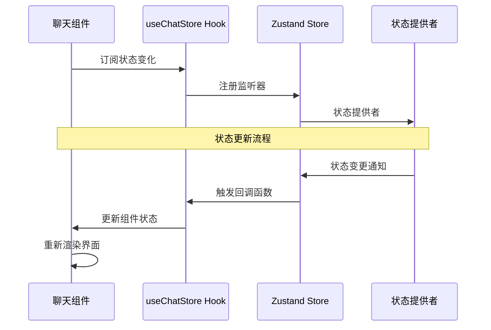

**图表来源**
- [app/components/chat.tsx](file://app/components/chat.tsx#L1-L50)

**章节来源**
- [app/components/chat.tsx](file://app/components/chat.tsx#L1-L50)

## API层数据交互

### API客户端架构

系统采用统一的API客户端架构：

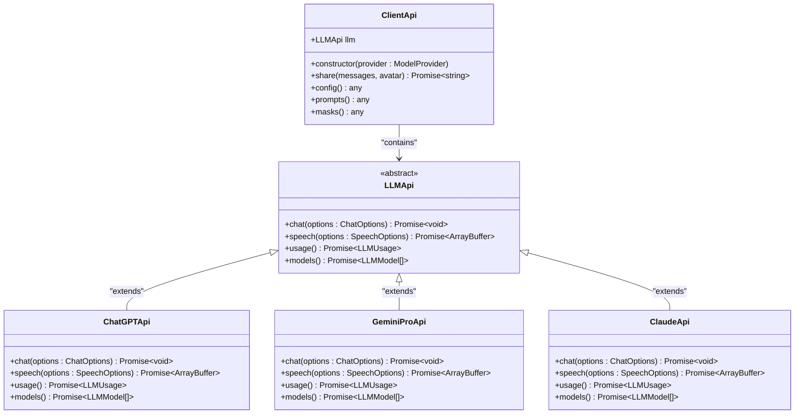

**图表来源**
- [app/client/api.ts](file://app/client/api.ts#L136-L182)

### 数据同步机制

系统提供了完整的数据同步功能：

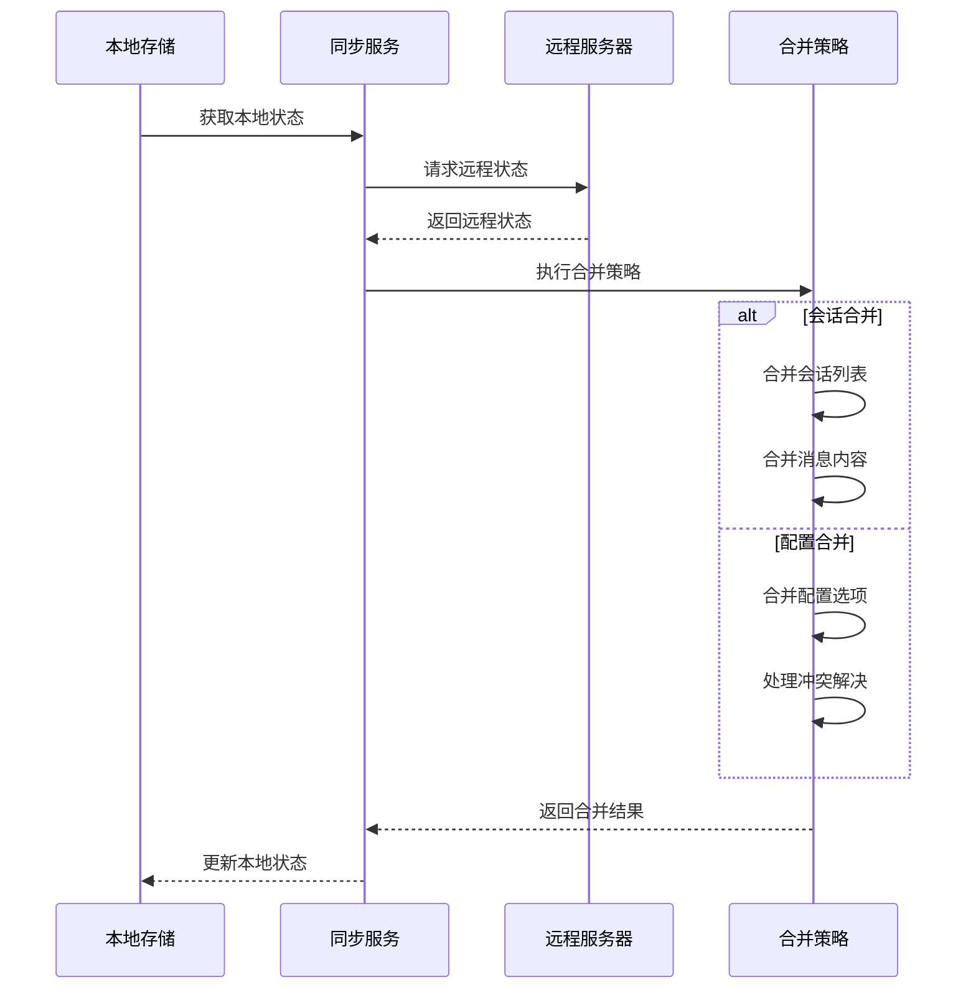

**图表来源**
- [app/utils/sync.ts](file://app/utils/sync.ts#L65-L119)

**章节来源**
- [app/client/api.ts](file://app/client/api.ts#L136-L182)
- [app/utils/sync.ts](file://app/utils/sync.ts#L65-L119)

## 最佳实践指南

### 流式响应处理最佳实践

1. **响应动画优化**
   - 使用 `requestAnimationFrame` 实现平滑动画
   - 设置合理的缓冲区大小避免频繁更新
   - 实现中断检测防止内存泄漏

2. **错误恢复策略**
   - 实现指数退避重试机制
   - 提供用户友好的错误提示
   - 支持手动重试和自动恢复

3. **性能优化建议**
   - 使用虚拟滚动处理大量消息
   - 实现消息内容懒加载
   - 优化DOM更新频率

### 并发编辑处理

1. **状态一致性保证**
   - 使用原子操作更新状态
   - 实现乐观锁机制
   - 提供冲突检测和解决

2. **实时协作支持**
   - 实现WebSocket长连接
   - 处理网络断线重连
   - 支持离线模式

### 数据持久化策略

1. **存储优化**
   - 使用IndexedDB存储大量数据
   - 实现增量同步减少传输
   - 定期清理过期数据

2. **备份恢复**
   - 提供自动备份功能
   - 支持手动导出导入
   - 实现版本回滚机制

## 总结

ChatGPT Next Web 的聊天状态管理系统展现了现代前端应用的最佳实践。通过精心设计的架构，系统实现了以下核心特性：

1. **高性能状态管理**：基于Zustand的响应式状态管理，支持复杂的业务逻辑和高效的状态更新

2. **智能上下文管理**：动态的上下文窗口管理和自动摘要生成功能，确保长时间对话的流畅性

3. **可靠的流式处理**：完善的流式响应处理机制，提供即时的用户体验

4. **健壮的错误处理**：多层次的错误处理和恢复机制，保证系统的稳定性

5. **灵活的扩展性**：模块化的架构设计，便于功能扩展和维护

这套状态管理系统不仅满足了当前的功能需求，还为未来的功能扩展奠定了坚实的基础。通过持续的优化和改进，它将继续为用户提供卓越的聊天体验。