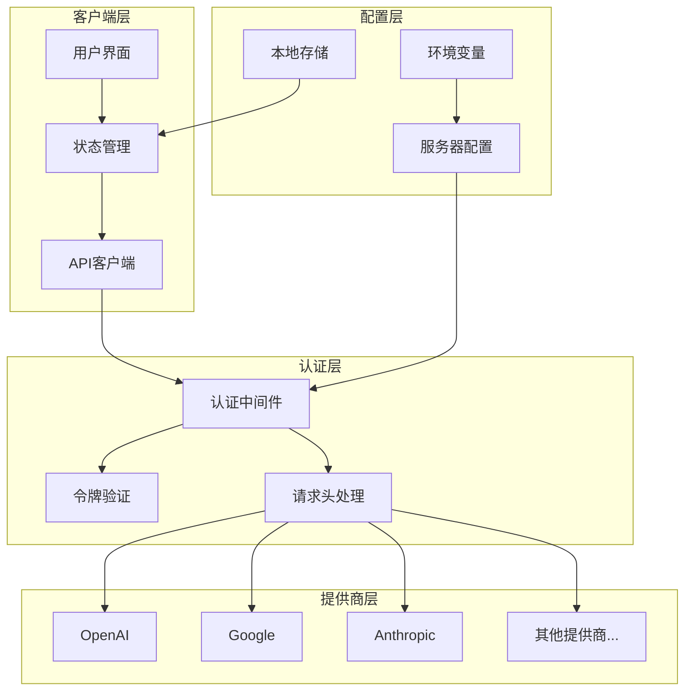
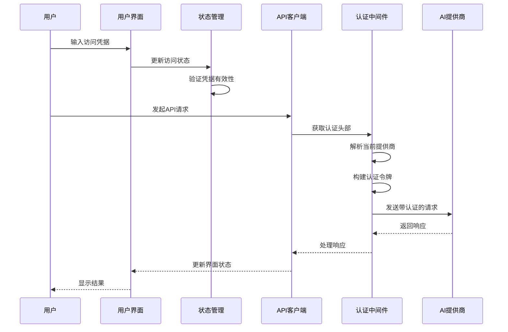
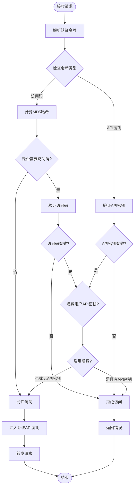
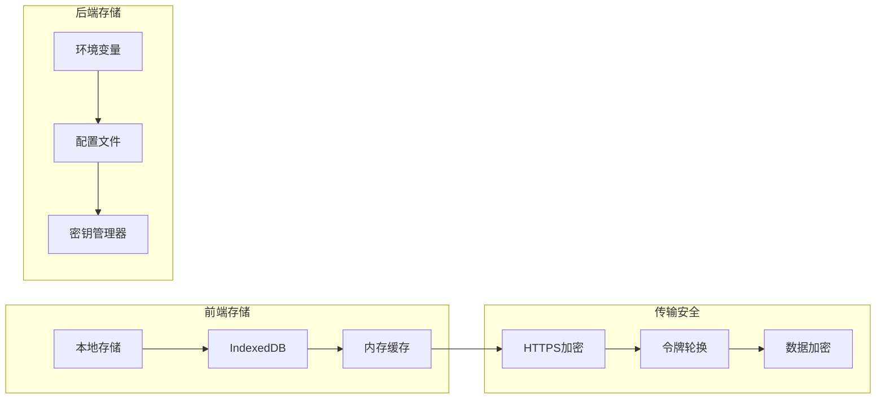
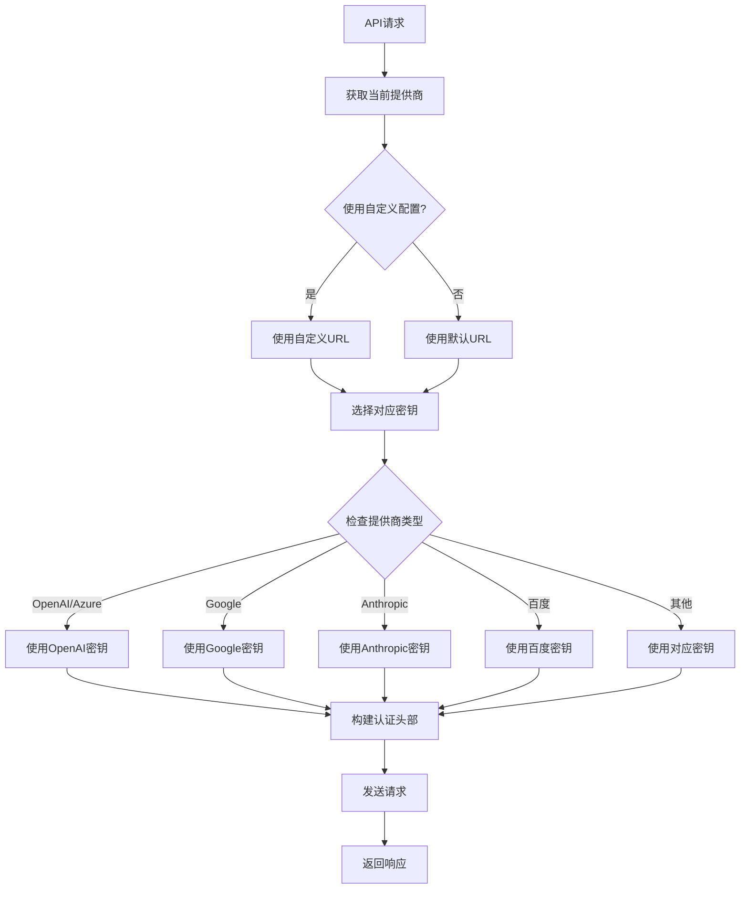
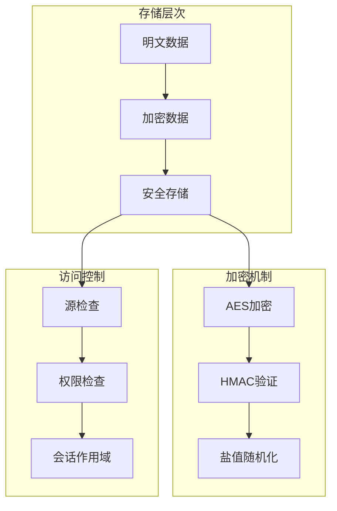
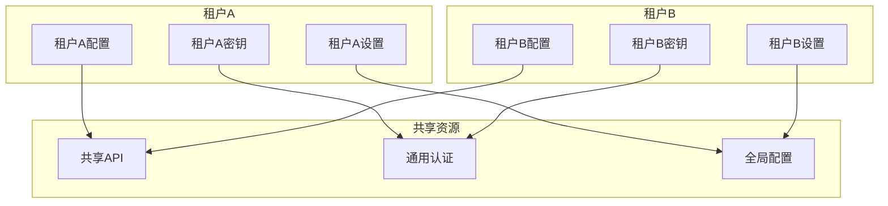
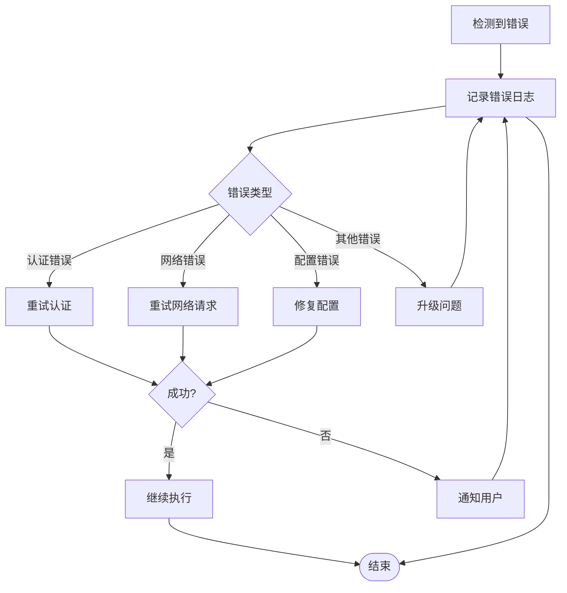

# 访问控制管理

<cite>
**本文档中引用的文件**
- [app/store/access.ts](file://app/store/access.ts)
- [app/client/api.ts](file://app/client/api.ts)
- [app/api/auth.ts](file://app/api/auth.ts)
- [app/constant.ts](file://app/constant.ts)
- [app/config/server.ts](file://app/config/server.ts)
- [app/utils/store.ts](file://app/utils/store.ts)
- [app/components/auth.tsx](file://app/components/auth.tsx)
- [app/components/settings.tsx](file://app/components/settings.tsx)
- [app/client/platforms/openai.ts](file://app/client/platforms/openai.ts)
- [app/client/platforms/google.ts](file://app/client/platforms/google.ts)
- [app/client/platforms/anthropic.ts](file://app/client/platforms/anthropic.ts)
</cite>

## 目录
1. [简介](#简介)
2. [系统架构概览](#系统架构概览)
3. [核心数据模型](#核心数据模型)
4. [认证机制详解](#认证机制详解)
5. [提供商密钥管理](#提供商密钥管理)
6. [动态切换逻辑](#动态切换逻辑)
7. [安全存储策略](#安全存储策略)
8. [多租户扩展能力](#多租户扩展能力)
9. [最佳实践指南](#最佳实践指南)
10. [故障排除](#故障排除)

## 简介

ChatGPT-Next-Web 的访问控制管理系统是一个多层次的安全框架，负责管理用户认证、API密钥存储、提供商访问凭证以及身份验证状态。该系统支持多种AI服务提供商（OpenAI、Google、Anthropic等），实现了密钥隔离、动态切换和安全存储等核心功能。

## 系统架构概览



**图表来源**
- [app/store/access.ts](file://app/store/access.ts#L1-L304)
- [app/client/api.ts](file://app/client/api.ts#L1-L400)
- [app/api/auth.ts](file://app/api/auth.ts#L1-L130)

## 核心数据模型

### 访问状态结构

系统的核心数据模型定义在访问状态中，包含所有提供商的认证信息：

```mermaid
classDiagram
class AccessState {
+string accessCode
+boolean useCustomConfig
+ServiceProvider provider
+string openaiUrl
+string openaiApiKey
+string azureUrl
+string azureApiKey
+string azureApiVersion
+string googleUrl
+string googleApiKey
+string googleApiVersion
+GoogleSafetySettingsThreshold googleSafetySettings
+string anthropicUrl
+string anthropicApiKey
+string anthropicApiVersion
+string baiduUrl
+string baiduApiKey
+string baiduSecretKey
+string bytedanceUrl
+string bytedanceApiKey
+string alibabaUrl
+string alibabaApiKey
+string moonshotUrl
+string moonshotApiKey
+string stabilityUrl
+string stabilityApiKey
+string tencentUrl
+string tencentSecretKey
+string tencentSecretId
+string iflytekUrl
+string iflytekApiKey
+string iflytekApiSecret
+string deepseekUrl
+string deepseekApiKey
+string xaiUrl
+string xaiApiKey
+string chatglmUrl
+string chatglmApiKey
+string siliconflowUrl
+string siliconflowApiKey
+string ai302Url
+string ai302ApiKey
+boolean needCode
+boolean hideUserApiKey
+boolean hideBalanceQuery
+boolean disableGPT4
+boolean disableFastLink
+string customModels
+string defaultModel
+string visionModels
+string edgeTTSVoiceName
}
class ServiceProvider {
<<enumeration>>
OpenAI
Azure
Google
Anthropic
Baidu
ByteDance
Alibaba
Tencent
Moonshot
Stability
Iflytek
XAI
ChatGLM
DeepSeek
SiliconFlow
"302.AI"
}
AccessState --> ServiceProvider
```

**图表来源**
- [app/store/access.ts](file://app/store/access.ts#L65-L154)
- [app/constant.ts](file://app/constant.ts#L120-L136)

### 验证方法体系

系统提供了针对不同提供商的验证方法：

| 提供商 | 验证方法 | 必需字段 |
|--------|----------|----------|
| OpenAI | isValidOpenAI() | openaiApiKey |
| Azure | isValidAzure() | azureUrl, azureApiKey, azureApiVersion |
| Google | isValidGoogle() | googleApiKey |
| Anthropic | isValidAnthropic() | anthropicApiKey |
| 百度 | isValidBaidu() | baiduApiKey, baiduSecretKey |
| 字节跳动 | isValidByteDance() | bytedanceApiKey |
| 阿里云 | isValidAlibaba() | alibabaApiKey |
| 腾讯云 | isValidTencent() | tencentSecretKey, tencentSecretId |
| 月之暗面 | isValidMoonshot() | moonshotApiKey |
| 科大讯飞 | isValidIflytek() | iflytekApiKey |
| 深度求索 | isValidDeepSeek() | deepseekApiKey |
| XAI/Grok | isValidXAI() | xaiApiKey |
| ChatGLM | isValidChatGLM() | chatglmApiKey |
| 硅基流动 | isValidSiliconFlow() | siliconflowApiKey |
| 302.AI | isValidAI302() | ai302ApiKey |

**段落来源**
- [app/store/access.ts](file://app/store/access.ts#L175-L249)

## 认证机制详解

### 客户端认证流程



**图表来源**
- [app/client/api.ts](file://app/client/api.ts#L244-L366)
- [app/api/auth.ts](file://app/api/auth.ts#L27-L129)

### 服务器端认证验证

服务器端认证机制负责验证访问码和API密钥的有效性：



**图表来源**
- [app/api/auth.ts](file://app/api/auth.ts#L27-L129)

**段落来源**
- [app/api/auth.ts](file://app/api/auth.ts#L17-L25)

## 提供商密钥管理

### 密钥存储策略

系统采用分层密钥存储策略，确保敏感信息的安全性：



**图表来源**
- [app/utils/store.ts](file://app/utils/store.ts#L29-L79)
- [app/config/server.ts](file://app/config/server.ts#L103-L130)

### 密钥隔离机制

每个提供商都有独立的密钥存储空间，防止密钥泄露影响其他服务：

| 提供商 | 密钥字段 | 安全级别 | 存储位置 |
|--------|----------|----------|----------|
| OpenAI | openaiApiKey | 高 | 加密本地存储 |
| Azure | azureApiKey | 高 | 加密本地存储 |
| Google | googleApiKey | 高 | 加密本地存储 |
| Anthropic | anthropicApiKey | 高 | 加密本地存储 |
| 百度 | baiduApiKey, baiduSecretKey | 中 | 加密本地存储 |
| 腾讯云 | tencentSecretKey, tencentSecretId | 中 | 加密本地存储 |
| 其他 | 各自专用字段 | 可配置 | 加密本地存储 |

**段落来源**
- [app/store/access.ts](file://app/store/access.ts#L71-L141)

## 动态切换逻辑

### 请求路由机制

系统根据当前选中的提供商动态注入相应的认证信息：



**图表来源**
- [app/client/api.ts](file://app/client/api.ts#L244-L366)

### 认证头部构建

系统根据不同提供商的要求构建相应的认证头部：

| 提供商 | 认证头 | 前缀 | 特殊处理 |
|--------|--------|------|----------|
| OpenAI/Azure | Authorization | Bearer | 通用格式 |
| Google | x-goog-api-key | - | 专用头部 |
| Anthropic | x-api-key | - | 专用头部 |
| Azure | api-key | - | 专用头部 |
| 百度 | - | - | 不设置头部（应用模式） |

**段落来源**
- [app/client/api.ts](file://app/client/api.ts#L320-L327)

## 安全存储策略

### 本地存储安全

系统使用IndexedDB进行持久化存储，并实现了多层安全保护：



**图表来源**
- [app/utils/store.ts](file://app/utils/store.ts#L29-L79)

### 敏感信息保护

系统对敏感信息实施严格的保护措施：

1. **传输加密**: 所有敏感数据通过HTTPS传输
2. **内存清理**: 使用后立即清理内存中的敏感数据
3. **访问限制**: 限制对敏感数据的访问权限
4. **审计日志**: 记录敏感操作的审计日志

**段落来源**
- [app/utils/store.ts](file://app/utils/store.ts#L45-L79)

## 多租户扩展能力

### 租户隔离机制

系统支持多租户架构，每个租户可以独立配置其访问凭据：



### 代理模式支持

系统支持代理模式，允许通过代理服务器访问不同的AI提供商：

| 代理类型 | 配置方式 | 适用场景 |
|----------|----------|----------|
| HTTP代理 | HTTP_PROXY环境变量 | 基础网络代理 |
| SOCKS代理 | SOCKS_PROXY环境变量 | 高级网络代理 |
| API网关 | 自定义网关URL | 企业级部署 |
| 负载均衡 | 多个提供商配置 | 高可用性 |

**段落来源**
- [app/config/server.ts](file://app/config/server.ts#L1-L279)

## 最佳实践指南

### 密钥管理最佳实践

1. **定期轮换**: 定期更换API密钥以降低风险
2. **最小权限**: 仅授予必要的API权限
3. **监控使用**: 监控API密钥的使用情况
4. **备份恢复**: 建立密钥备份和恢复机制

### 安全配置建议

1. **启用访问控制**: 在生产环境中启用访问码控制
2. **禁用用户密钥**: 对于企业部署，考虑禁用用户自定义API密钥
3. **配置防火墙**: 限制对管理接口的访问
4. **定期更新**: 及时更新系统和依赖包

### 性能优化建议

1. **连接池**: 使用连接池管理HTTP连接
2. **缓存策略**: 实施适当的缓存策略
3. **超时设置**: 合理设置请求超时时间
4. **并发控制**: 控制并发请求数量

## 故障排除

### 常见问题及解决方案

| 问题类型 | 症状 | 可能原因 | 解决方案 |
|----------|------|----------|----------|
| 认证失败 | 401错误 | API密钥无效 | 检查密钥格式和有效性 |
| 访问被拒绝 | 403错误 | 访问码错误 | 验证访问码配置 |
| 网络超时 | 请求超时 | 网络连接问题 | 检查网络连接和代理设置 |
| 配置错误 | 初始化失败 | 配置文件错误 | 验证配置文件格式 |

### 调试工具和技巧

1. **浏览器开发者工具**: 检查网络请求和响应
2. **控制台日志**: 查看详细的错误信息
3. **环境变量检查**: 验证环境变量配置
4. **API测试**: 使用Postman等工具测试API

### 错误处理流程



**段落来源**
- [app/api/auth.ts](file://app/api/auth.ts#L42-L54)

通过这套完整的访问控制管理系统，ChatGPT-Next-Web实现了安全、灵活、可扩展的AI服务访问控制，为用户提供可靠的多提供商AI服务体验。