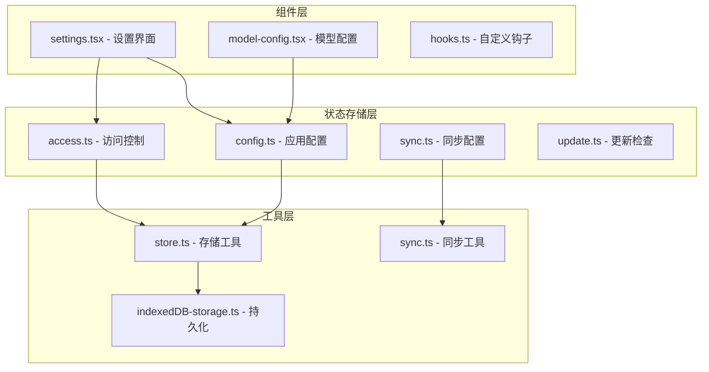
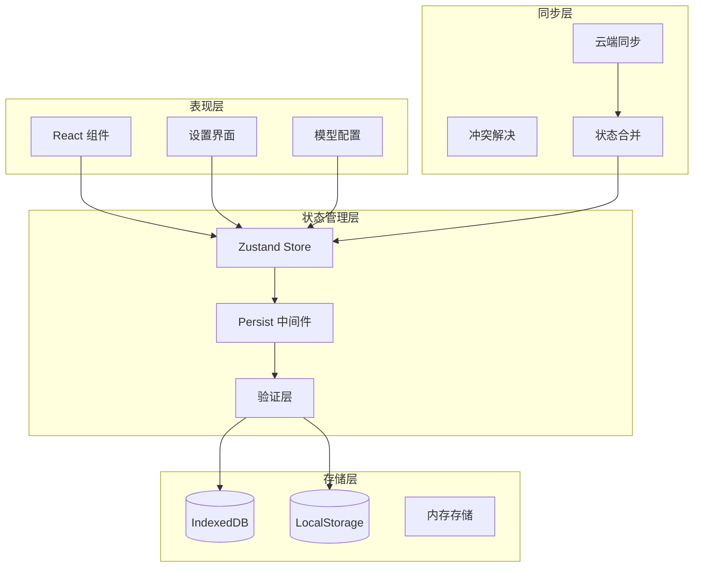
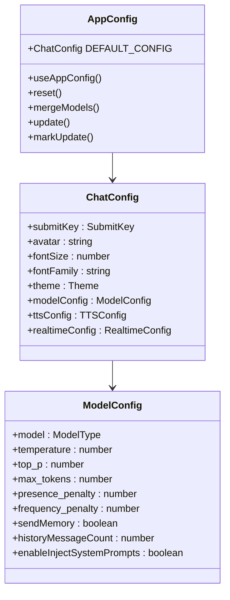
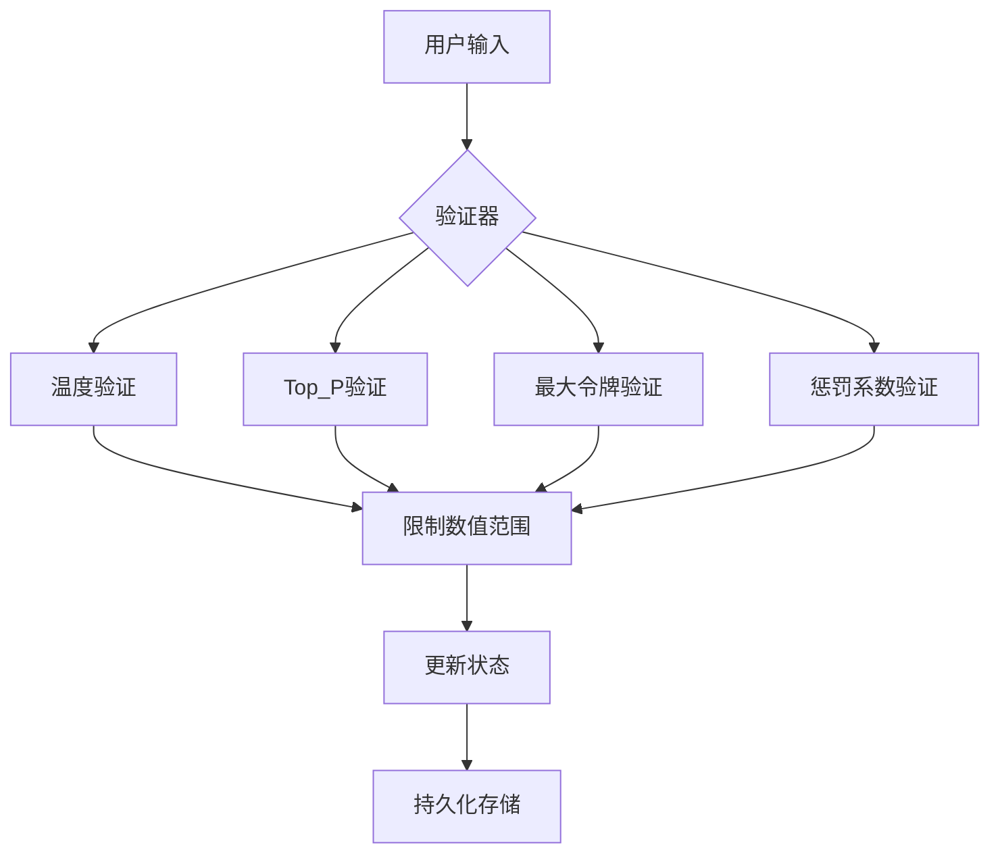
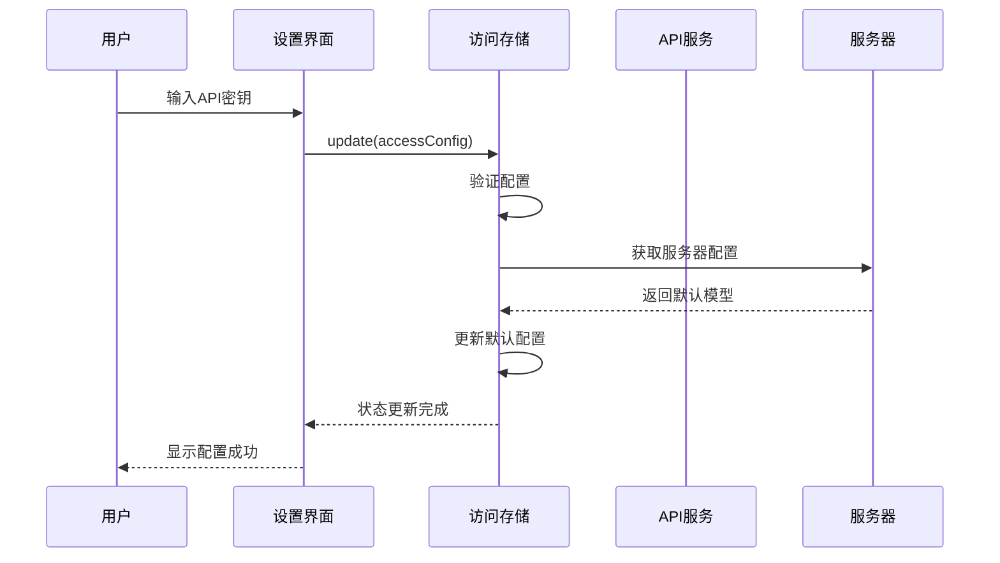
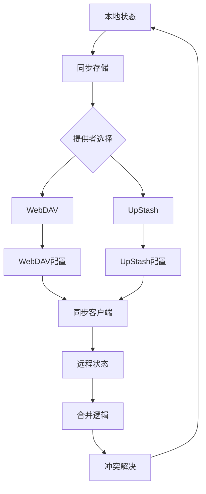
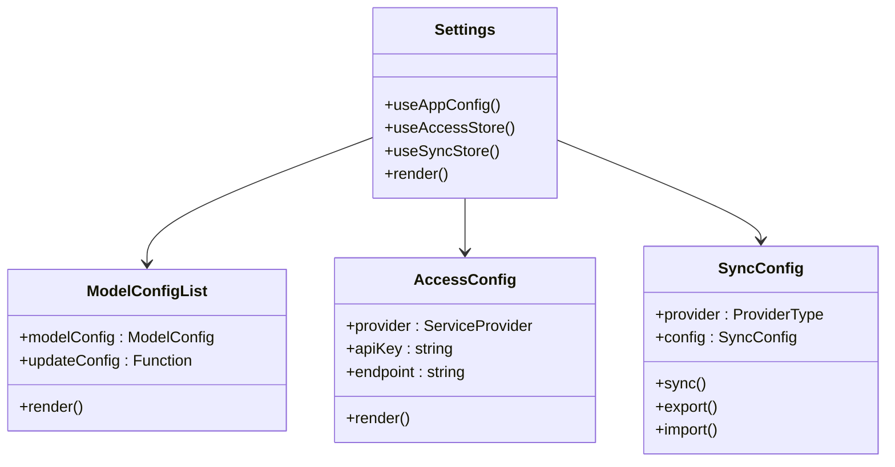
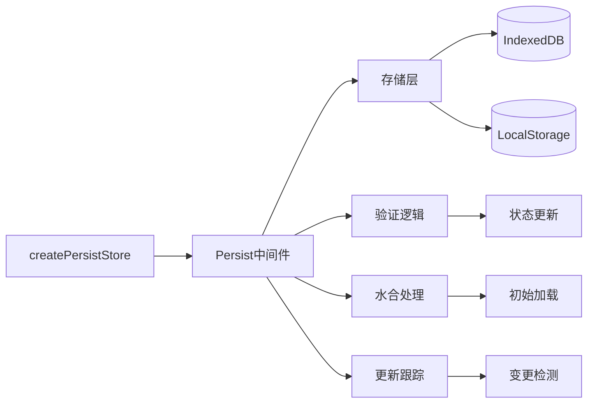
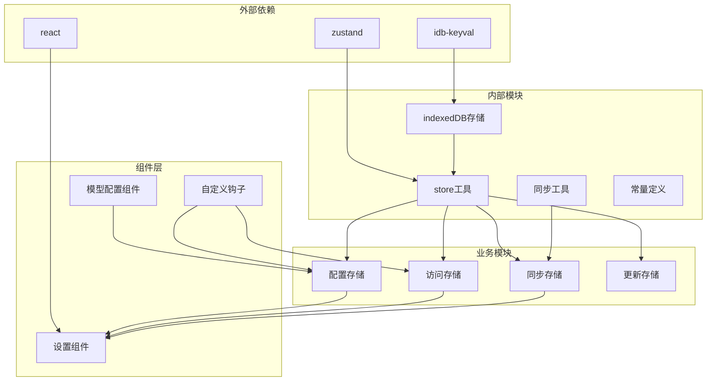

# 配置状态管理

<cite>
**本文档中引用的文件**
- [app/store/config.ts](file://app/store/config.ts)
- [app/store/index.ts](file://app/store/index.ts)
- [app/components/settings.tsx](file://app/components/settings.tsx)
- [app/utils/hooks.ts](file://app/utils/hooks.ts)
- [app/utils/store.ts](file://app/utils/store.ts)
- [app/store/sync.ts](file://app/store/sync.ts)
- [app/constant.ts](file://app/constant.ts)
- [app/config/client.ts](file://app/config/client.ts)
- [app/utils/sync.ts](file://app/utils/sync.ts)
- [app/store/access.ts](file://app/store/access.ts)
- [app/store/update.ts](file://app/store/update.ts)
- [app/utils/indexedDB-storage.ts](file://app/utils/indexedDB-storage.ts)
- [app/components/model-config.tsx](file://app/components/model-config.tsx)
</cite>

## 目录
1. [简介](#简介)
2. [项目结构](#项目结构)
3. [核心组件](#核心组件)
4. [架构概览](#架构概览)
5. [详细组件分析](#详细组件分析)
6. [依赖关系分析](#依赖关系分析)
7. [性能考虑](#性能考虑)
8. [故障排除指南](#故障排除指南)
9. [结论](#结论)

## 简介

ChatGPT Next Web 的配置状态管理系统是一个基于 React 和 Zustand 构建的复杂状态管理解决方案，负责管理用户偏好设置、模型参数、系统配置以及跨设备同步功能。该系统采用分层架构设计，支持本地持久化存储、实时状态更新和多设备配置同步。

## 项目结构

配置状态管理系统的核心文件组织如下：

**图表来源**
- [app/store/config.ts](file://app/store/config.ts#L1-L262)
- [app/store/access.ts](file://app/store/access.ts#L1-L304)
- [app/store/sync.ts](file://app/store/sync.ts#L1-L151)

**章节来源**
- [app/store/index.ts](file://app/store/index.ts#L1-L6)

## 核心组件

### 配置数据结构

系统定义了完整的配置数据结构，包括用户偏好设置和模型参数：

| 配置类别 | 数据类型 | 默认值 | 描述 |
|---------|---------|--------|------|
| 用户界面 | Theme | auto | 主题设置（自动/深色/浅色） |
| 输入设置 | SubmitKey | Enter | 提交键位设置 |
| 显示选项 | fontSize | 14 | 字体大小 |
| 显示选项 | avatar | 1f603 | 头像图标 |
| 显示选项 | fontFamily | "" | 自定义字体 |
| 显示选项 | tightBorder | false | 边框样式 |
| 显示选项 | sendPreviewBubble | true | 发送预览气泡 |
| 显示选项 | enableAutoGenerateTitle | true | 自动标题生成 |
| 显示选项 | sidebarWidth | 300 | 侧边栏宽度 |

### 模型配置参数

| 参数名称 | 类型 | 默认值 | 范围 | 描述 |
|---------|------|--------|------|------|
| model | string | gpt-4o-mini | - | 当前使用的模型 |
| temperature | number | 0.5 | 0-2 | 创造性/随机性控制 |
| top_p | number | 1 | 0-1 | 核采样参数 |
| max_tokens | number | 4000 | 0-512000 | 最大令牌数 |
| presence_penalty | number | 0 | -2到2 | 存在惩罚 |
| frequency_penalty | number | 0 | -2到2 | 频率惩罚 |
| sendMemory | boolean | true | - | 是否发送历史记忆 |
| historyMessageCount | number | 4 | - | 历史消息数量 |
| compressMessageLengthThreshold | number | 1000 | - | 压缩阈值 |
| enableInjectSystemPrompts | boolean | true | - | 注入系统提示 |

**章节来源**
- [app/store/config.ts](file://app/store/config.ts#L41-L107)

## 架构概览

配置状态管理系统采用分层架构，实现了清晰的关注点分离：

**图表来源**
- [app/utils/store.ts](file://app/utils/store.ts#L29-L78)
- [app/utils/indexedDB-storage.ts](file://app/utils/indexedDB-storage.ts#L1-L47)

## 详细组件分析

### 配置存储核心（config.ts）

配置存储是整个系统的核心，负责管理应用的主要配置状态：

**图表来源**
- [app/store/config.ts](file://app/store/config.ts#L164-L262)

#### 配置验证机制

系统实现了完善的配置验证机制，确保数据完整性：

**图表来源**
- [app/store/config.ts](file://app/store/config.ts#L115-L162)

**章节来源**
- [app/store/config.ts](file://app/store/config.ts#L164-L262)

### 访问控制存储（access.ts）

访问控制存储管理 API 密钥、端点配置和提供商设置：

**图表来源**
- [app/store/access.ts](file://app/store/access.ts#L252-L282)

**章节来源**
- [app/store/access.ts](file://app/store/access.ts#L156-L304)

### 同步存储（sync.ts）

同步存储实现了多设备间的配置同步功能：

**图表来源**
- [app/store/sync.ts](file://app/store/sync.ts#L46-L151)

**章节来源**
- [app/store/sync.ts](file://app/store/sync.ts#L46-L151)

### 设置组件（settings.tsx）

设置组件提供了完整的配置界面，支持实时配置更新：

**图表来源**
- [app/components/settings.tsx](file://app/components/settings.tsx#L584-L800)

**章节来源**
- [app/components/settings.tsx](file://app/components/settings.tsx#L584-L800)

### 存储工具（store.ts）

存储工具提供了统一的状态管理接口：

**图表来源**
- [app/utils/store.ts](file://app/utils/store.ts#L29-L78)

**章节来源**
- [app/utils/store.ts](file://app/utils/store.ts#L29-L78)

## 依赖关系分析

系统的依赖关系呈现清晰的层次结构：

**图表来源**
- [app/utils/store.ts](file://app/utils/store.ts#L1-L5)
- [app/store/config.ts](file://app/store/config.ts#L1-L19)

**章节来源**
- [app/store/index.ts](file://app/store/index.ts#L1-L6)

## 性能考虑

### 状态更新优化

系统采用了多种性能优化策略：

1. **防抖处理**：避免频繁的状态更新导致的性能问题
2. **批量更新**：将多个状态变更合并为单次更新
3. **选择性渲染**：只重新渲染受影响的组件
4. **懒加载**：按需加载配置模块

### 存储优化

1. **分层存储**：优先使用 IndexedDB，回退到 LocalStorage
2. **压缩存储**：对大型配置进行压缩存储
3. **增量更新**：只保存变更的部分，而不是完整状态

### 同步优化

1. **差异检测**：只同步变更的配置项
2. **冲突解决**：智能合并算法减少冲突
3. **离线支持**：支持离线操作和后续同步

## 故障排除指南

### 常见问题及解决方案

#### 配置丢失问题

**症状**：重启后配置重置为默认值

**原因**：
- IndexedDB 存储失败
- 浏览器隐私模式限制
- 存储空间不足

**解决方案**：
1. 检查浏览器存储权限
2. 清理浏览器缓存
3. 手动导出配置备份

#### 同步失败问题

**症状**：多设备间配置不同步

**原因**：
- 网络连接问题
- 认证凭据过期
- 存储配额超限

**解决方案**：
1. 检查网络连接
2. 重新配置同步凭据
3. 清理旧的同步数据

#### 性能问题

**症状**：配置更新响应缓慢

**原因**：
- 配置项过多
- 频繁的状态更新
- 存储读写阻塞

**解决方案**：
1. 减少不必要的配置项
2. 使用防抖机制
3. 优化存储查询

**章节来源**
- [app/utils/indexedDB-storage.ts](file://app/utils/indexedDB-storage.ts#L1-L47)
- [app/store/sync.ts](file://app/store/sync.ts#L90-L120)

## 结论

ChatGPT Next Web 的配置状态管理系统展现了现代前端应用的最佳实践。通过采用分层架构、持久化存储、实时同步和完善的验证机制，系统实现了可靠、高效且用户友好的配置管理体验。

### 主要优势

1. **模块化设计**：清晰的职责分离，便于维护和扩展
2. **持久化存储**：多重存储方案确保数据安全
3. **实时同步**：支持多设备无缝切换
4. **类型安全**：完整的 TypeScript 类型定义
5. **性能优化**：多种优化策略提升用户体验

### 技术亮点

- 基于 Zustand 的轻量级状态管理
- 基于 IndexedDB 的持久化存储
- 智能的冲突解决机制
- 完善的错误处理和恢复机制

该系统为现代 Web 应用的配置管理提供了优秀的参考实现，展示了如何在保持简洁性的同时实现复杂的功能需求。