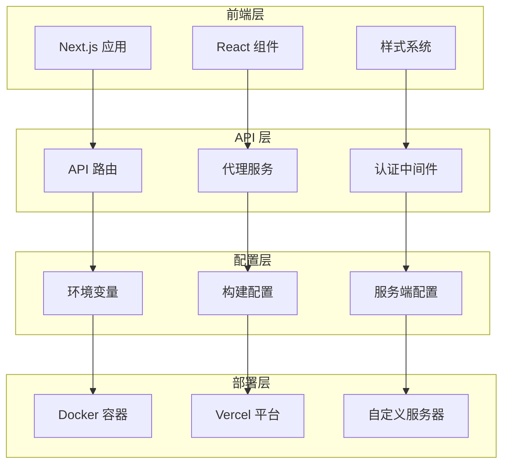
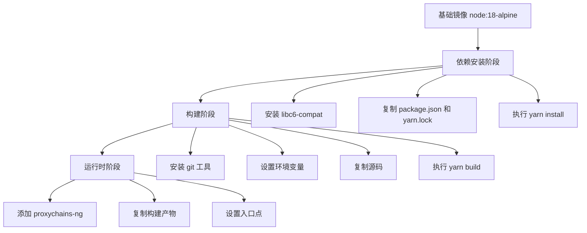
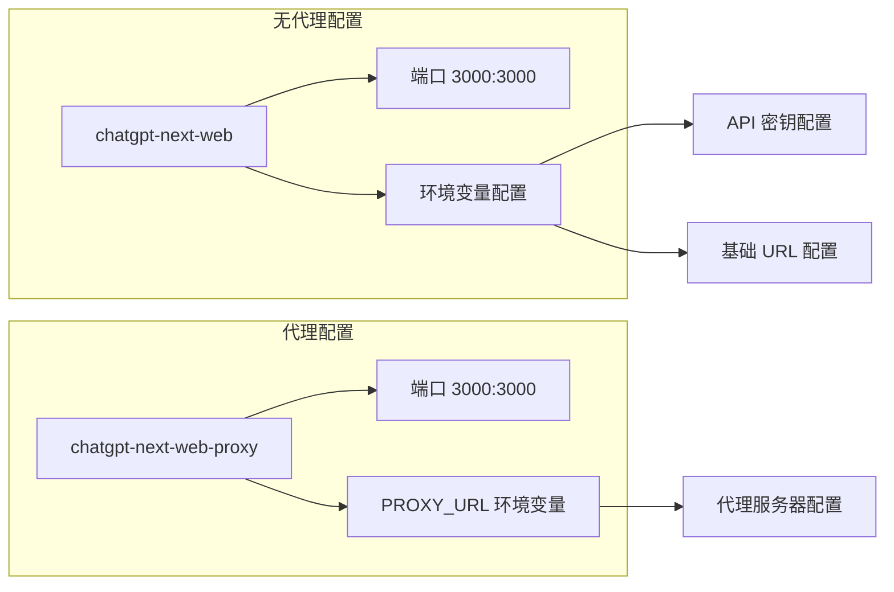
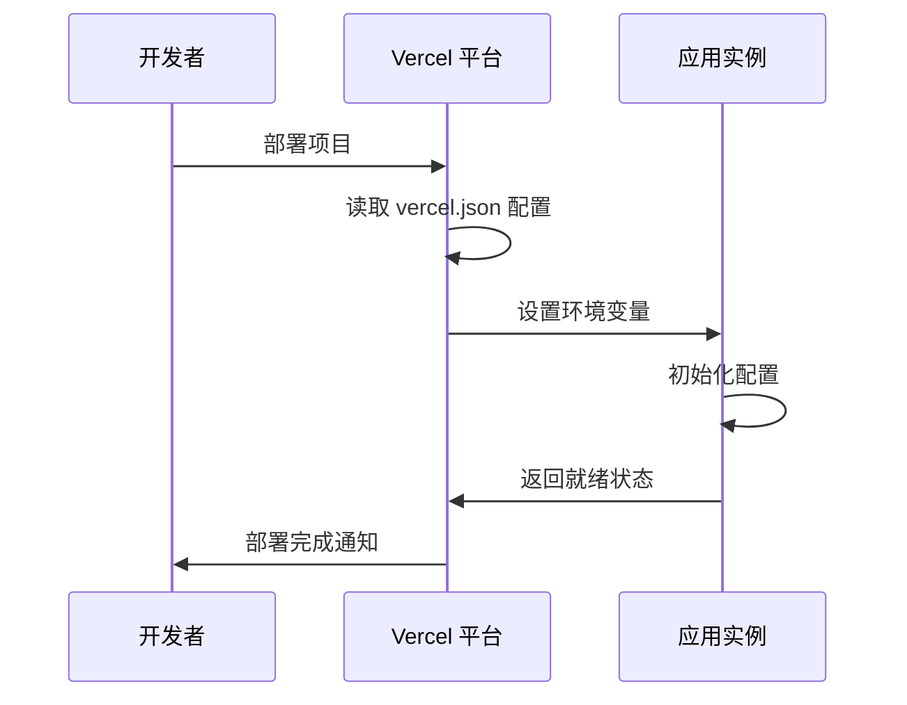
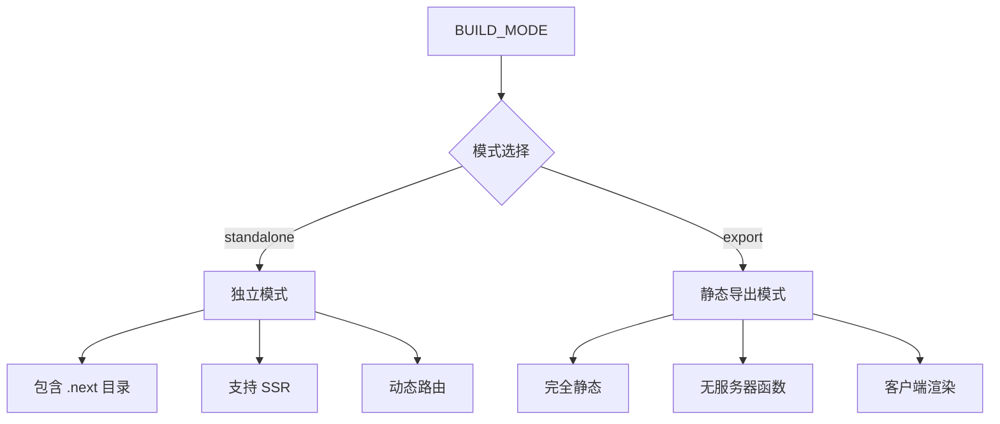
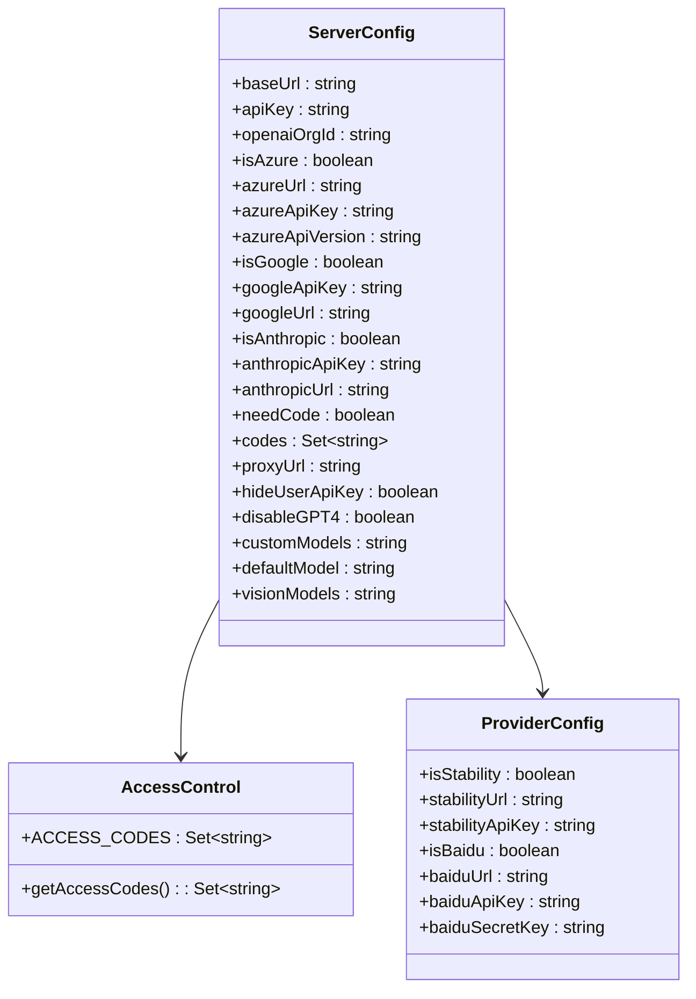
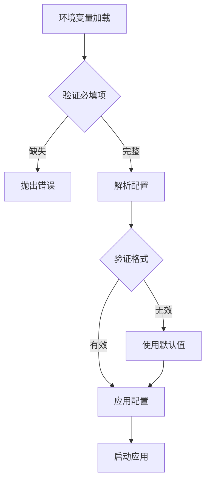
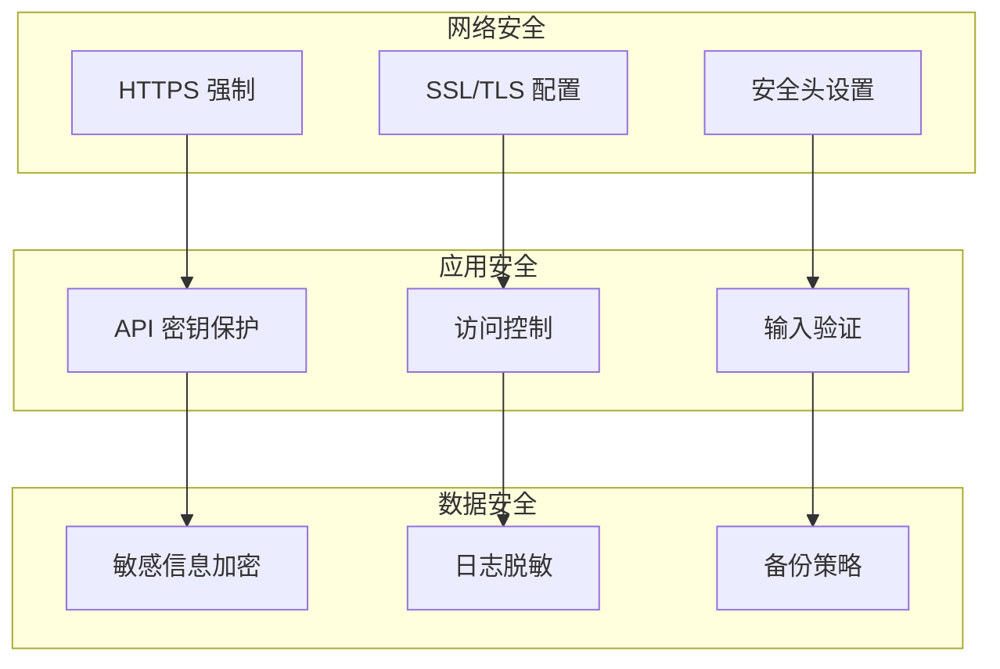

# 部署与配置

<cite>
**本文档中引用的文件**
- [Dockerfile](file://Dockerfile)
- [docker-compose.yml](file://docker-compose.yml)
- [vercel.json](file://vercel.json)
- [next.config.mjs](file://next.config.mjs)
- [app/config/server.ts](file://app/config/server.ts)
- [app/config/build.ts](file://app/config/build.ts)
- [app/config/client.ts](file://app/config/client.ts)
- [package.json](file://package.json)
- [scripts/setup.sh](file://scripts/setup.sh)
- [README.md](file://README.md)
</cite>

## 目录
1. [简介](#简介)
2. [项目架构概览](#项目架构概览)
3. [Docker容器化部署](#docker容器化部署)
4. [Docker Compose服务编排](#docker-compose服务编排)
5. [Vercel平台部署](#vercel平台部署)
6. [Next.js构建配置](#nextjs构建配置)
7. [服务端配置详解](#服务端配置详解)
8. [环境变量配置](#环境变量配置)
9. [生产环境最佳实践](#生产环境最佳实践)
10. [性能优化与安全配置](#性能优化与安全配置)
11. [故障排除指南](#故障排除指南)

## 简介

ChatGPT Next Web 是一个基于 Next.js 构建的现代化 AI 助手应用，支持多种 AI 模型提供商，具备高度可配置性和可扩展性。本文档提供了完整的部署与配置指南，涵盖从本地开发到生产环境的各种部署场景。

## 项目架构概览

该应用采用前后端分离架构，主要组件包括：



**图表来源**
- [app/config/server.ts](file://app/config/server.ts#L1-L279)
- [next.config.mjs](file://next.config.mjs#L1-L112)

## Docker容器化部署

### 镜像构建过程

项目使用多阶段 Docker 构建来优化最终镜像大小：



**图表来源**
- [Dockerfile](file://Dockerfile#L1-L69)

### 运行参数配置

Docker 容器支持丰富的环境变量配置：

| 环境变量 | 类型 | 默认值 | 描述 |
|---------|------|--------|------|
| OPENAI_API_KEY | String | "" | OpenAI API 密钥，支持逗号分隔的多个密钥 |
| GOOGLE_API_KEY | String | "" | Google Gemini API 密钥 |
| CODE | String | "" | 访问密码，支持多个密码用逗号分隔 |
| PROXY_URL | String | "" | 代理服务器地址，格式：协议://主机:端口 用户名 密码 |
| BASE_URL | String | "" | API 基础 URL，用于自定义代理 |
| ENABLE_MCP | String | "" | 是否启用 MCP（模型上下文协议）功能 |

### 代理配置

Dockerfile 内置了 proxychains 支持，可以配置复杂的代理链：

```bash
# 代理配置示例
-e PROXY_URL="http://localhost:7890 user pass"
```

**章节来源**
- [Dockerfile](file://Dockerfile#L18-L68)

## Docker Compose服务编排

### 服务配置结构

项目提供了两种部署配置文件，分别针对不同网络环境：



**图表来源**
- [docker-compose.yml](file://docker-compose.yml#L1-L39)

### 环境变量映射

| 变量名 | 用途 | 示例值 |
|--------|------|--------|
| OPENAI_API_KEY | OpenAI API 密钥 | sk-xxxxxxxxxxxxxxxxxxxxxxxxxxxxxxxx |
| GOOGLE_API_KEY | Google API 密钥 | xxxxxxxxxxxxxxxxxxxxxxxxxxxxxxxxxxxx |
| CODE | 访问控制密码 | admin,password123 |
| BASE_URL | 自定义 API 地址 | https://api.openai.com |
| PROXY_URL | 代理服务器地址 | http://proxy.example.com:8080 |
| OPENAI_ORG_ID | OpenAI 组织ID | org-xxxxxxxxxxxxxxxxxxxxxxxx |
| HIDE_USER_API_KEY | 隐藏用户API输入 | 1 |
| DISABLE_GPT4 | 禁用GPT-4模型 | 1 |
| ENABLE_BALANCE_QUERY | 启用余额查询 | 1 |

**章节来源**
- [docker-compose.yml](file://docker-compose.yml#L9-L38)

## Vercel平台部署

### 平台配置要点

Vercel 部署配置相对简单，主要通过环境变量进行控制：



**图表来源**
- [vercel.json](file://vercel.json#L1-L6)

### 环境变量设置

Vercel 部署需要设置以下关键环境变量：

| 变量名 | 必需 | 描述 |
|--------|------|------|
| OPENAI_API_KEY | ✓ | OpenAI API 密钥 |
| CODE | ✗ | 页面访问密码 |
| BASE_URL | ✗ | API 基础 URL |
| GOOGLE_API_KEY | ✗ | Google API 密钥 |
| AZURE_URL | ✗ | Azure API 地址 |
| AZURE_API_KEY | ✗ | Azure API 密钥 |

### 静态资源处理

Next.js 的静态资源处理配置确保了最佳的性能表现：

- **图片优化**：自动优化图片大小和格式
- **代码分割**：智能分割 JavaScript 代码
- **预渲染**：支持静态生成和增量静态再生

**章节来源**
- [vercel.json](file://vercel.json#L1-L6)
- [next.config.mjs](file://next.config.mjs#L30-L32)

## Next.js构建配置

### 构建模式配置

项目支持多种构建模式以适应不同的部署需求：



**图表来源**
- [next.config.mjs](file://next.config.mjs#L3-L4)

### 构建优化选项

| 配置项 | 作用 | 性能影响 |
|--------|------|----------|
| DISABLE_CHUNK | 禁用代码分割 | 减少请求数，增加单个文件大小 |
| forceSwcTransforms | 强制使用 SWC 转换 | 提升构建速度 |
| webpack 配置 | SVG 处理优化 | 支持 SVG 图标 |
| fallback 配置 | Node.js 模块回退 | 兼容性保证 |

### 重写规则配置

Next.js 配置了丰富的 API 重写规则：

- **Azure OpenAI 重写**：`/api/proxy/azure/:resource_name/deployments/:deploy_name/:path*`
- **Google Generative 重写**：`/api/proxy/google/:path*`
- **OpenAI 重写**：`/api/proxy/openai/:path*`
- **Anthropic 重写**：`/api/proxy/anthropic/:path*`

**章节来源**
- [next.config.mjs](file://next.config.mjs#L1-L112)

## 服务端配置详解

### 配置架构设计

服务端配置采用分层架构，支持多种 AI 服务提供商：



**图表来源**
- [app/config/server.ts](file://app/config/server.ts#L132-L278)

### 核心配置项

| 配置项 | 类型 | 默认值 | 描述 |
|--------|------|--------|------|
| baseUrl | String | undefined | API 基础 URL |
| apiKey | String | undefined | 主要 API 密钥 |
| openaiOrgId | String | undefined | OpenAI 组织 ID |
| needCode | Boolean | false | 是否需要访问密码 |
| hideUserApiKey | Boolean | false | 是否隐藏用户 API 输入 |
| disableGPT4 | Boolean | false | 是否禁用 GPT-4 |
| customModels | String | "" | 自定义模型配置 |
| defaultModel | String | "" | 默认模型名称 |
| visionModels | String | "" | 视觉模型列表 |

### API 密钥管理

系统支持多 API 密钥轮换机制：

```typescript
// API 密钥随机选择逻辑
function getApiKey(keys?: string) {
  const apiKeys = keys?.split(",").map(v => v.trim());
  const randomIndex = Math.floor(Math.random() * apiKeys.length);
  return apiKeys[randomIndex];
}
```

**章节来源**
- [app/config/server.ts](file://app/config/server.ts#L116-L129)

## 环境变量配置

### 核心环境变量

项目支持广泛的环境变量配置，覆盖所有主要功能模块：

| 分类 | 变量名 | 类型 | 描述 |
|------|--------|------|------|
| 认证 | CODE | String | 访问密码，支持逗号分隔 |
| OpenAI | OPENAI_API_KEY | String | OpenAI API 密钥 |
| OpenAI | BASE_URL | String | API 基础 URL |
| OpenAI | OPENAI_ORG_ID | String | OpenAI 组织 ID |
| Google | GOOGLE_API_KEY | String | Google Gemini API 密钥 |
| Azure | AZURE_URL | String | Azure API 地址 |
| Azure | AZURE_API_KEY | String | Azure API 密钥 |
| Azure | AZURE_API_VERSION | String | Azure API 版本 |
| Anthropic | ANTHROPIC_API_KEY | String | Anthropic API 密钥 |
| 百度 | BAIDU_API_KEY | String | 百度 API 密钥 |
| 百度 | BAIDU_SECRET_KEY | String | 百度密钥 |
| 字节跳动 | BYTEDANCE_API_KEY | String | 字节跳动 API 密钥 |
| 阿里云 | ALIBABA_API_KEY | String | 阿里云 API 密钥 |

### 高级配置选项

| 变量名 | 用途 | 示例值 |
|--------|------|--------|
| CUSTOM_MODELS | 自定义模型 | `+llama,-gpt-3.5-turbo,gpt-4-1106-preview=gpt-4-turbo` |
| DEFAULT_MODEL | 默认模型 | `gpt-4` |
| VISION_MODELS | 视觉模型 | `gpt-4-vision,claude-3-opus` |
| DISABLE_GPT4 | 禁用 GPT-4 | `1` |
| HIDE_USER_API_KEY | 隐藏 API 输入 | `1` |
| ENABLE_BALANCE_QUERY | 启用余额查询 | `1` |
| DISABLE_FAST_LINK | 禁用快速链接 | `1` |
| ENABLE_MCP | 启用 MCP 功能 | `true` |

### 配置验证流程



**章节来源**
- [app/config/server.ts](file://app/config/server.ts#L5-L99)

## 生产环境最佳实践

### HTTPS配置

在生产环境中，强烈建议启用 HTTPS：

```nginx
# Nginx 配置示例
server {
    listen 443 ssl;
    server_name your-domain.com;
    
    ssl_certificate /path/to/certificate.crt;
    ssl_certificate_key /path/to/private.key;
    
    location / {
        proxy_pass http://localhost:3000;
        proxy_set_header Host $host;
        proxy_set_header X-Real-IP $remote_addr;
        proxy_set_header X-Forwarded-For $proxy_add_x_forwarded_for;
        proxy_set_header X-Forwarded-Proto $scheme;
    }
}
```

### 反向代理设置

推荐使用 Nginx 或 Traefik 作为反向代理：

| 代理类型 | 优势 | 适用场景 |
|----------|------|----------|
| Nginx | 成熟稳定，性能优异 | 高并发场景 |
| Traefik | 自动服务发现，动态配置 | 容器化环境 |
| Caddy | 自动 HTTPS，配置简单 | 快速部署 |

### 性能调优建议

1. **缓存策略**
   - 静态资源长期缓存
   - API 响应适当缓存
   - 浏览器缓存优化

2. **CDN 配置**
   - 使用 CDN 加速静态资源
   - 配置地理位置就近分发
   - 启用压缩传输

3. **数据库优化**
   - 连接池配置
   - 查询优化
   - 缓存策略

### 安全配置



## 性能优化与安全配置

### 构建优化

项目内置了多项性能优化措施：

| 优化项 | 实现方式 | 效果 |
|--------|----------|------|
| 代码分割 | 动态导入 | 减少初始加载时间 |
| 图片优化 | Next.js 图片组件 | 自动优化图片格式和尺寸 |
| 代码压缩 | SWC 编译器 | 提升构建和运行速度 |
| 缓存策略 | 智能缓存 | 减少重复请求 |

### 安全最佳实践

1. **API 密钥管理**
   - 使用环境变量存储密钥
   - 定期轮换 API 密钥
   - 限制密钥权限范围

2. **访问控制**
   - 启用访问密码保护
   - IP 白名单限制
   - 请求频率限制

3. **数据保护**
   - 敏感数据加密存储
   - HTTPS 强制传输
   - 日志信息脱敏

### 监控与告警

建议实施以下监控指标：

| 指标类型 | 监控内容 | 告警阈值 |
|----------|----------|----------|
| 性能指标 | 响应时间、吞吐量 | 响应时间 > 2s |
| 错误指标 | 错误率、超时率 | 错误率 > 5% |
| 资源指标 | CPU、内存使用率 | 使用率 > 80% |
| 业务指标 | API 调用量、活跃用户 | 异常波动 |

## 故障排除指南

### 常见部署问题

1. **Docker 容器启动失败**
   - 检查端口占用情况
   - 验证环境变量配置
   - 查看容器日志输出

2. **API 调用失败**
   - 验证 API 密钥有效性
   - 检查网络连接状态
   - 确认服务提供商可用性

3. **性能问题**
   - 分析资源使用情况
   - 优化数据库查询
   - 启用适当的缓存策略

### 调试工具

项目提供了多种调试和诊断工具：

```bash
# 开发环境调试
yarn dev

# 生产环境构建
yarn build

# 性能分析
yarn export

# 单元测试
yarn test
```

### 日志分析

建议配置集中式日志管理系统：

```yaml
# 日志配置示例
logging:
  level: INFO
  format: json
  destinations:
    - file: /var/log/chatgpt-next-web/app.log
    - syslog: localhost:514
```

**章节来源**
- [package.json](file://package.json#L6-L21)

## 结论

本文档提供了 ChatGPT Next Web 项目的完整部署与配置指南，涵盖了从本地开发到生产环境的各种部署场景。通过合理配置环境变量、优化构建参数和实施安全措施，可以确保应用在各种环境下稳定高效运行。

建议根据实际需求选择合适的部署方案，并持续监控和优化系统性能，以提供最佳的用户体验。