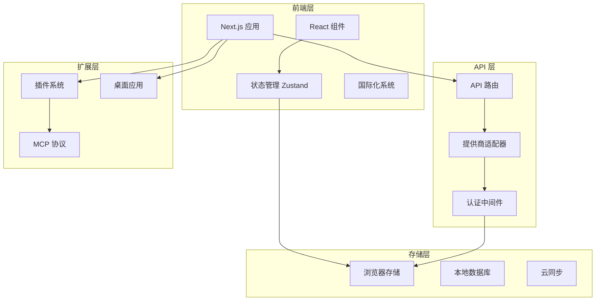
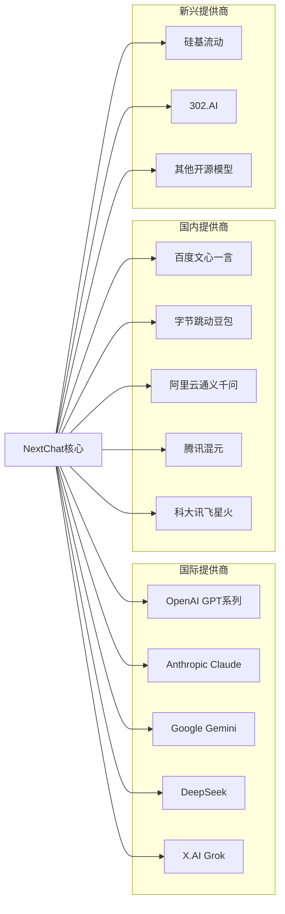
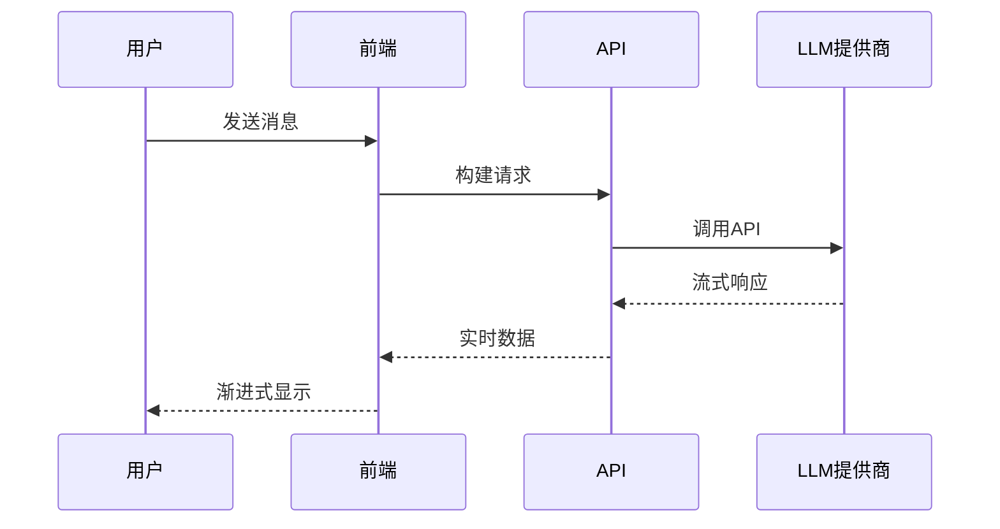
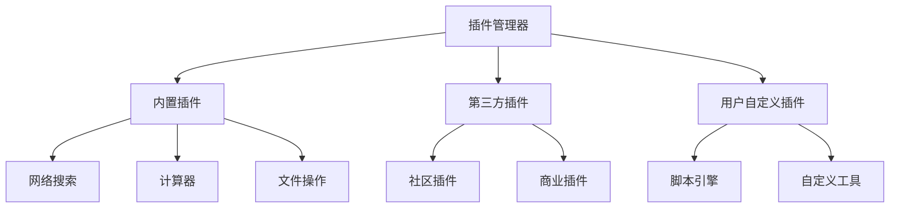
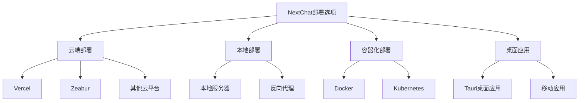
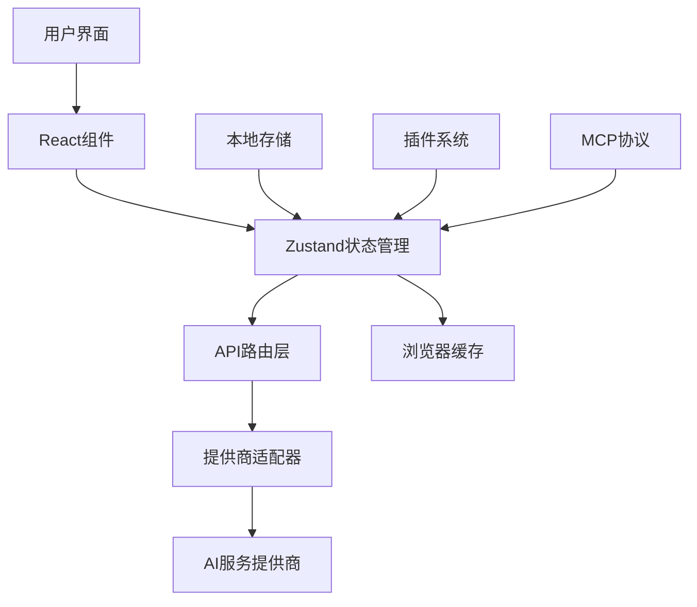
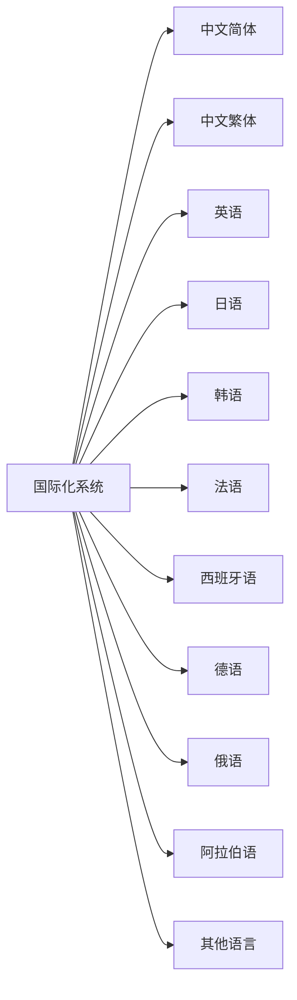

# 项目概述

<cite>
**本文档引用的文件**
- [README.md](file://README.md)
- [README_CN.md](file://README_CN.md)
- [package.json](file://package.json)
- [app/page.tsx](file://app/page.tsx)
- [app/layout.tsx](file://app/layout.tsx)
- [app/components/home.tsx](file://app/components/home.tsx)
- [app/config/server.ts](file://app/config/server.ts)
- [app/config/client.ts](file://app/config/client.ts)
- [app/constant.ts](file://app/constant.ts)
- [app/store/index.ts](file://app/store/index.ts)
- [next.config.mjs](file://next.config.mjs)
- [Dockerfile](file://Dockerfile)
- [app/mcp/types.ts](file://app/mcp/types.ts)
- [app/mcp/client.ts](file://app/mcp/client.ts)
- [app/store/plugin.ts](file://app/store/plugin.ts)
- [app/components/plugin.tsx](file://app/components/plugin.tsx)
- [app/components/realtime-chat/realtime-chat.tsx](file://app/components/realtime-chat/realtime-chat.tsx)
- [app/components/artifacts.tsx](file://app/components/artifacts.tsx)
- [app/locales/index.ts](file://app/locales/index.ts)
- [src-tauri/src/main.rs](file://src-tauri/src/main.rs)
</cite>

## 目录
1. [项目简介](#项目简介)
2. [核心目标与愿景](#核心目标与愿景)
3. [技术架构概览](#技术架构概览)
4. [多提供商集成体系](#多提供商集成体系)
5. [核心功能特性](#核心功能特性)
6. [部署方式与环境](#部署方式与环境)
7. [目标用户群体](#目标用户群体)
8. [前后端协同机制](#前后端协同机制)
9. [国际化与本地化](#国际化与本地化)
10. [项目发展路线图](#项目发展路线图)

## 项目简介

ChatGPT-Next-Web（简称NextChat）是一个现代化、可扩展的全栈Next.js应用程序，专为多种大型语言模型（LLMs）提供统一的前端界面解决方案。该项目致力于打造一个轻量级、高性能且高度可定制的AI助手平台，支持包括OpenAI、Claude、Gemini、DeepSeek、Google等在内的众多AI服务提供商。

### 项目定位

NextChat定位于一个全栈Next.js应用，采用现代化的技术栈构建，具备以下核心特征：
- **全栈架构**：基于React和Next.js的完整前后端解决方案
- **轻量部署**：单文件部署，最小化资源占用
- **高度可定制**：丰富的配置选项和插件系统
- **跨平台兼容**：支持Web、桌面应用和移动端

**章节来源**
- [README.md](file://README.md#L1-L50)
- [package.json](file://package.json#L1-L20)

## 核心目标与愿景

### 项目愿景

NextChat的核心愿景是成为"现代AI助手的首选界面"，为用户提供：
- **统一的AI体验**：在一个界面上无缝切换不同AI提供商
- **极致的性能表现**：快速响应和流畅的用户体验
- **开放的生态系统**：支持插件和第三方扩展
- **隐私优先的设计**：本地存储和数据保护

### 设计哲学

项目秉承以下设计原则：
1. **简洁至上**：去除冗余功能，专注于核心对话体验
2. **性能优先**：优化加载速度和响应时间
3. **隐私保护**：数据本地存储，最小化云端依赖
4. **开发者友好**：易于理解和扩展的代码结构

**章节来源**
- [README_CN.md](file://README_CN.md#L1-L30)

## 技术架构概览

### 整体架构设计

NextChat采用现代化的全栈架构，主要包含以下层次：

**图表来源**
- [app/layout.tsx](file://app/layout.tsx#L1-L73)
- [app/components/home.tsx](file://app/components/home.tsx#L1-L50)

### 技术栈组成

项目采用以下核心技术栈：

| 技术组件 | 版本 | 用途 |
|---------|------|------|
| Next.js | 14.1.1+ | 主框架和路由系统 |
| React | 18.2.0+ | 用户界面组件库 |
| TypeScript | 5.2.2+ | 类型安全的JavaScript |
| SCSS | 最新版 | 样式预处理器 |
| Zustand | 4.3.8+ | 状态管理 |
| Tauri | 1.5.11+ | 桌面应用框架 |

**章节来源**
- [package.json](file://package.json#L23-L60)
- [next.config.mjs](file://next.config.mjs#L1-L30)

## 多提供商集成体系

### 支持的AI提供商

NextChat实现了全面的多提供商支持体系，涵盖当前主流的AI服务：

**图表来源**
- [app/constant.ts](file://app/constant.ts#L120-L200)
- [app/config/server.ts](file://app/config/server.ts#L132-L278)

### 提供商适配机制

每个AI提供商都有专门的适配器，负责：
- **API调用封装**：统一的接口调用方式
- **参数转换**：标准化的请求参数格式
- **流式响应**：实时消息流处理
- **错误处理**：统一的异常处理机制

**章节来源**
- [app/constant.ts](file://app/constant.ts#L40-L120)

## 核心功能特性

### 1. 实时对话与流式响应

NextChat支持实时对话功能，提供流畅的交互体验：

**图表来源**
- [app/client/controller.ts](file://app/client/controller.ts#L1-L37)
- [app/components/realtime-chat/realtime-chat.tsx](file://app/components/realtime-chat/realtime-chat.tsx#L1-L50)

### 2. 插件系统架构

项目实现了强大的插件系统，支持功能扩展：

**图表来源**
- [app/store/plugin.ts](file://app/store/plugin.ts#L170-L260)
- [app/components/plugin.tsx](file://app/components/plugin.tsx#L114-L196)

### 3. MCP协议支持

Model Context Protocol (MCP) 集成提供了先进的AI工具链功能：

- **工具调用**：支持复杂的工具链操作
- **上下文管理**：智能的上下文感知
- **安全性**：严格的权限控制机制

**章节来源**
- [app/mcp/types.ts](file://app/mcp/types.ts#L1-L57)
- [app/mcp/client.ts](file://app/mcp/client.ts#L1-L55)

### 4. Artifacts生成功能

Artifacts系统允许用户生成和分享各种类型的AI生成内容：

- **HTML网页**：动态生成交互式网页
- **代码片段**：支持多种编程语言
- **可视化图表**：集成Mermaid图表支持
- **分享功能**：一键分享到外部平台

**章节来源**
- [app/components/artifacts.tsx](file://app/components/artifacts.tsx#L1-L266)

### 5. 会话管理与持久化

- **本地存储**：所有数据保存在浏览器中
- **智能压缩**：自动压缩长对话历史
- **标签分类**：支持对话分组管理
- **导入导出**：支持数据备份和迁移

## 部署方式与环境

### 多平台部署选项

NextChat提供多种部署方式，适应不同的使用场景：

**图表来源**
- [Dockerfile](file://Dockerfile#L1-L69)
- [next.config.mjs](file://next.config.mjs#L55-L111)

### 环境配置

项目通过环境变量进行灵活配置：

| 配置项 | 必需性 | 默认值 | 说明 |
|--------|--------|--------|------|
| OPENAI_API_KEY | 必需 | 无 | OpenAI API密钥 |
| CODE | 可选 | 无 | 访问密码 |
| BASE_URL | 可选 | https://api.openai.com | API基础URL |
| ENABLE_MCP | 可选 | false | 启用MCP功能 |

**章节来源**
- [app/config/server.ts](file://app/config/server.ts#L1-L279)

## 目标用户群体

### 主要用户类型

NextChat针对以下用户群体进行了专门设计：

1. **个人开发者**
   - 需要快速测试AI功能
   - 希望定制个性化界面
   - 需要离线使用能力

2. **企业用户**
   - 需要私有化部署
   - 要求数据安全保障
   - 需要品牌定制功能

3. **技术爱好者**
   - 对AI技术感兴趣
   - 喜欢探索新功能
   - 乐于参与开源社区

### 使用场景

- **日常办公**：文档撰写、代码调试、创意构思
- **教育培训**：教学辅助、作业批改、知识问答
- **产品开发**：原型设计、功能规划、市场分析
- **个人学习**：语言学习、技能提升、兴趣探索

**章节来源**
- [README.md](file://README.md#L60-L70)
- [README_CN.md](file://README_CN.md#L25-L40)

## 前后端协同机制

### 数据流架构

NextChat采用前后端分离的架构模式，实现高效的协同工作：

**图表来源**
- [app/store/index.ts](file://app/store/index.ts#L1-L6)
- [app/components/home.tsx](file://app/components/home.tsx#L223-L273)

### 状态管理策略

项目使用Zustand进行状态管理，实现：
- **模块化设计**：聊天、配置、插件等功能独立管理
- **持久化存储**：支持本地数据持久化
- **响应式更新**：自动化的状态同步机制

**章节来源**
- [app/store/index.ts](file://app/store/index.ts#L1-L6)

## 国际化与本地化

### 多语言支持

NextChat支持超过20种语言，覆盖全球用户群体：

**图表来源**
- [app/locales/index.ts](file://app/locales/index.ts#L29-L77)

### 本地化特性

- **自动语言检测**：根据浏览器语言自动切换
- **语言切换**：支持运行时语言切换
- **文化适配**：考虑不同地区的使用习惯
- **字体支持**：针对不同语言的字体优化

**章节来源**
- [app/locales/index.ts](file://app/locales/index.ts#L88-L171)

## 项目发展路线图

### 当前版本特性

NextChat v2.15.8版本包含以下重要特性：

- ✅ 实时对话功能
- ✅ 插件系统
- ✅ Artifacts生成功能
- ✅ 桌面应用支持
- ✅ MCP协议集成
- ✅ 多语言支持

### 未来发展规划

项目持续演进的方向包括：

1. **本地知识库**：集成企业内部知识库
2. **增强AI能力**：支持多模态AI功能
3. **性能优化**：进一步提升加载速度
4. **生态建设**：完善插件和工具链生态

**章节来源**
- [README.md](file://README.md#L100-L125)
- [README_CN.md](file://README_CN.md#L50-L80)

## 总结

ChatGPT-Next-Web作为一个现代化的AI助手前端解决方案，成功地将复杂的技术架构转化为简洁易用的产品。通过其独特的设计理念和技术实现，项目不仅满足了当前用户的需求，更为未来的AI应用发展奠定了坚实的基础。

项目的成功体现在：
- **技术先进性**：采用最新的Web技术和架构模式
- **用户体验**：注重性能和易用性的平衡
- **生态开放性**：提供丰富的扩展能力和插件支持
- **部署灵活性**：支持多种部署方式和环境配置

无论是个人开发者还是企业用户，NextChat都能提供高质量的AI对话体验，是现代AI应用开发的理想选择。